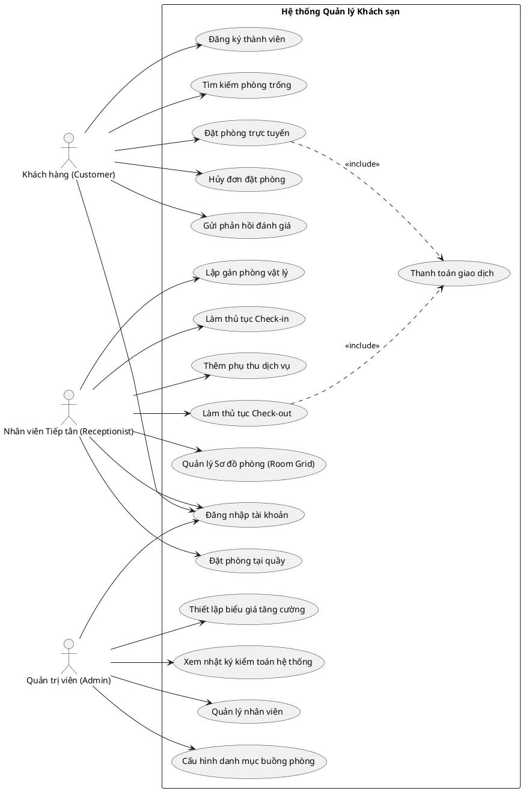
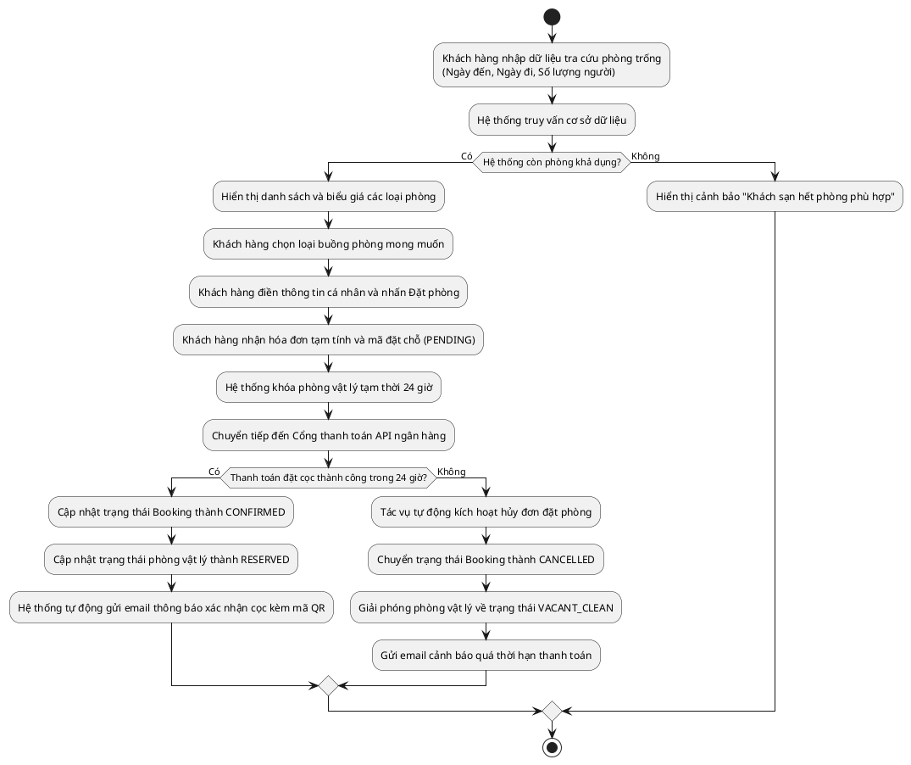
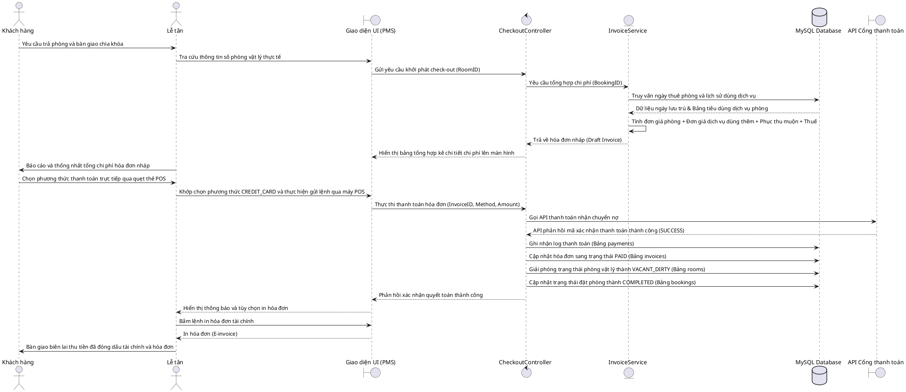
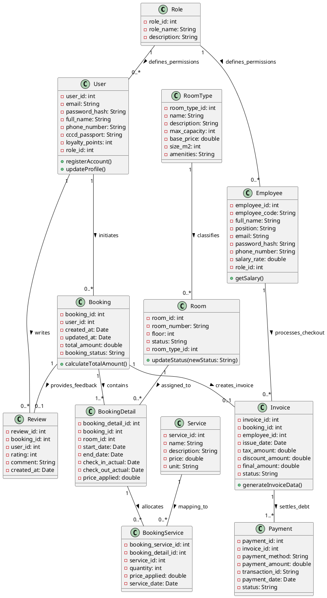

# FILE: Backend_Architecture_Design.md

# KIẾN TRÚC BACKEND HỆ THỐNG QUẢN LÝ KHÁCH SẠN
## DỰ ÁN: HOTEL MANAGEMENT SYSTEM (PROJECT EXAMPLE HOLIDAY)
**Tác giả:** Software Architect  
**Công nghệ sử dụng:** Java 17, Spring Boot, Spring Security, JWT, MySQL, Maven, JPA Hibernate, Lombok

---

## 1. KIẾN TRÚC HỆ THỐNG (SYSTEM ARCHITECTURE)

Hệ thống quản lý khách sạn được thiết kế theo mô hình 3 lớp vật lý (3-Tier Architecture) hoạt động độc lập, tích hợp khả năng bảo mật an toàn đa lớp.

```text
+--------------------------------------------------------------------------------+
|                                CLIENT TIER (TẦNG KHÁCH HÀNG)                   |
|  +--------------------+    +--------------------+    +----------------------+  |
|  | Web Browser (React) |    |  Mobile App (iOS)  |    | Mobile App (Android) |  |
|  +--------------------+    +--------------------+    +----------------------+  |
+---------------------------+----------------------------------------------------+
                            | 1. HTTP/HTTPS Requests (Rest API)
                            v
+--------------------------------------------------------------------------------+
|                        REVERSE PROXY & SECURITY GATEWAY                        |
|  +--------------------------------------------------------------------------+  |
|  |             Nginx Reverse Proxy / Load Balancer (Port 80/443)            |  |
|  |   - Định tuyến Request      - SSL/TLS Termination    - Gzip Compression  |  |
|  +--------------------------------------------------------------------------+  |
+---------------------------+----------------------------------------------------+
                            | 2. Proxy Requests to Upstream
                            v
+--------------------------------------------------------------------------------+
|                        APPLICATION SERVER TIER (SPRING BOOT)                   |
|  +--------------------------------------------------------------------------+  |
|  |  Spring Security JWT Filter (Xác thực và phân quyền)                    |  |
|  |  +--------------------------------------------------------------------+  |  |
|  |  |  Application Modules (Java 17 Engine)                              |  |  |
|  |  |  - Authentication   - Room Management   - Booking   - Payment     |  |  |
|  |  |  - Service          - Invoice           - Review    - Dashboard   |  |  |
|  |  +--------------------------------------------------------------------+  |  |
|  |  Spring Cache Manager (In-memory Cache / Redis Integration)              |  |
|  +--------------------------------------------------------------------------+  |
+---------------------------+------------------------+---------------------------+
                            | 3. Read/Write Data     | 4. Cache Operations
                            v                        v
+------------------------------------+  +-------------------------------------+
|         DATABASE TIER              |  |             CACHE TIER              |
|  +------------------------------+  |  |  +-------------------------------+  |
|  |   MySQL RDBMS (Port 3306)    |  |  |  |  In-Memory / Redis (Port 6379) |  |
|  |   - Quan hệ thực thể (SQL)   |  |  |  |  - Cache dữ liệu phòng vật lý  |  |
|  |   - Transaction ACID         |  |  |  |  - Tối ưu hóa lượt tra cứu     |  |
|  +------------------------------+  |  |  +-------------------------------+  |
+------------------------------------+  +-------------------------------------+
```

### Giải thích các thành phần:
*   **Client Tier:** Là điểm tương tác cuối của người dùng. Giao tiếp qua tiêu chuẩn RESTful API, trao đổi dữ liệu định dạng JSON.
*   **Reverse Proxy (Nginx):** Đóng vai trò là cổng ngõ chặn ngoài cùng, che giấu địa chỉ IP thật của máy chủ ứng dụng bên trong, xử lý mã hóa SSL và chuyển tiếp request.
*   **Application Server Tier:** Sử dụng Java 17 LTS mang lại độ ổn định cao, tối ưu và khả năng tương thích toàn diện cho hệ thống. Framework Spring Boot 3 phụ trách triển khai logic nghiệp vụ cấu trúc bảo mật thông qua Spring Security Core.
*   **Database & Cache:** Dữ liệu có cấu trúc ràng buộc quan hệ cao (Mối quan hệ 1-N, N-N giữa Customer, Room, Booking, Payment, Invoice) được lưu vào MySQL. Danh sách phòng trống, cấu hình loại phòng được cache lại để giảm tải truy vấn MySQL liên tục.

---

## 2. MÔ HÌNH NHIỀU TẦNG (LAYERED ARCHITECTURE)

Ứng dụng Spring Boot phân tách rõ rệt cấu trúc logic logic (Separation of Concerns) theo mô hình Layered Architecture 4 tầng nghiệp vụ cơ bản:

```text
    +----------------------------------------------------------------+
    |                     PRESENTATION / REST LAYER                  |
    |      [Controllers] - Tiếp nhận HTTP Request và xuất Response   |
    +-------------------------------+--------------------------------+
                                    | Request DTO
                                    v [Data Validation]
    +----------------------------------------------------------------+
    |                        BUSINESS LAYER                          |
    |      [Services (Interface) & ServiceImpl (Logic Nghiệp vụ)]    |
    +-------------------------------+--------------------------------+
                                    | Data Operations
                                    v [Transactional Management]
    +----------------------------------------------------------------+
    |                      DATA ACCESS LAYER                         |
    |      [Repositories] - JPA / Hibernate Interface                |
    +-------------------------------+--------------------------------+
                                    | SQL / Connection pool (Hikari)
                                    v
    +----------------------------------------------------------------+
    |                        DATABASE LAYER                          |
    |      [MySQL Table Engine] - Lưu trữ dữ liệu vật lý              |
    +----------------------------------------------------------------+
```

### Chi tiết các lớp (Layers):
1.  **Presentation / Controller Layer (Lớp giao diện/điều khiển):** 
    *   Chữa các API Endpoint xử lý đầu vào của người dùng (`@RestController`).
    *   Chỉ tiếp nhận và gửi đi dữ liệu trung gian thông qua cấu trúc **DTO (Data Transfer Object)**.
    *   Đảm nhiệm xác thực định dạng dữ liệu Validation (`@Valid`, `@Validated`).
2.  **Business Logic Layer (Lớp nghiệp vụ):**
    *   Chứa toàn bộ logic hoạt động khách sạn (Ví dụ: tính tiền cọc, kiểm tra chênh lệch giờ checkin/checkout phạt tiền, cập nhật trạng thái buồng phòng, cộng điểm thành viên).
    *   Mọi nghiệp vụ tác động lênDB phải được cấu hình Transaction (`@Transactional`) nhằm bảo toàn dữ liệu khi có lỗi xảy ra.
3.  **Data Access Layer (Lớp truy xuất dữ liệu):**
    *   Sử dụng Spring Data JPA kế thừa `JpaRepository`.
    *   Thực hiện tương tác trực tiếp với Database thông qua ORM Hibernate.
4.  **Domain / Entity Layer (Lớp thực thể mô hình):**
    *   Định nghĩa đại diện cho các bảng vật lý trong MySQL (`@Entity`).
    *   Sử dụng annotations của JPA để thiết lập các mối quan hệ One-to-Many (`@OneToMany`), Many-to-One (`@ManyToOne`).

---

## 3. PACKAGE STRUCTURE (CẤU TRÚC THƯ MỤC NGUỒN MAVEN)

Hệ thống được tổ chức theo cấu trúc Modular hóa theo Tính năng (Feature-based Package) kết hợp Phân tầng (Layer-based) tiêu chuẩn doanh nghiệp:

```text
src/main/java/com/holiday/hotelmanagement
├── HolidayHotelApplication.java                # Điểm khởi chạy bootstrap ứng dụng
│
├── config                                      # Cấu hình cấu trúc hạ tầng
│   ├── SecurityConfig.java                     # Spring Security Filter Chain & RBAC
│   ├── WebMvcConfig.java                       # Cấu hình CORS, Interceptors
│   ├── CacheConfig.java                        # Cấu hình cache Redis/Ehcache
│   └── OpenApiConfig.java                      # Cấu hình Swagger/OpenAPI documentation
│
├── security                                    # Phân hệ kiểm soát Token JWT
│   ├── JwtTokenProvider.java                   # Gợi sinh, giải mã & xác thực cấu trúc JWT
│   ├── JwtAuthenticationFilter.java            # Bộ lọc Filter chắn các request bắt JWT
│   ├── CustomUserDetailsService.java           # Trích lục tải tài khoản phục vụ Security
│   └── UserPrincipal.java                      # Đối tượng Principal triển khai UserDetails
│
├── exception                                   # Quản lý biệt lệ & Mã lỗi
│   ├── GlobalExceptionHandler.java             # Bộ đánh giá lỗi toàn cục (@RestControllerAdvice)
│   ├── ErrorResponse.java                      # Chuẩn dữ liệu đầu ra khi phát sinh lỗi
│   └── UserException.java / BookingException.java # Các lỗi nghiệp vụ tùy biến riêng
│
├── common                                      # Định dạng dùng chung toàn hệ thống
│   ├── ApiResponse.java                        # Chuẩn hóa JSON phản hồi chung
│   ├── BaseEntity.java                         # Định nghĩa ID, CreatedAt, UpdatedAt chung
│   └── AuditListener.java                      # Kiểm toán tự động ngày tạo/ngày sửa DB
│
└── modules                                     # Các module nghiệp vụ chính của hệ thống
    ├── auth                                    # Module: Xác thực hệ thống
    │   ├── AuthController.java
    │   ├── AuthService.java
    │   ├── AuthServiceImpl.java
    │   └── dto (LoginRequest, RegisterRequest, TokenResponse)
    │
    ├── user                                    # Module: Quản lý hồ sơ người dùng
    │   ├── User.java (Entity)
    │   ├── UserRepository.java
    │   ├── UserService.java
    │   ├── UserServiceImpl.java
    │   ├── dto
    │   └── mapper (UserMapper.java - Sử dụng MapStruct)
    │
    ├── employee                                # Module: Quản lý nhân viên
    │
    ├── roomtype                                # Module: Cấu hình loại phòng
    │
    ├── room                                    # Module: Quản lý phòng vật lý
    │
    ├── booking                                 # Module: Quản lý đơn đặt phòng
    │
    ├── payment                                 # Module: Quản lý thanh toán
    │
    ├── invoice                                 # Module: Hóa đơn chứng từ
    │
    ├── review                                  # Module: Đánh giá chất lượng
    │
    ├── service                                 # Module: Cịch vụ & Mini-bar phụ thu
    │
    └── dashboard                               # Module: Tổng hợp KPI, doanh thu
```

---

## 4. QUY TRÌNH XỬ LÝ REQUEST (REQUEST LIFECYCLE)

Sơ đồ tuần tự xử lý trọn vẹn vòng đời của một Request trong Spring Boot:

```text
Client                Spring Security            DispatcherServlet          Controller            Service             Repository            MySQL
  |                           |                          |                      |                    |                   |                    |
  |--- 1. Rest API Request -->|                          |                      |                    |                   |                    |
  |                           |--- 2. Kiểm tra JWT ----> |                      |                    |                   |                    |
  |                           |    (Hợp lệ / Phân quyền) |                      |                    |                   |                    |
  |                           |                          |--- 3. Định tuyến --->|                    |                   |                    |
  |                           |                          |    đến Controller    |                    |                   |                    |
  |                           |                          |                      |--- 4. Gọi hàm ---->|                   |                    |
  |                           |                          |                      |    nghiệp vụ       |                   |                    |
  |                           |                          |                      |                    |--- 5. Tác động -->|                    |
  |                           |                          |                      |                    |    dữ liệu        |-- 6. SQL Query --->|
  |                           |                          |                      |                    |                   |                    |
  |                           |                          |                      |                    |                   |<-- 7. SQL Result --|
  |                           |                          |                      |                    |<-- 8. Entity -----|                    |
  |                           |                          |                      |                    |    (ORM Mapping)  |                    |
  |                           |                          |                      |                    |                   |                    |
  |                           |                          |                      |                    |                   |                    |
  |                           |                          |                      |<-- 9. DTO ---------|                   |                    |
  |                           |                          |                      |    (Mapper)        |                   |                    |
  |                           |                          |<-- 10. ApiResponse --|                    |                   |                    |
  |                           |<-- 11. Format JSON ------|                      |                    |                   |                    |
  |<-- 12. HTTP Response -----|                          |                      |                    |                   |                    |
```

### Diễn giải quy trình:
1.  **Bước 1 - 2:** Request đi qua `Filter Chain` của Security. `JwtAuthenticationFilter` phân tích Header `Authorization`, giải mã JWT xem token có hợp lệ không. Nếu token có, hệ thống trích thông tin nhét vào `SecurityContextHolder`.
2.  **Bước 3 - 4:** `DispatcherServlet` định tuyến đường dẫn REST API khớp đến đúng Controller tương ứng. Đầu vào được kiểm tra hợp lệ cấu trúc qua `@Valid`.
3.  **Bước 5 - 8:** Controller gọi Service. Service xử lý logic (Ví dụ: tính tiền thuê phòng, áp dụng cọc). Service tương tác với Repository để thực hiện các câu SQL xuống MySQL thực hiện Transaction.
4.  **Bước 9 - 12:** Dữ liệu JPA Entity trả lên Service được MapStruct chuyển đổi sang định dạng DTO tối giản, bảo mật. Controller đóng gói DTO vào `ApiResponse<T>` chuẩn và chuyển định dạng qua JSON gửi hồi đáp lại cho Client.

---

## 5. QUY TRÌNH AUTHENTICATION (XÁC THỰC LẤY JWT TOKEN)

Quy trình người dùng gửi tài khoản mật khẩu để thực hiện cấp phát mã bảo mật JWT:

```text
Client                AuthController           AuthenticationManager      CustomUserDetailsService     UserRepository        Helper Security
  |                           |                         |                          |                         |                  |
  |-- 1. POST /auth/login --->|                         |                          |                         |                  |
  |   (email & password)      |                         |                          |                         |                  |
  |                           |-- 2. Authenticate() --->|                          |                         |                  |
  |                           |   (UsernamePasswordAuth)|                          |                         |                  |
  |                           |                         |-- 3. loadUserByUsername()|                         |                  |
  |                           |                         |   (email) --------------->|                         |                  |
  |                           |                         |                          |-- 4. Tìm kiếm --------->|                  |
  |                           |                         |                          |   User theo email       |                  |
  |                           |                         |                          |                         |                  |
  |                           |                         |<-- 5. Trả về Entity-----|                  |
  |                           |                         |                          |                         |                  |
  |                           |                         |<-- 6. Trả UserPrincipal -|                         |                  |
  |                           |                         |   (Chứa băm BCrypt)      |                         |                  |
  |                           |                         |                          |                         |                  |
  |                           |                         |-- 7. So sánh mật khẩu ----------------------------------------------->|
  |                           |                         |   (BCrypt.matches())                                                      |
  |                           |<-- 8. Auth Success -----|                          |                         |                  |
  |                           |                         |                          |                         |                  |
  |                           |-- 9. Sinh Token JWT  -------------------------------------------------------------------------->|
  |                           |   (TokenProvider)                                                                               |
  |                           |                         |                          |                         |                  |
  |<-- 10. HTTP 200 OK -------|                         |                          |                         |                  |
  |    (AccessToken & Refresh)|                         |                          |                         |                  |
```

### Các bước cốt lõi:
*   Mật khẩu của người dùng được mã hóa bằng thuật toán băm một chiều **BCrypt** trên Server, ngăn ngừa rò rỉ dữ liệu thô.
*   Nếu xác thực thành công, hệ thống phát sinh cặp Token: **Access Token** (Có hiệu lực ngắn, ví dụ 15 - 60 phút) và **Refresh Token** (Lưu trữ và đối khớp tại DB, có hiệu lực dài, ví dụ 7 - 30 ngày) để khách hàng xin cấp mới Session mà không phải nhập lại mật khẩu.

---

## 6. QUY TRÌNH AUTHORIZATION (ỦY QUYỀN TRUY CẬP API THEO ROLE)

Mô hình phân quyền kiểm soát an ninh đa tầng bảo vệ thông tin khi Client thực hiện kích hoạt Protected API:

```text
Client                  Interceptor/Filter          SecurityContext          Request Interceptor          Controller API Endpoint
  |                              |                         |                          |                            |
  |-- 1. Yêu cầu API bảo mật --->|                         |                          |                            |
  |   (JWT Request Header)       |                         |                          |                            |
  |                              |-- 2. Trích xuất & ------>|                          |                            |
  |                              |   Xác thực Token JWT    |                          |                            |
  |                              |                         |                          |                            |
  |                              |-- 3. Đưa thông tin Role |                          |                            |
  |                              |   vào Security Context -|                          |                            |
  |                              |                         |                          |                            |
  |                              |-- 4. Chuyển tiếp Request ------------------------->|                            |
  |                              |                                                    |-- 5. Đánh giá quyền ------>|
  |                              |                                                    |   @PreAuthorize("HAS_ROLE")|
  |                              |                                                    |   (Khớp/Không khớp)        |
  |                              |                                                    |                            |
  |                              |                                                    |<-- Không khớp (HTTP 403) --|
  |<-- Trả về HTTP 403 Forbidden |<-- 6. AccessDeniedException -----------------------|                            |
  |   (Từ chối quyền truy cứu)   |                                                    |                            |
  |                              |                                                    |-- 7. Khớp quyền ---------->|
  |                              |                                                    |   (Thực thi nghiệp vụ)     |
```

### Kỹ thuật áp dụng cấu hình:
1.  **JwtAuthenticationFilter:** Kiểm tra định danh Token. Trích xuất Role gắn kèm trong JWT Payload (Ví dụ: `ADMIN`, `RECEPTIONIST`, `CUSTOMER`) đưa vào luồng Security Context.
2.  **Khóa chặn mức Controller Method:** Áp dụng `@EnableMethodSecurity` trong cấu hình Spring Security. 
3.  Khi request chạm tới Endpoint, Spring AOP đánh giá biểu thức `@PreAuthorize("hasRole('ADMIN')")` hoặc `@PreAuthorize("hasAnyRole('RECEPTIONIST', 'ADMIN')")`. Nếu không thỏa mãn, sinh ra `AccessDeniedException` ngay lập tức.

---

## 7. LUỒNG XỬ LÝ CRUD CHUẨN HÓA (STANDARD CRUD OPERATION PATTERN)

Mọi thao tác CRUD cơ bản phải tuân theo luồng chuyển dịch dữ liệu chặt chẽ từ DTO -> Entity -> DTO.

### 7.1. CREATE (Tạo mới bản ghi)
*   **Input:** Request DTO chứa các nhãn xác thực định dạng dữ liệu (`@NotBlank`, `@Pattern`).
*   **Service:** Có trách nhiệm kiểm tra trùng lặp (ví dụ: `existsByEmail`), chuyển đổi Mapper DTO sang Entity.
*   **Output:** Lưu trữ thông qua Repository và trả về Response DTO chứa ID hệ thống sinh ra kèm `HTTP Status 201 Created`.

### 7.2. READ (Truy vấn dữ liệu)
*   **Truy vấn đơn lẻ (Find by ID):** Nếu không tìm thấy, bắt buộc đẩy ra ngoại lệ `ResourceNotFoundException`.
*   **Truy vấn danh sách (Search & Pagination):** Phải phân trang toàn bộ qua tham số `Pageable` (`page`, `size`, `sort`) của Spring Data, cấm sử dụng `findAll()` trả vãng lai hàng ngàn dòng gây thắt nút cổ chai mạng dữ liệu.

### 7.3. UPDATE (Thay đổi dữ liệu)
*   **Quy trình:**
    1. Truy tìm thực thể cũ trong DB (Không tìm thấy -> `NotFoundException`).
    2. Sử dụng MapStruct map đè các trường thay đổi từ Request DTO vào Entity tìm thấy.
    3. Thực hiện lưu trữ thông qua Repository.

### 7.4. DELETE (Xóa dữ liệu)
*   **Nguyên tắc:** 
    *   Hạn chế tối đa xóa vĩnh viễn (Hard Delete) đối với thực thể cốt lõi (User, Room, Booking, Payment) để phục vụ mục đích kiểm toán nghiệp vụ (Audit Trail).
    *   Chuyển sang cơ chế xóa mềm **Soft Delete** bằng cách đặt cờ hoạt động (Ví dụ: cờ `deleted = true` hoặc trạng thái `INACTIVE`), kết hợp cơ chế `@SQLRestriction("deleted = false")` trong Hibernate Entity để tự động bỏ qua bản ghi đã ẩn khi chạy lọc dữ liệu.

---

## 8. XỬ LÝ NGOẠI LỆ TOÀN CỤC (GLOBAL EXCEPTION HANDLING)

Khi có bất cứ sự cố nào xảy ra tại Tầng Service hoặc tầng Database, toàn bộ lỗi được gom về một mối xử lý thông tin tập trung, định dạng rõ cấu trúc lỗi thống nhất cho Client.

```text
       +-------------------------------------------------------------+
       |   Ngoại lệ phát sinh tại: Controller / Service / Repository |
       +------------------------------+------------------------------+
                                      |
                                      v
       +-------------------------------------------------------------+
       |             @RestControllerAdvice (Global Controller)       |
       |             - Lắng nghe và chặn bắt mọi Exceptions          |
       +------------------------------+------------------------------+
                                      |
                                      +---------------------------------------------------------+
                                      |                                                         |
                                      v [Kiểu Exception dạng Validation]                          v [Kiểu Biệt lệ Nghiệp vụ]
       +-------------------------------------------------------------+  +-------------------------------------------------------+
       |  @ExceptionHandler(MethodArgumentNotValidException.class)  |  |  @ExceptionHandler(CustomBusinessException.class)      |
       |  - Đọc các field bị validation lỗi                          |  |  - Trích xuất mã Message lỗi nghiệp vụ                 |
       |  - Đóng gói mảng lý do lỗi đầu vào                          |  |  - Ánh xạ mã bảo mật HTTP Status phù hợp               |
       +------------------------------+------------------------------+  +-------------------------------------+-----------------+
                                      |                                                                       |
                                      +-----------------------------------+-----------------------------------+
                                                                          |
                                                                          v
                                      +-------------------------------------------------------------+
                                      |         Tạo cấu trúc Response dạng JSON Chuẩn               |
                                      |         - success: false                                    |
                                      |         - timestamp: Thời gian thực hiện lỗi                 |
                                      |         - error: { code, message, details: [...] }          |
                                      +-------------------------------+------------------------------+
                                                                          |
                                                                          v
                                      +-------------------------------------------------------------+
                                      |          REST Client nhận về HTTP Standard status           |
                                      |          (Ví dụ: 400 Bad Request, 404 Not Found)            |
                                      +-------------------------------------------------------------+
```

### Mẫu Cấu trúc JSON báo lỗi Hệ thống (Error HTTP Body):
```json
{
  "success": false,
  "timestamp": "2026-07-09T16:53:00Z",
  "error": {
    "code": "VALIDATION_FAILED",
    "message": "Dữ liệu yêu cầu gửi lên không hợp lệ.",
    "details": [
      {
        "field": "phone_number",
        "issue": "Số điện thoại không đúng định dạng nhà mạng Việt Nam."
      }
    ]
  }
}
```

---

## 9. RÀNG BUỘC DỮ LIỆU ĐẦU VÀO (DATA VALIDATION SYSTEM)

Ứng dụng Spring Boot khai thác tính năng Validation toàn diện thông qua Dependency `spring-boot-starter-validation` (Dựa trên thông số kỹ thuật JSR-380).

### Ràng buộc định nghĩa mẫu trong DTO:
```java
@Getter
@Setter
public class BookingRequest {

    @NotNull(message = "Ngày bắt đầu không được để trống")
    @FutureOrPresent(message = "Ngày bắt đầu phải là ngày hiện tại hoặc tương lai")
    private LocalDate startDate;

    @NotNull(message = "Ngày kết thúc không được để trống")
    @Future(message = "Ngày kết thúc phải là một ngày trong tương lai")
    private LocalDate endDate;

    @NotNull(message = "Mã loại phòng không được để trống")
    private Long roomTypeId;

    @Min(value = 1, message = "Số lượng khách lưu trú tối thiểu phải từ 1 người")
    @Max(value = 10, message = "Không phục vụ đoàn khách quá 10 người/buồng")
    private Integer guestsCount;
}
```

---

## 10. GHI VẾT HỆ THỐNG (SYSTEM LOGGING STRATEGY)

Sử dụng thư viện **SLF4J** cùng động cơ logging **Logback** mặc định của Spring Boot.

### Cấu hình môi trường Log Levels:
*   **Môi trường Development (DEV):** Thiết lập cấp độ log `DEBUG` hoặc `TRACE` để hiển thị SQL Query đầy đủ tham số đầu vào của Hibernate.
*   **Môi trường Production (PROD):** Chỉ cho phép đặt cấu hình tối thiểu là `INFO` và `ERROR` để tối ưu hóa hiệu suất và dung lượng lưu trữ ổ đĩa cứng.

### File Appender Rolling Policy:
Log ghi vết được ghi song song ra Console và File máy chủ theo cấu trúc xoay vòng (Rolling File Policy) tự đóng gói nén zip định kỳ:
*   **Log size limits:** Cắt file khi đạt 10MB (`maxFileSize`).
*   **Retention:** Giữ tối đa 30 ngày log gần nhất (`maxHistory`) hoặc tổng dung lượng log đạt tối đa 3GB.

---

## 11. BỘ NHỚ ĐỆM HIỆU NĂNG CAO (CACHING SYSTEM)

Để giảm tải tài nguyên hoạt động cho Database MySQL, Spring Cache được ứng dụng cho các tác vụ lấy dữ liệu tĩnh ít biến động:

```text
                       Client Request (Xem danh sách hạng phòng)
                                   |
                                   v
                      +--------------------------+
                      |    Hệ thống Cache        |
                      |    (Redis / Memory)      |
                      +------------+-------------+
                                   |
                       +-----------+-----------+
                       |                       |
               [HIT: Có Key Cache]      [MISS: Chưa Cache]
                       |                       |
                       v                       v
            +--------------------+   +-------------------+
            | Đọc lập tức từ     |   | Truy quét DB      |
            | bộ nhớ RAM         |   | MySQL             |
            +----------+---------+   +---------+---------+
                       |                       |
                       |                       v
                       |             +-------------------+
                       |             | Lưu kết quả vào   |
                       |             | Cache Server      |
                       |             +---------+---------+
                       |                       |
                       +-----------+-----------+
                                   |
                                   v
                        Dữ liệu xuất về Client
```

### Cách thức hoạt động bằng Annotation Core trong Service:
*   `@Cacheable(value = "roomTypes", key = "'all'")`: Dùng cho phương thức get hạng phòng. Request sau đó sẽ không cần truy quét MySQL.
*   `@CacheEvict(value = "roomTypes", allEntries = true)`: Tự động xóa sạch vùng nhớ Cache khi Admin thực hiện cập nhật loại phòng hoặc thêm loại phòng mới, đảm bảo khách đặt phòng luôn nhìn thấy giá phòng cập nhật chuẩn xác.


---


# FILE: Backend_Architecture_Specification.md

# ĐẶC TẢ THIẾT KẾ KIẾN TRÚC BACKEND CHUẨN DOANH NGHIỆP
## DỰ ÁN: HỆ THỐNG QUẢN LÝ KHÁCH SẠN (HOTEL MANAGEMENT SYSTEM)
**Tác giả:** Senior Java Backend Developer & Software Architect  
**Công nghệ:** Java 17, Spring Boot 3.x, Spring Security, JWT, Spring Data JPA, Hibernate, MySQL, Maven

---

Tài liệu này đặc tả thiết kế kiến trúc hệ thống Backend chuẩn doanh nghiệp cho Hotel Management System. Kiến trúc này được thiết kế theo nguyên lý Clean Architecture kết hợp Layered Architecture (Kiến trúc phân tầng) nhằm đạt được sự độc lập giữa các thành phần, tăng tính bảo trì, khả năng mở rộng và dễ dàng kiểm thử.

---

## 1. FOLDER STRUCTURE (CẤU TRÚC THƯ MỤC ROOT DỰ ÁN)

Cấu trúc thư mục mức dự án được tổ chức theo tiêu chuẩn quản lý mã nguồn Maven đa phần (Multi-Module) hoặc Mô-đun đơn cực chuẩn dịch vụ. Ở đây thiết kế theo dạng chuẩn Mono-Repo Spring Boot tối ưu cho đội ngũ phát triển tinh gọn:

```text
hotel-management-backend/
├── pom.xml                         # File cấu hình dependencies Maven tổng
├── mvnw                            # Script chạy Maven wrapper môi trường Linux/Mac
├── mvnw.cmd                        # Script chạy Maven wrapper môi trường Windows
├── .gitignore                      # Chỉ định các file không đưa lên Git
├── README.md                       # Tài liệu hướng dẫn cài đặt và chạy dự án
└── src/
    ├── main/
    │   ├── java/                   # Chứa toàn bộ mã nguồn Java của hệ thống
    │   └── resources/              # Thư mục cấu hình tĩnh của Spring Boot
    │       ├── application.yml     # Cấu hình chung (Port, Database, JPA, Logging, JWT)
    │       ├── application-dev.yml # Cấu hình dành riêng cho môi trường Development
    │       ├── application-prod.yml# Cấu hình dành riêng cho môi trường Production (Staging)
    │       └── db/migration/       # Thư mục chứa các file SQL Migration (Flyway/Liquibase)
    └── test/
        └── java/                   # Chứa mã nguồn kiểm thử tự động (Unit/Integration Tests)
```

**Lý do thiết kế:**
*   **Tách biệt cấu hình theo môi trường (Profiles):** Việc chia nhỏ cấu hình thành `application-dev.yml` và `application-prod.yml` giúp ngăn chặn việc nhầm lẫn tài nguyên cơ sở dữ liệu và bảo mật giữa môi trường nội bộ và máy chủ staging thực tế.
*   **Hỗ trợ công cụ Database Migration:** Thư mục `db/migration` giúp theo dõi phiên bản database (Version Control for Database), đảm bảo tính nhất quán của schema giữa các máy của lập trình viên và môi trường triển khai.

---

## 2. PACKAGE STRUCTURE (CẤU TRÚC GÓI MÃ NGUỒN CHUYÊN BIỆT)

Nguồn mã Java được định vị dưới gói cơ sở `com.holiday.hotel` và phân chia thành các lớp chức năng tách biệt:

```text
com.holiday.hotel/
├── config/             # Cấu hình hệ thống (Cors, Caching, Swagger, WebMvc)
├── security/           # Cấu hình Spring Security, AuthenticationEntryPoint
│   ├── jwt/            # Tạo, giải mã và xử lý Jwt Token, JwtFilter
│   └── user/           # Khai báo UserPrincipal và CustomUserDetailsService
├── controller/         # Tiếp nhận HTTP request, phân phối API endpoints
├── service/            # Khai báo Interfaces định nghĩa nghiệp vụ Business Logic
│   └── impl/           # Cụ thể hoá các Services xử lý nghiệp vụ thực tế
├── repository/         # Tầng giao tiếp Database sử dụng Spring Data JPA Repositories
├── entity/             # Định nghĩa cấu trúc các thực thể ánh xạ xuống bảng MySQL
├── dto/                # Data Transfer Objects
│   ├── request/        # Nhận dữ liệu gửi lên từ Client
│   └── response/       # Đóng gói dữ liệu trả về cho Client
├── mapper/             # Triển khai MapStruct chuyển đổi qua lại giữa Entity <-> DTO
├── exception/          # Quản lý lỗi tập trung (Custom Exceptions, GlobalExceptionHandler)
├── validation/         # Triển khai các Custom Validators riêng biệt
├── constant/           # Định nghĩa các hằng số tĩnh hệ thống (Error Message, Table Name)
├── enum/               # Chứa các kiểu liệt kê tĩnh (BookingStatus, RoleName, PaymentMethod)
├── util/               # Chứa các hàm tiện ích trợ giúp xử lý chuỗi, định dạng ngày tháng
└── response/           # Định dạng mẫu phản hồi JSON chuẩn (ApiResponse)
```

**Lý do thiết kế:**
*   **Nguyên tắc Single Responsibility (SRP):** Mỗi package chỉ đảm nhận duy nhất một nhóm vai trò về mặt kỹ thuật, giúp lập trình viên định vị nhanh file cần chỉnh sửa.
*   **Tránh tối đa phụ thuộc vòng (Circular Dependency):** Việc phân tách rõ ràng giữa `controller`, `service`, và `repository` giúp luồng dữ liệu đi một chiều từ ngoài vào trong, giảm thiểu sự phụ thuộc chéo.

---

## 3. THIẾT KẾ ENTITY (TẦNG THỰC THỂ CƠ SỞ DỮ LIỆU)

Tầng Entity đại diện cho các bảng dữ liệu vật lý MySQL. Chúng sử dụng các Annotation của `jakarta.persistence` để ánh xạ trực tiếp và Hibernate quản lý vòng đời.

*   **Lớp Cha chung (BaseEntity):** Gộp chung các trường siêu dữ liệu (`id`, `createdAt`, `updatedAt`) sử dụng `@MappedSuperclass` để tránh viết lặp code ở các entity con.
*   **Quan hệ thực thể (Relationships):**
    *   Tận dụng tải chậm Lazy Loading (`FetchType.LAZY`) cho tất cả các quan hệ `@ManyToOne` và `@OneToMany` nhằm tránh lỗi N+1 Query và nâng cao hiệu năng RAM.
    *   Sử dụng `@JoinColumn` để chỉ định tường minh tên khoá ngoại dưới Database.
*   **Nhận dạng (Identity):** Dùng `@GeneratedValue(strategy = GenerationType.IDENTITY)` để nhường quyền sinh khoá tự động tăng cho database MySQL.

**Lý do thiết kế:**
*   **Tách biệt logic kỹ thuật và nghiệp vụ:** Nhờ Hibernate, nhà phát triển chỉ cần làm việc với đối tượng Java (POJO) thay vì viết các câu lệnh SQL thuần tuý phức tạp.
*   **Lazy Loading tối ưu tài nguyên:** Hạn chế việc truy vấn các bảng liên quan không cần thiết (chẳng hạn khi chỉ cần xem thông tin Room, hệ thống không nhất thiết phải tải thông tin RoomType đi kèm lên bộ nhớ).

---

## 4. THIẾT KẾ DTO (DATA TRANSFER OBJECTS)

DTO đóng vai trò là vỏ bọc bảo vệ thực thể Database khỏi việc lộ thông tin nhạy cảm ra ngoài và chuẩn hóa dữ liệu đầu vào.

*   **Tách biệt Request và Response DTO:**
    *   `Request DTO`: Hứng dữ liệu đầu vào, ghim sẵn các annotation Validation (`@NotBlank`, `@NotNull`, `@Pattern`).
    *   `Response DTO`: Chỉ chứa các trường cần hiển thị trên UI, lược bỏ các trường bảo mật như `password` hay các trường thô không cần thiết.
*   **Tự động chuyển đổi (Mapping):** Thiết lập `MapStruct mappers` để tự động hóa ánh xạ dữ liệu DTO ↔ Entity mà không cần sử dụng reflection như Spring BeanUtils, giúp tăng hiệu năng xử lý.

**Lý do thiết kế:**
*   **Bảo mật dữ liệu (Data Exposure Prevention):** Ngăn chặn việc truyền tải trực tiếp Entity chứa mật khẩu hay các thông tin quản trị nội bộ ra giao diện người dùng.
*   **Độc lập API và Database:** Thay đổi cấu trúc bảng dưới cơ sở dữ liệu không làm ảnh hưởng trực tiếp đến cấu trúc JSON trả về cho Client, giúp tăng tính ổn định của API.

---

## 5. THIẾT KẾ REPOSITORY (TẦNG TRUY VẤN DỮ LIỆU)

Tầng Repository kế thừa từ `JpaRepository` của Spring Data JPA để tự động sinh mã nguồn truy vấn database.

*   **Sử dụng Query Method:** Tự động sinh truy vấn bằng quy ước đặt tên hàm (như `findByEmail`, `existsByRoomNumber`).
*   **Sử dụng Custom `@Query`:** Trong các tình huống xử lý phức tạp (như tính doanh số tại Dashboard, rà lịch trống phòng), sử dụng câu lệnh JPQL hoặc Native SQL chỉ định cụ thể.
*   **Phân trang dữ liệu:** Tất cả các danh sách trả về lớn (như lịch sử Booking, tập khách hàng) đều bắt buộc nhận tham số `Pageable` để thực hiện phân trang, tránh query tải nặng một lúc.

**Lý do thiết kế:**
*   **Giảm thiểu Code Boilerplate:** Loại bỏ việc tự viết các câu lệnh JDBC Connection, Statement, Result Set thô sơ dễ gây lỗi rò rỉ kết nối.
*   **Bảo mật trước tấn công SQL Injection:** JPA tự động bind tham số an toàn (Parameter Binding) đối với các câu lệnh truy vấn động.

---

## 6. THIẾT KẾ SERVICE (TẦNG NGHỆP VỤ CỐT LÕI)

Tầng Service là nơi tập trung toàn bộ các quy tắc nghiệp vụ kinh doanh của khách sạn (Business Rules).

*   **Thiết kế Interface-Driven:** Khai báo Interface trước, sau đó phát triển lớp triển khai (`ServiceImpl`) kế thừa.
*   **Quản lý giao dịch (Transaction Management):** Đánh dấu `@Transactional` trên các phương thức service làm thay đổi trạng thái dữ liệu nhiều bảng (chẳng hạn quy trình tạo Booking đồng thời tạo BookingDetail và trừ điểm thành viên) nhằm bảo đảm tính toàn vẹn (ACID), tự động rollback nếu xảy ra lỗi.
*   **Phụ thuộc (Dependencies):** Sử dụng cơ chế Inject constructor thông qua `@RequiredArgsConstructor` của Lombok thay cho `@Autowired` ở cấp thuộc tính để thuận tiện viết Mockito Unit Test.

**Lý do thiết kế:**
*   **Tính lỏng ứng dụng (Loose Coupling):** Việc gọi Service thông qua Interface giúp dễ dàng thay thế lớp triển khai (ví dụ chuyển từ thanh toán thủ công sang tích hợp Stripe) mà không cần viết lại Controller.
*   **Bảo đảm toàn vẹn dữ liệu:** Tránh tình trạng hệ thống bị lỗi nửa chừng dẫn đến dữ liệu rác hoặc không đồng bộ (như đã trừ tiền nhưng chưa gán phòng).

---

## 7. THIẾT KẾ CONTROLLER (TẦNG PHÂN PHỐI API)

Tầng Controller tiếp nhận đầu vào RESTful, xử lý định dạng cơ bản và định hướng phản hồi.

*   **Không xử lý nghiệp vụ:** Nhiệm vụ của Controller chỉ là nhận dữ liệu, gọi tới Service xử lý và bao bọc đầu ra vào đối tượng `ApiResponse`. Tránh hoàn toàn việc viết logic tính toán tại đây.
*   **Cấu trúc Endpoint RESTful:** Thiết chế URL danh từ số nhiều (ví dụ `/api/v1/rooms`, `/api/v1/bookings`) và sử dụng đúng HTTP Methods cho từng hành động (GET - Đọc, POST - Tạo, PUT - Cập nhật toàn bộ, PATCH - Cập nhật một phần, DELETE - Xoá).

**Lý do thiết kế:**
*   **Duy trì tính Clean Code:** Giúp Controller luôn ngắn gọn, dễ đọc, chỉ tập trung vào vai trò phân phối mạng HTTP.
*   **Chuẩn hoá đầu ra (Standardized API):** Giúp đội ngũ Frontend dễ dàng nắm bắt cấu trúc phản hồi nhờ một đối tượng JSON `ApiResponse` thống nhất toàn app.

---

## 8. KIỂM SOÁT LỖI TẬP TRUNG (GLOBAL EXCEPTION HANDLING)

Cơ chế quản lý lỗi sử dụng mô hình chặn lỗi tập trung bằng `@RestControllerAdvice`.

*   **Custom Exceptions:** Tạo ra các lớp lỗi độc lập kế thừa từ `RuntimeException` (như `ResourceNotFoundException`, `InsufficientStockException`, `UnauthorizedException`).
*   **Bắt lỗi toàn cục:** Một Controller Advice sẽ đứng ra hứng toàn bộ ngoại lệ phát sinh từ bất kỳ tầng nào (Controller, Service, Repository) ném ra và chuyển dịch chúng sang mã JSON có định dạng thân thiện kèm HTTP Status Code chuẩn.

**Lý do thiết kế:**
*   **Không để lộ thông tin máy chủ (Information Leak Prevention):** Ngăn chặn việc in Stack Trace thô của Java lên màn hình Client (ví dụ lỗi SQL Syntax hay Connection Pool), tránh việc tin tặc phát hiện lỗ hổng hạ tầng.
*   **Trải nghiệm người dùng tốt:** Trả về các thông điệp lỗi rõ ràng bằng tiếng Việt hoặc mã lỗi hệ thống giúp Frontend dễ xử lý hiển thị.

---

## 9. QUY CHUẨN XÁC THỰC VÀ ỦY QUYỀN (SECURITY DESIGN)

Hệ thống bảo mật sử dụng kiến trúc bảo mật phi trạng thái (Stateless Architecture) cấu tạo từ:

*   **Bộ lọc JWT Filter:** Đứng chặn trước tầng Servlet của Spring để kiểm tra mã an ninh Access Token ở HTTP Header `Authorization: Bearer <Token>`.
*   **Phân quyền dựa trên vai trò (RBAC):** Định cấu hình tường minh các API công khai tại cấu hình Security Filter Chain, đồng thời bảo vệ các API quản trị cấp cao bằng cách khai báo kiểm tra phân quyền `@PreAuthorize` tại Controller nâng lên mức Method-level.
*   **Bảo vệ mật mã:** Cung cấp `BCryptPasswordEncoder` dùng băm một chiều mật khẩu thô trước khi lưu vào DB.

**Lý do thiết kế:**
*   **Kiến trúc Stateless dễ scale mạng:** Server không cần lưu cấu trúc session của người dùng, giúp hệ thống phân phối tải ngang (Horizontal Scaling) đơn giản.
*   **Chặn đăng nhập trái phép ở lớp ngoài:** Giảm tải cho Application Server bằng cách chặn đứng các yêu cầu không có quyền truy cập trước khi chúng có cơ hội chạm tới tầng Controller/Service.

---

## 10. THIẾT KẾ VALIDATION DỮ LIỆU ĐẦU VÀO

Kiểm tra tính hợp lệ của dữ liệu thông qua cơ chế Validation hai lớp:

*   **Lớp 1: Cấu trúc cơ bản (Declarative Validation):** Sử dụng các thẻ ràng buộc của `jakarta.validation` ở Request DTO để kiểm tra định dạng email, CCCD, sđt Việt Nam trước khi truyền dữ liệu vào Controller.
*   **Lớp 2: Kiểm tra nghiệp vụ sâu (Dynamic Validation):** Kiểm tra logic phức tạp tại tầng Service (ví dụ: ngày checkout có thực sự sau ngày checkin hay không, hạng phòng yêu cầu có còn phòng trống trong khoảng thời gian đã chọn hay không).

**Lý do thiết kế:**
*   **Tiết kiệm tài nguyên máy chủ:** Từ chối các request sai cấu trúc ngay tại cửa ngõ Controller, tránh tốn tài nguyên chạy vào sâu trong DB.
*   **Đảm bảo toàn vẹn dữ liệu cực đoan:** Chặn đứng hoàn toàn dữ liệu bẩn xâm nhập gây xung đột hệ thống.

---

## 11. LUỒNG XỬ LÝ YÊU CẦU API VẬN HÀNH (API FLOW)

Sơ đồ ASCII mô tả luồng một Request đi qua các tầng kiến trúc Backend:

```text
[ Client Request ]
       │
       ▼
 1. [ Security Filter Chain (JwtAuthenticationFilter) ] -> Chặn bắt JWT, nạp SecurityContext nếu hợp lệ
       │
       ▼
 2. [ Controller Layer ] -> Nhận DTO, tự động kích hoạt @Valid kiểm tra cú pháp đầu vào
       │
       ▼
 3. [ Mapper Layer ] -> Chuyển đổi Request DTO sang Entity JPA sang tầng xử lý
       │
       ▼
 4. [ Service Layer ] -> Thực thi Business Logic, kiểm tra luật sâu, quản trị Transaction (@Transactional)
       │
       ▼
 5. [ Repository Layer ] -> Tra cứu, thực hiện câu lệnh ghi/sửa dữ liệu thông qua Data JPA
       │
       ▼
 6. [ Database (MySQL 8) ] -> Lưu trữ dữ liệu vật lý
       │
       ▼
 7. [ Service Layer ] -> Nhận kết quả từ DB, gọi Mapper đổi Entity sang Response DTO tương ứng
       │
       ▼
 8. [ Controller Layer ] -> Đóng gói Response DTO vào đối tượng ApiResponse tiêu chuẩn
       │
       ▼
[ Client Response JSON ]
```

---

## 12. QUY CHUẨN GHI NHẬT KÝ VẬN HÀNH (LOGGING ARCHITECTURE)

Sử dụng thư viện ghi nhật ký **SLF4J** đi kèm giải pháp triển khai **Logback** mặc định của Spring Boot.

*   **Phân chia cấp độ ghi nhật ký:**
    *   `INFO`: Ghi nhận các sự kiện quan trọng của hệ thống (Khởi chạy server, phân phối cấu hình kết nối database, người dùng đăng ký hoặc check-out thành công).
    *   `WARN`: Cảnh báo các sự cố nhẹ, hệ thống tự xử lý được (nhầm lẫn token chưa hợp chuẩn, cảnh báo kết nối chậm).
    *   `ERROR`: Ghi chi tiết stacktrace các lỗi nghiêm trọng gây treo luồng hoặc crash luồng (như sập DB Connection, đơ bộ nhớ) kèm thông tin về thời gian và các dữ liệu liên quan để phục vụ công tác rà lỗi.
*   **Cấu hình File Log:** Log được cấu hình ghi song song ra Console khi chạy môi trường Dev và xuất tệp tin Rolling log trên ổ đĩa vật lý lưu trữ lâu dài của máy chủ môi trường Production.

**Lý do thiết kế:**
*   **Nâng cao khả năng giám sát hệ thống (Observability):** Giúp quản trị viên phát hiện sớm lỗi rò rỉ tài nguyên hệ thống và cung cấp bằng chứng kỹ thuật để khắc phục nhanh sự cố (Troubleshooting) khi vận hành thực tế.


---


# FILE: JPA_Entity_Design.md

# THIẾT KẾ THỰC THỂ LẬP TRÌNH JPA (HIBERNATE)
## DỰ ÁN: HỆ THỐNG QUẢN LÝ KHÁCH SẠN (HOTEL MANAGEMENT SYSTEM)

### PHẦN XV: THIẾT KẾ CẤU TRÚC ENTITIES (SPRING BOOT DATA JPA STANDARDS)

Tài liệu này đặc tả thiết kế chi tiết lớp thực thể Java (JPA Entities) cho 12 đối tượng nghiệp vụ cốt lõi của Hệ thống Quản lý Khách sạn, cấu hình tương thích hoàn toàn với Spring Boot Data JPA và Hibernate ORM.

---

### CÁC NGUYÊN TẮC THIẾT KẾ MẪU CHUỒNG (DESIGN DESIGNIONS)
- **Kiểu dữ liệu Khóa chính**: Sử dụng kiểu dữ liệu `Long` kết hợp chiến lược sinh tự tăng `GenerationType.IDENTITY` để tương thích tối đa với MySQL.
- **Chiến lược Tải dữ liệu (Fetch Strategy)**: Ưu tiên thiết lập `FetchType.LAZY` (Lazy Loading) cho hầu hết các mối quan hệ `@ManyToOne` và `@OneToMany` nhằm tránh rò rỉ bộ nhớ và lỗi truy vấn dư N+1 (N+1 Select Problem).
- **Tính trọn vẹn và an toàn giao dịch**: Sử dụng tham số `cascade = CascadeType.ALL` và `orphanRemoval = true` một cách cẩn trọng tại các thực thể cha-con như `Booking` - `BookingDetail` hoặc `Invoice` - `Payment`.

---

### BẢNG ĐẶC TẢ CHI TIẾT CÁC ENTITY CLASSES

#### 1. Entity: Role (Vai trò tài khoản)
- **Tên lớp Java**: `Role`
- **Bảng ánh xạ tương ứng**: `roles`

| Thuộc tính (Attribute) | Kiểu dữ liệu Java | JPA Annotations | Chi tiết quan hệ & Cấu hình mapping |
|---|---|---|---|
| id | Long | `@Id`, `@GeneratedValue` | Khóa chính tự tăng |
| roleName | String | `@Column(nullable = false, unique = true)` | Tên quyền (ADMIN, CUSTOMER...) |
| description | String | `@Column(length = 255)` | Thuyết minh nghiệp vụ vai trò |
| users | `List<User>` | `@OneToMany(mappedBy = "role", fetch = FetchType.LAZY)` | Một vai trò được cấp cho nhiều Khách hàng |
| employees | `List<Employee>` | `@OneToMany(mappedBy = "role", fetch = FetchType.LAZY)` | Một vai trò được cấp cho nhiều Nhân viên |

- **Lý do thiết kế**: Đảm bảo cấu trúc kiểm soát truy cập dựa trên vai trò (RBAC). Mối quan hệ hai chiều `mappedBy` giúp JPA quản trị đối tượng Role mà không cần định nghĩa khóa ngoại dư tại bảng này.

---

#### 2. Entity: User (Khách hàng)
- **Tên lớp Java**: `User`
- **Bảng ánh xạ tương ứng**: `users`

| Thuộc tính | Kiểu dữ liệu Java | JPA Annotations | Chi tiết quan hệ & Cấu hình mapping |
|---|---|---|---|
| id | Long | `@Id`, `@GeneratedValue` | Khóa chính tự tăng |
| email | String | `@Column(nullable = false, unique = true)` | Email đăng nhập chính |
| password | String | `@Column(nullable = false)` | Chuỗi mật khẩu băm BCrypt |
| fullName | String | `@Column(nullable = false)` | Họ tên của khách hàng |
| phoneNumber | String | `@Column(nullable = false, unique = true)` | Số điện thoại liên lạc |
| cccdPassport | String | `@Column(unique = true)` | ID căn cước công dân |
| loyaltyPoints | Integer | `@Column(nullable = false)` | Điểm thưởng tích lũy hội viên |
| role | Role | `@ManyToOne(fetch = FetchType.LAZY)`<br>`@JoinColumn(name = "role_id", nullable = false)` | Quan hệ N-1 đến thực thể Role |
| bookings | `List<Booking>` | `@OneToMany(mappedBy = "user", fetch = FetchType.LAZY)` | Lịch sử đặt phòng của khách hàng |

- **Lý do thiết kế**: Trường `loyaltyPoints` mặc định gán là 0 trong database. `role` được thiết lập `FetchType.LAZY` để tránh tự động Join thừa bảng Role khi chỉ truy vấn thông tin cơ bản khách hàng.

---

#### 3. Entity: Employee (Nhân sự vận hành)
- **Tên lớp Java**: `Employee`
- **Bảng ánh xạ tương ứng**: `employees`

| Thuộc tính | Kiểu dữ liệu Java | JPA Annotations | Chi tiết quan hệ & Cấu hình mapping |
|---|---|---|---|
| id | Long | `@Id`, `@GeneratedValue` | Khóa chính tự tăng |
| employeeCode | String | `@Column(nullable = false, unique = true)` | Mã số nhân sự tĩnh |
| fullName | String | `@Column(nullable = false)` | Họ tên nhân viên |
| position | String | `@Column(nullable = false)` | Bộ phận làm việc |
| email | String | `@Column(nullable = false, unique = true)` | Email cơ quan cấp |
| password | String | `@Column(nullable = false)` | Mật khẩu truy cập hệ thống PMS |
| phoneNumber | String | `@Column(nullable = false)` | Số điện thoại nhân viên |
| salaryRate | BigDecimal | `@Column(nullable = false)` | Biểu lương theo khung ca làm |
| role | Role | `@ManyToOne(fetch = FetchType.LAZY)`<br>`@JoinColumn(name = "role_id", nullable = false)` | Quan hệ N-1 đến thực thể Role |

- **Lý do thiết kế**: `salaryRate` dùng `BigDecimal` để đảm bảo độ chính xác tài chính của tiền lương, tránh sai số của kiểu Float hoặc Double. Phân tách bảng `Employee` với `User` giúp tối ưu hóa nghiệp vụ nội bộ và dữ liệu khách hàng.

---

#### 4. Entity: RoomType (Phân hạng loại phòng)
- **Tên lớp Java**: `RoomType`
- **Bảng ánh xạ tương ứng**: `room_types`

| Thuộc tính | Kiểu dữ liệu Java | JPA Annotations | Chi tiết quan hệ & Cấu hình mapping |
|---|---|---|---|
| id | Long | `@Id`, `@GeneratedValue` | Khóa chính tự tăng |
| name | String | `@Column(nullable = false, unique = true)` | Tên loại phòng (Vip, Standard...) |
| description | String | `@Column(columnDefinition = "TEXT")` | Mô tả chi tiết buồng phòng |
| maxCapacity | Integer | `@Column(nullable = false)` | Số người ở tối đa |
| basePrice | BigDecimal | `@Column(nullable = false)` | Giá phòng chuẩn cơ sở |
| sizeM2 | Integer | `@Column(nullable = false)` | Diện tích phòng nghỉ |
| amenities | String | `@Column(columnDefinition = "TEXT")` | Tiện ích dạng chuỗi JSON |
| rooms | `List<Room>` | `@OneToMany(mappedBy = "roomType", fetch = FetchType.LAZY)` | Mối quan hệ 1-N đến buồng phòng vật lý |

- **Lý do thiết kế**: `basePrice` dùng `BigDecimal` để khớp tính toán tổng tiền hóa đơn chuẩn xác. Danh mục tiện ích `amenities` lưu dạng `TEXT` để lưu cấu trúc JSON linh hoạt của danh sách tiện nghi phòng.

---

#### 5. Entity: Room (Buồng phòng vật lý)
- **Tên lớp Java**: `Room`
- **Bảng ánh xạ tương ứng**: `rooms`

| Thuộc tính | Kiểu dữ liệu Java | JPA Annotations | Chi tiết quan hệ & Cấu hình mapping |
|---|---|---|---|
| id | Long | `@Id`, `@GeneratedValue` | Khóa chính tự tăng |
| roomNumber | String | `@Column(nullable = false, unique = true)` | Số phòng vật lý (101, 202) |
| floor | Integer | `@Column(nullable = false)` | Số tầng |
| status | RoomStatus | `@Enumerated(EnumType.STRING)`<br>`@Column(nullable = false)` | Trạng thái phòng nghỉ (Enum) |
| roomType | RoomType | `@ManyToOne(fetch = FetchType.LAZY)`<br>`@JoinColumn(name = "room_type_id", nullable = false)` | Mối quan hệ N-1 đến thực thể loại phòng |

- **Lý do thiết kế**: Trường `status` sử dụng kiểu dữ liệu Enum `RoomStatus` (định cấu hình: `VACANT_CLEAN`, `VACANT_DIRTY`, `OCCUPIED`, `MAINTENANCE`) kết hợp `@Enumerated(EnumType.STRING)` để lưu giữ dạng chuỗi dễ hiểu trong database và an toàn kiểu dữ liệu (Type-safety) trong code.

---

#### 6. Entity: Booking (Đơn hàng đặt phòng)
- **Tên lớp Java**: `Booking`
- **Bảng ánh xạ tương ứng**: `bookings`

| Thuộc tính | Kiểu dữ liệu Java | JPA Annotations | Chi tiết quan hệ & Cấu hình mapping |
|---|---|---|---|
| id | Long | `@Id`, `@GeneratedValue` | Khóa chính tự tăng |
| user | User | `@ManyToOne(fetch = FetchType.LAZY)`<br>`@JoinColumn(name = "user_id", nullable = true)` | Quan hệ N-1 đến User (Khách hàng) |
| createdAt | LocalDateTime | `@Column(nullable = false, updatable = false)` | Ngày khởi lập đơn hàng |
| updatedAt | LocalDateTime | `@Column(nullable = false)` | Ngày thay đổi đơn |
| totalAmount | BigDecimal | `@Column(nullable = false)` | Tổng số tiền đơn phòng |
| bookingStatus | BookingStatus | `@Enumerated(EnumType.STRING)`<br>`@Column(nullable = false)` | Trạng thái đơn phòng (Enum) |
| bookingDetails | `List<BookingDetail>` | `@OneToMany(mappedBy = "booking", cascade = CascadeType.ALL, orphanRemoval = true)` | Quan hệ 1-N chứa danh mục các phòng đặt |
| invoice | Invoice | `@OneToOne(mappedBy = "booking", cascade = CascadeType.ALL, fetch = FetchType.LAZY)` | Quan hệ 1-1 đến Hóa đơn quyết toán tiền |

- **Lý do thiết kế**: Cần cấu hình `cascade = CascadeType.ALL` cho `bookingDetails` để đảm bảo khi lưu đối tượng `Booking` cha, toàn bộ chi tiết phòng đặt lưu trú con sẽ được lưu tuần tự tự động. `user` cho phép `nullable = true` để phục vụ các luồng đặt chỗ trực tiếp tại quầy của khách vãng lai không đăng ký tài khoản.

---

#### 7. Entity: BookingDetail (Chi tiết lượt phòng thuê)
- **Tên lớp Java**: `BookingDetail`
- **Bảng ánh xạ tương ứng**: `booking_details`

| Thuộc tính | Kiểu dữ liệu Java | JPA Annotations | Chi tiết quan hệ & Cấu hình mapping |
|---|---|---|---|
| id | Long | `@Id`, `@GeneratedValue` | Khóa chính tự tăng |
| booking | Booking | `@ManyToOne(fetch = FetchType.LAZY)`<br>`@JoinColumn(name = "booking_id", nullable = false)` | Quan hệ N-1 về đơn hàng đặt phòng |
| room | Room | `@ManyToOne(fetch = FetchType.LAZY)`<br>`@JoinColumn(name = "room_id", nullable = false)` | Quan hệ N-1 liên kết phòng vật lý trống gán |
| startDate | LocalDate | `@Column(nullable = false)` | Ngày nhận buồng nghỉ |
| endDate | LocalDate | `@Column(nullable = false)` | Ngày trả buồng nghỉ |
| checkInActual | LocalDateTime | `@Column` | Thời gian check-in của lễ tân thực tế |
| checkOutActual | LocalDateTime | `@Column` | Thời gian check-out của lễ tân thực tế |
| priceApplied | BigDecimal | `@Column(nullable = false)` | Giá áp đơn phòng thực tế thời điểm cọc |
| bookingServices | `List<BookingService>` | `@OneToMany(mappedBy = "bookingDetail", cascade = CascadeType.ALL, orphanRemoval = true)` | Các dịch vụ đính kèm phát sinh tại phòng |

- **Lý do thiết kế**: Lưu `priceApplied` trực tiếp tại bảng này giúp chống trượt giá phòng khi cấu hình loại phòng có thay đổi trong tương lai, duy trì lịch sử thanh toán chính xác. `startDate` và `endDate` chỉ dùng `LocalDate` để biểu thị ngày, độc lập với múi giờ hoặc giờ cụ thể.

---

#### 8. Entity: Invoice (Hóa đơn tài chính)
- **Tên lớp Java**: `Invoice`
- **Bảng ánh xạ tương ứng**: `invoices`

| Thuộc tính | Kiểu dữ liệu Java | JPA Annotations | Chi tiết quan hệ & Cấu hình mapping |
|---|---|---|---|
| id | Long | `@Id`, `@GeneratedValue` | Khóa chính tự tăng |
| booking | Booking | `@OneToOne(fetch = FetchType.LAZY)`<br>`@JoinColumn(name = "booking_id", nullable = false)` | Quan hệ 1-1 liên kết duy nhất về Booking |
| employee | Employee | `@ManyToOne(fetch = FetchType.LAZY)`<br>`@JoinColumn(name = "employee_id", nullable = false)` | Nhân viên lễ tân xuất hóa đơn (N-1) |
| issueDate | LocalDateTime | `@Column(nullable = false)` | Ngày giờ xuất bản ghi hóa đơn |
| taxAmount | BigDecimal | `@Column(nullable = false)` | Thuế GTGT |
| discountAmount | BigDecimal | `@Column(nullable = false)` | Số tiền chiết khấu giảm giá |
| finalAmount | BigDecimal | `@Column(nullable = false)` | Tổng số thực thu |
| status | InvoiceStatus | `@Enumerated(EnumType.STRING)`<br>`@Column(nullable = false)` | Trạng thái hóa đơn (Enum) |
| payments | `List<Payment>` | `@OneToMany(mappedBy = "invoice", cascade = CascadeType.ALL, fetch = FetchType.LAZY)` | Mối quan hệ 1-N đến đợt thanh toán nợ |

- **Lý do thiết kế**: Mối quan hệ `@OneToOne` với Booking giúp thắt chặt tính hợp lệ nghiệp vụ (Một booking chỉ có tối đa một hóa đơn quyết toán dòng tiền).

---

#### 9. Entity: Payment (Giao dịch dòng tiền)
- **Tên lớp Java**: `Payment`
- **Bảng ánh xạ tương ứng**: `payments`

| Thuộc tính | Kiểu dữ liệu Java | JPA Annotations | Chi tiết quan hệ & Cấu hình mapping |
|---|---|---|---|
| id | Long | `@Id`, `@GeneratedValue` | Khóa chính tự tăng |
| invoice | Invoice | `@ManyToOne(fetch = FetchType.LAZY)`<br>`@JoinColumn(name = "invoice_id", nullable = false)` | Thuộc hóa đơn quyết toán nào (N-1) |
| paymentMethod | String | `@Column(nullable = false)` | Phương thức thanh toán (CASH, BANK...) |
| paymentAmount | BigDecimal | `@Column(nullable = false)` | Số tiền thanh toán ở giao dịch này |
| transactionId | String | `@Column` | Mã tham chiếu ngân hàng nếu chuyển khoản |
| paymentDate | LocalDateTime | `@Column(nullable = false)` | Thời điểm ký nhận xác nhận giao dịch |
| status | PaymentStatus | `@Enumerated(EnumType.STRING)`<br>`@Column(nullable = false)` | Trạng thái giao dịch (SUCCESS, FAILED) |

- **Lý do thiết kế**: Hóa đơn có thể chia làm nhiều đợt đóng tiền cọc trước và thanh toán sau, do đó quan hệ `@ManyToOne` đến `Invoice` cho phép một hóa đơn lưu giữ lịch sử nhiều giao dịch nạp tiền độc lập.

---

#### 10. Entity: Review (Đánh giá phản hồi)
- **Tên lớp Java**: `Review`
- **Bảng ánh xạ tương ứng**: `reviews`

| Thuộc tính | Kiểu dữ liệu Java | JPA Annotations | Chi tiết quan hệ & Cấu hình mapping |
|---|---|---|---|
| id | Long | `@Id`, `@GeneratedValue` | Khóa chính tự tăng |
| booking | Booking | `@ManyToOne(fetch = FetchType.LAZY)`<br>`@JoinColumn(name = "booking_id", nullable = false)` | Đơn đặt phòng được đánh giá |
| user | User | `@ManyToOne(fetch = FetchType.LAZY)`<br>`@JoinColumn(name = "user_id", nullable = false)` | Khách hàng viết đánh giá bình luận |
| rating | Integer | `@Column(nullable = false)` | Điểm số đánh giá thang 1-5 |
| comment | String | `@Column(columnDefinition = "TEXT")` | Nhận xét chi tiết |
| createdAt | LocalDateTime | `@Column(nullable = false, updatable = false)` | Ngày giờ đăng bình luận |

- **Lý do thiết kế**: Ràng buộc khóa ngoại kép đến `Booking` và `User` để đảm bảo dữ liệu đánh giá có căn cứ thực tế lưu trú và được xác lập danh tính chính xác.

---

#### 11. Entity: Service (Dịch vụ phụ trợ)
- **Tên lớp Java**: `Service`
- **Bảng ánh xạ tương ứng**: `services`

| Thuộc tính | Kiểu dữ liệu Java | JPA Annotations | Chi tiết quan hệ & Cấu hình mapping |
|---|---|---|---|
| id | Long | `@Id`, `@GeneratedValue` | Khóa chính tự tăng |
| name | String | `@Column(nullable = false, unique = true)` | Tên gọi dịch vụ (Giặt là, Mini-bar...) |
| description | String | `@Column(length = 255)` | Mô tả cách thức phục vụ |
| price | BigDecimal | `@Column(nullable = false)` | Đơn giá niêm yết của dịch vụ |
| unit | String | `@Column(nullable = false)` | Đơn vị bán dịch vụ (Lượt, Chai, Ngày...) |

- **Lý do thiết kế**: Đóng vai trò là bảng danh mục tĩnh lưu đơn giá chuẩn. Mọi thay đổi về đơn giá gốc tại đây không lập tức làm xáo trộn hóa đơn nợ cũ của các khách hàng đang thuê phòng.

---

#### 12. Entity: BookingService (Tiêu dùng dịch vụ lẻ)
- **Tên lớp Java**: `BookingService`
- **Bảng ánh xạ tương ứng**: `booking_services`

| Thuộc tính | Kiểu dữ liệu Java | JPA Annotations | Chi tiết quan hệ & Cấu hình mapping |
|---|---|---|---|
| id | Long | `@Id`, `@GeneratedValue` | Khóa chính tự tăng |
| bookingDetail | BookingDetail | `@ManyToOne(fetch = FetchType.LAZY)`<br>`@JoinColumn(name = "booking_detail_id", nullable = false)` | Tiêu dùng bởi phòng nghỉ cụ thể (N-1) |
| service | Service | `@ManyToOne(fetch = FetchType.LAZY)`<br>`@JoinColumn(name = "service_id", nullable = false)` | Mối liên kết đến dịch vụ sử dụng (N-1) |
| quantity | Integer | `@Column(nullable = false)` | Số lượng dịch vụ dùng thực tế |
| priceApplied | BigDecimal | `@Column(nullable = false)` | Đơn giá thực thu thời điểm sử dụng |
| serviceDate | LocalDateTime | `@Column(nullable = false)` | Thời điểm kích hoạt sử dụng dịch vụ |

- **Lý do thiết kế**: Tương tự như giá phòng, `priceApplied` dùng để chốt giá dịch vụ tại thời điểm tiêu dùng của khách, tránh rủi ro khi Admin sau đó cập nhật bảng giá niêm yết trong bảng `services` tĩnh.


---


# FILE: DTO_Design.md

# ĐẶC TẢ CHI TIẾT THIẾT KẾ CÁC DTO (DATA TRANSFER OBJECTS)
## DỰ ÁN: HOTEL MANAGEMENT SYSTEM (PROJECT EXAMPLE HOLIDAY)
**Tác giả:** Senior Java Developer  
**Tiêu chuẩn Validation:** Jakarta Bean Validation (Spring Boot Starter Validation)  
**Môi trường:** Java 17

---

Tài liệu này đặc tả chi tiết toàn bộ các đối tượng trao đổi dữ liệu (DTO) của hệ thống bao gồm DTO Đầu vào (Requests) được ràng buộc định dạng dữ liệu nghiêm ngặt qua Jakarta Constraints, và DTO Đầu ra (Responses) định dạng dữ liệu sạch gửi trả Client.

---

## 1. PHÂN HỆ AUTHENTICATION & USER DTO

### 1.1. LoginRequest (DTO Đăng nhập)
*   **Mục đích:** Hứng và xác thực tài khoản mật khẩu người dùng gửi lên để lấy Token.

| Thuộc tính | Kiểu dữ liệu | Validation Annotations | Ý nghĩa thực tế |
|---|---|---|---|
| `email` | `String` | `@NotBlank(message = "Email không được để trống")`<br>`@Email(message = "Định dạng email không hợp lệ")` | Email tài khoản dùng để đăng nhập |
| `password` | `String` | `@NotBlank(message = "Mật khẩu không được để trống")` | Mật khẩu tài khoản (dạng thô) |

### 1.2. RegisterRequest (DTO Đăng ký tài khoản Customer)
*   **Mục đích:** Đăng ký tài khoản khách hàng trực tuyến từ trang chủ.

| Thuộc tính | Kiểu dữ liệu | Validation Annotations | Ý nghĩa thực tế |
|---|---|---|---|
| `email` | `String` | `@NotBlank`<br>`@Email`<br>`@Size(max = 100)` | Email đăng ký độc nhất |
| `password` | `String` | `@NotBlank`<br>`@Pattern(regexp = "^(?=.*[a-z])(?=.*[A-Z])(?=.*\\d)(?=.*[@$!%*?&])[A-Za-z\\d@$!%*?&]{8,50}$", message = "Mật khẩu tối thiểu 8 ký tự, gồm 1 chữ hoa, 1 chữ thường, 1 số và 1 ký tự đặc biệt")` | Mật khẩu bảo mật đăng ký |
| `fullName` | `String` | `@NotBlank`<br>`@Size(min = 2, max = 50, message = "Họ tên phải từ 2 đến 50 ký tự")` | Họ và tên đầy đủ |
| `phoneNumber` | `String` | `@NotBlank`<br>`@Pattern(regexp = "^(0|\\+84)(\\s|\\.)?((3[2-9])|(5[689])|(7[06-9])|(8[1-689])|(9[0-46-9]))(\\d(\\s|\\.)?){7}$", message = "Số điện thoại Việt Nam không đúng định dạng")` | Số điện thoại liên lạc |
| `cccdPassport` | `String` | `@NotBlank`<br>`@Pattern(regexp = "^([0-9]{12}|[A-Z][0-9]{7})$", message = "CCCD phải là 12 chữ số hoặc Hộ chiếu gồm 1 chữ hoa và 7 chữ số")` | Số định danh CCCD hoặc Hộ chiếu |

### 1.3. UserResponse (DTO Phản hồi thông tin Người dùng)
*   **Mục đích:** Gửi thông tin cá nhân hiện hành về giao diện. Không có dữ liệu đầu vào nên không yêu cầu Validation Annotation.

| Thuộc tính | Kiểu dữ liệu | Ý nghĩa thực tế |
|---|---|---|
| `userId` | `Long` | ID định danh tài khoản duy nhất |
| `email` | `String` | Email liên lạc của tài khoản |
| `fullName` | `String` | Họ tên đầy đủ |
| `phoneNumber` | `String` | Số điện thoại |
| `cccdPassport` | `String` | Số chứng minh thư/Hộ chiếu |
| `loyaltyPoints` | `Integer` | Điểm số thành viên tích lũy |
| `role` | `String` | Vai trò hệ thống (`ADMIN`, `RECEPTIONIST`, `CUSTOMER`) |
| `active` | `Boolean` | Trạng thái hoạt động của tài khoản |

---

## 2. PHÂN HỆ QUẢN LÝ BUỒNG PHÒNG DTO

### 2.1. RoomRequest (DTO Tạo/Cập nhật Phòng vật lý)
*   **Mục đích:** Quản lý buồng phòng vật lý trong hệ thống khách sạn.

| Thuộc tính | Kiểu dữ liệu | Validation Annotations | Ý nghĩa thực tế |
|---|---|---|---|
| `roomNumber` | `String` | `@NotBlank(message = "Số phòng không được trống")`<br>`@Size(max = 10)` | Mã phòng (Ví dụ: "101", "304B") |
| `floor` | `Integer` | `@NotNull`<br>`@Min(1)` | Vị trí tầng lầu của phòng ở |
| `roomTypeId` | `Long` | `@NotNull(message = "Loại phòng không được để trống")` | ID phân loại hạng phòng liên kết |
| `status` | `String` | `@NotBlank` | Trạng thái bắt đầu (ví dụ: `VACANT_CLEAN`) |

### 2.2. RoomResponse (DTO Trả về thông tin Phòng)

| Thuộc tính | Kiểu dữ liệu | Ý nghĩa thực tế |
|---|---|---|
| `roomId` | `Long` | ID duy nhất phòng vật lý |
| `roomNumber` | `String` | Số phòng của khách sạn |
| `floor` | `Integer` | Số tầng |
| `status` | `String` | Trạng thái buồng phòng hiện tại (`VACANT_CLEAN`, `OCCUPIED`, v.v.) |
| `roomTypeName` | `String` | Tên của hạng phòng liên danh (Deluxe, Suite) |
| `basePrice` | `BigDecimal` | Giá tiền phòng cơ sở/đêm |

---

## 3. PHÂN HỆ ĐẶT PHÒNG & ĐÁNH GIÁ DTO

### 3.1. BookingRequest (DTO Khởi đặt phòng)
*   **Mục đích:** Khách đặt phòng qua giao diện ứng dụng hoặc Lễ tân tạo trực tiếp.

| Thuộc tính | Kiểu dữ liệu | Validation Annotations | Ý nghĩa thực tế |
|---|---|---|---|
| `startDate` | `LocalDate` | `@NotNull`<br>`@FutureOrPresent(message = "Ngày checkin không được ở quá khứ")` | Ngày đến dự kiến (Check-in) |
| `endDate` | `LocalDate` | `@NotNull` | Ngày đi dự kiến (Check-out) |
| `roomTypeId` | `Long` | `@NotNull` | ID hạng phòng khách đăng ký chọn |
| `guestsCount` | `Integer` | `@NotNull`<br>`@Min(1)`<br>`@Max(10)` | Số lượng hành khách lưu trú buồng |
| `specialRequests` | `String` | `@Size(max = 500)` | Ghi chú yêu cầu đặc biệt của khách |

### 3.2. BookingResponse (DTO Chi tiết đơn hàng Booking)

| Thuộc tính | Kiểu dữ liệu | Ý nghĩa thực tế |
|---|---|---|
| `bookingId` | `Long` | ID đơn đặt phòng duy nhất |
| `userId` | `Long` | ID khách đặt phòng |
| `customerName` | `String` | Tên đầy đủ của khách tương ứng |
| `roomNumber` | `String` | Số phòng thực tế đã gán khi nhận phòng (nếu có) |
| `startDate` | `LocalDate` | Ngày checkin |
| `endDate` | `LocalDate` | Ngày checkout |
| `totalAmount` | `BigDecimal` | Tổng trị giá phòng tính toán |
| `status` | `String` | Trạng thái đơn đặt (`PENDING`, `CONFIRMED`, `CANCELLED`) |

### 3.3. ReviewRequest (DTO Gửi đánh giá dịch vụ)
*   **Mục đích:** Nhận đánh giá của khách sau kì nghỉ đã hoàn thành.

| Thuộc tính | Kiểu dữ liệu | Validation Annotations | Ý nghĩa thực tế |
|---|---|---|---|
| `bookingId` | `Long` | `@NotNull(message = "Mã đặt phòng không được để trống")` | ID đặt phòng tương tác thực tế |
| `rating` | `Integer` | `@NotNull`<br>`@Min(1)`<br>`@Max(5)` | Điểm đánh giá chất lượng (1-5 Sao) |
| `comment` | `String` | `@NotBlank`<br>`@Size(max = 1000)` | Nội dung phản hồi, ý kiến khách |

### 3.4. ReviewResponse (DTO Trả về thông tin Đánh giá)

| Thuộc tính | Kiểu dữ liệu | Ý nghĩa thực tế |
|---|---|---|
| `reviewId` | `Long` | ID bài viết review |
| `fullName` | `String` | Tên của khách để lại đánh giá |
| `rating` | `Integer` | Số lượng sao |
| `comment` | `String` | Nội dung bình luận |
| `status` | `String` | Trạng thái hiển thị (`PENDING_MODERATION`, `APPROVED`) |

---

## 4. PHÂN HỆ THANH TOÁN & HÓA ĐƠN DTO

### 4.1. PaymentRequest (DTO Đề xuất thanh toán)
*   **Mục đích:** Gửi thông tin về phiên thanh toán từ cổng điện tử hoặc lễ tân thu.

| Thuộc tính | Kiểu dữ liệu | Validation Annotations | Ý nghĩa thực tế |
|---|---|---|---|
| `invoiceId` | `Long` | `@NotNull` | ID hoá đơn thanh toán |
| `paymentMethod` | `String` | `@NotBlank` | Hình thức thanh toán (`CREDIT_CARD`, `BANK_TRANSFER`, `CASH`) |
| `paymentAmount` | `BigDecimal` | `@NotNull`<br>`@DecimalMin(value = "0.0", inclusive = false)` | Số tiền thực hiện giao dịch nạp |
| `transactionId` | `String` | Không yêu cầu | Số tham chiếu ngân hàng/phiên chuyển khoản |

### 4.2. PaymentResponse (DTO Biên nhận thanh toán)

| Thuộc tính | Kiểu dữ liệu | Ý nghĩa thực tế |
|---|---|---|
| `paymentId` | `Long` | ID phiên thanh toán |
| `invoiceId` | `Long` | ID hoá đơn tương ứng |
| `paymentMethod` | `String` | Hình thức giao dịch |
| `paymentAmount` | `BigDecimal` | Số tiền giao dịch |
| `paymentDate` | `LocalDateTime` | Thời gian hệ thống ghi nhận giao dịch |
| `status` | `String` | Trạng thái (`SUCCESS`, `FAILED`) |
| `remainingBalance` | `BigDecimal` | Số dư công nợ còn lại của hoá đơn sau khi cấn trừ |

### 4.3. InvoiceResponse (DTO Trả về Hoá đơn hoàn thành)

| Thuộc tính | Kiểu dữ liệu | Ý nghĩa thực tế |
|---|---|---|
| `invoiceId` | `Long` | ID hóa đơn |
| `bookingId` | `Long` | ID đơn đặt phòng |
| `issueDate` | `LocalDateTime` | Thời điểm phát hành hoá đơn |
| `roomCharges` | `BigDecimal` | Chi phí tiền phòng |
| `serviceCharges` | `BigDecimal` | Chi phí phát sinh (Spa, Mini-bar, giặt ủi) |
| `taxAmount` | `BigDecimal` | Giá trị thuế VAT cộng thêm |
| `discountAmount` | `BigDecimal` | Số tiền giảm giá được trừ |
| `finalAmount` | `BigDecimal` | Tổng giá trị hóa đơn thu cuối cùng |
| `status` | `String` | Trạng thái hoá đơn (`PAID`, `UNPAID`) |

---

## 5. PHÂN HỆ QUẢN TRỊ NHÂN VIÊN & DASHBOARD DTO

### 5.1. EmployeeRequest (DTO Tạo mới Nhân viên)
*   **Mục đích:** Admin tạo nhân viên khách sạn và tạo tài khoản đăng nhập đồng thời.

| Thuộc tính | Kiểu dữ liệu | Validation Annotations | Ý nghĩa thực tế |
|---|---|---|---|
| `employeeCode` | `String` | `@NotBlank`<br>`@Pattern(regexp = "^EMP[0-9]{3,6}$", message = "Mã nhân viên phải bắt đầu bằng EMP và từ 3-6 chữ số")` | Mã số quản lý nhân viên độc nhất |
| `fullName` | `String` | `@NotBlank`<br>`@Size(max = 50)` | Họ tên nhân viên |
| `position` | `String` | `@NotBlank` | Chức vụ vị trí (`RECEPTIONIST`, `HOUSEKEEPER`) |
| `email` | `String` | `@NotBlank`<br>`@Email` | Email đăng ký |
| `password` | `String` | `@NotBlank`<br>`@Size(min = 8, message = "Mật khẩu cấp ban đầu cần từ 8 ký tự")` | Mật khẩu cấp mới tài khoản |
| `phoneNumber` | `String` | `@NotBlank`<br>`@Pattern(regexp = "^0[0-9]{9}$")` | Số điện thoại cá nhân |
| `salaryRate` | `BigDecimal` | `@NotNull`<br>`@DecimalMin("0.0")` | Lương cơ bản cơ số |

### 5.2. EmployeeResponse (DTO Chi tiết dữ liệu nhân sự)

| Thuộc tính | Kiểu dữ liệu | Ý nghĩa thực tế |
|---|---|---|
| `employeeId` | `Long` | ID hệ sinh nhân viên |
| `employeeCode` | `String` | Mã thẻ nhân viên |
| `fullName` | `String` | Tên nhân sự |
| `position` | `String` | Vị trí công tác |
| `email` | `String` | Email tài khoản công việc |
| `phoneNumber` | `String` | Điện thoại |
| `salaryRate` | `BigDecimal` | Hệ số lương |
| `status` | `String` | Trạng thái hoạt động (`ACTIVE`, `INACTIVE`) |

### 5.3. DashboardResponse (DTO Thống kê KPI hoạt động tức thời)

| Thuộc tính | Kiểu dữ liệu | Ý nghĩa thực tế |
|---|---|---|
| `revenueToday` | `BigDecimal` | Tổng giá trị thực nhận ngày hôm nay |
| `occupancyRatePercent` | `Double` | Tỷ lệ phần trăm chiếm buồng phòng hiện tại |
| `expectedCheckins` | `Integer` | Lượt checkin dự kiến kết chuyển ngày hôm nay |
| `dirtyRoomsCount` | `Integer` | Số lượng phòng dơ cần dọn dẹp khẩn |


---


# FILE: REST_API_Design.md

# CHUẨN THIẾT KẾ REST API HỆ THỐNG
## DỰ ÁN: HỆ THỐNG QUẢN LÝ KHÁCH SẠN (HOTEL MANAGEMENT SYSTEM)

### PHẦN XIV: ĐẶC TẢ GIAO DIỆN LẬP TRÌNH RESTFUL API (API SPECIFICATION)

Tài liệu này đặc tả chi tiết thiết kế hệ thống giao diện lập trình ứng dụng RESTful API cho 12 phân hệ nghiệp vụ thuộc Hệ thống Quản lý Khách sạn. Mọi tài nguyên cấu trúc phản hồi đều sử dụng chuẩn định dạng JSON tĩnh, truyền tải mã hóa bảo mật thông qua tiêu chuẩn HTTPS.

---

### MẪU ĐỊNH DẠNG PHẢN HỒI CHUẨN (STANDARD RESPONSE FORMATS)

#### 1. Phản hồi thành công (Standard Success Response)
```json
{
  "success": true,
  "timestamp": "2026-07-09T16:32:00Z",
  "data": {}
}
```

#### 2. Phản hồi thất bại (Standard Error Response)
```json
{
  "success": false,
  "timestamp": "2026-07-09T16:32:00Z",
  "error": {
    "code": "VALIDATION_FAILED",
    "message": "Dữ liệu yêu cầu gửi lên không hợp lệ.",
    "details": [
      {
        "field": "email",
        "issue": "Địa chỉ email đã tồn tại trên hệ thống."
      }
    ]
  }
}
```

---

### CHI TIẾT ĐẶC TẢ CÁC API THEO PHÂN HỆ MODULE

#### 1. Phân hệ Authentication (Xác thực)

##### API-AUTH-01: Đăng ký thành viên mới (Customer) trực tuyến
| Thành phần cấu hình | Đặc tả kỹ thuật lập trình RESTful |
|---|---|
| **API ID** | `API-AUTH-01` |
| **Chức năng** | Đăng ký thành viên mới (Customer) trực tuyến |
| **HTTP Method** | `POST` |
| **URL** | `/api/v1/auth/register` |
| **Role được phép truy cập** | `PUBLIC` |
| **Request Header** | `Content-Type: application/json` |
| **Path Variable** | Không có |
| **Query Parameter** | Không có |
| **Request Body** | RegisterDto (email, password, full_name, phone_number, cccd_passport) |
| **Response Body** | User registration details and activation state |
| **Status Code** | `201 Created` |
| **Validation** | email: @NotBlank, @Email; password: @NotBlank, min 8 chars, 1 uppercase, 1 digit; phone_number: SĐT Việt Nam format; full_name: @NotBlank, max 50 chars |
| **Business Rule** | **BR01**: Độc nhất địa chỉ email đăng ký. Trạng thái mặc định là PENDING_ACTIVATION. Mật khẩu phải mã hóa bằng BCrypt. |
| **Exception** | 400 Bad Request (VALIDATION_ERROR, EMAIL_ALREADY_EXISTS) |
| **Ví dụ Request JSON** | `{"email": "customer@example.com", "password": "Password123!", "full_name": "Nguyen Van A", "phone_number": "0912345678", "cccd_passport": "001099988776"}` |
| **Ví dụ Response JSON** | `{"success": true, "timestamp": "2026-07-09T16:32:00Z", "data": {"user_id": 15, "email": "customer@example.com", "status": "PENDING_ACTIVATION"}}` |

---

##### API-AUTH-02: Đăng nhập hệ thống (Xác thực và lấy Token)
| Thành phần cấu hình | Đặc tả kỹ thuật lập trình RESTful |
|---|---|
| **API ID** | `API-AUTH-02` |
| **Chức năng** | Đăng nhập hệ thống (Xác thực và lấy Token) |
| **HTTP Method** | `POST` |
| **URL** | `/api/v1/auth/login` |
| **Role được phép truy cập** | `PUBLIC` |
| **Request Header** | `Content-Type: application/json` |
| **Path Variable** | Không có |
| **Query Parameter** | Không có |
| **Request Body** | LoginDto (email, password) |
| **Response Body** | AccessToken, RefreshToken, expiresIn, user details |
| **Status Code** | `200 OK` |
| **Validation** | email: @NotBlank, @Email; password: @NotBlank |
| **Business Rule** | Cấp phát cặp JWT Token. Đăng nhập sai quá 5 lần khóa tài khoản tạm thời 15 phút. |
| **Exception** | 401 Unauthorized (BAD_CREDENTIALS), 403 Forbidden (ACCOUNT_BLOCKED) |
| **Ví dụ Request JSON** | `{"email": "customer@example.com", "password": "Password123!"}` |
| **Ví dụ Response JSON** | `{"success": true, "data": {"accessToken": "eyJhb...", "refreshToken": "d7b2a9f1...", "expiresIn": 3600, "user": {"user_id": 15, "email": "customer@example.com", "role": "CUSTOMER"}}}` |

---

##### API-AUTH-03: Làm mới Token phiên truy cập (Refresh Token)
| Thành phần cấu hình | Đặc tả kỹ thuật lập trình RESTful |
|---|---|
| **API ID** | `API-AUTH-03` |
| **Chức năng** | Làm mới Token phiên truy cập (Refresh Token) |
| **HTTP Method** | `POST` |
| **URL** | `/api/v1/auth/refresh` |
| **Role được phép truy cập** | `PUBLIC` |
| **Request Header** | `Content-Type: application/json` |
| **Path Variable** | Không có |
| **Query Parameter** | Không có |
| **Request Body** | RefreshTokenDto (refreshToken) |
| **Response Body** | AccessToken mới, expiresIn |
| **Status Code** | `200 OK` |
| **Validation** | refreshToken: @NotBlank |
| **Business Rule** | Refresh Token phải khớp với mã lưu trữ trong DB và chưa hết hạn sử dụng. |
| **Exception** | 400 Bad Request (INVALID_REFRESH_TOKEN), 401 Unauthorized (REFRESH_TOKEN_EXPIRED) |
| **Ví dụ Request JSON** | `{"refreshToken": "d7b2a9f1-a123-4567-8910-111213141516"}` |
| **Ví dụ Response JSON** | `{"success": true, "data": {"accessToken": "eyJhb...", "expiresIn": 3600}}` |

---

##### API-AUTH-04: Yêu cầu khôi phục mật khẩu gửi OTP về Email
| Thành phần cấu hình | Đặc tả kỹ thuật lập trình RESTful |
|---|---|
| **API ID** | `API-AUTH-04` |
| **Chức năng** | Yêu cầu khôi phục mật khẩu gửi OTP về Email |
| **HTTP Method** | `POST` |
| **URL** | `/api/v1/auth/forgot-password` |
| **Role được phép truy cập** | `PUBLIC` |
| **Request Header** | `Content-Type: application/json` |
| **Path Variable** | Không có |
| **Query Parameter** | Không có |
| **Request Body** | ForgotPasswordDto (email) |
| **Response Body** | Mã OTP thông báo trạng thái gửi mail |
| **Status Code** | `200 OK` |
| **Validation** | email: @NotBlank, @Email |
| **Business Rule** | Gửi OTP 6 chữ số qua SMTP server, thời gian hiệu lực 5 phút. |
| **Exception** | 404 Not Found (EMAIL_NOT_FOUND) |
| **Ví dụ Request JSON** | `{"email": "customer@example.com"}` |
| **Ví dụ Response JSON** | `{"success": true, "data": {"message": "Mã OTP đã được gửi vào email."}}` |

---

##### API-AUTH-05: Đặt lại mật khẩu thông qua OTP
| Thành phần cấu hình | Đặc tả kỹ thuật lập trình RESTful |
|---|---|
| **API ID** | `API-AUTH-05` |
| **Chức năng** | Đặt lại mật khẩu thông qua OTP |
| **HTTP Method** | `POST` |
| **URL** | `/api/v1/auth/reset-password` |
| **Role được phép truy cập** | `PUBLIC` |
| **Request Header** | `Content-Type: application/json` |
| **Path Variable** | Không có |
| **Query Parameter** | Không có |
| **Request Body** | ResetPasswordDto (email, otp, new_password) |
| **Response Body** | Trạng thái cập nhật mật khẩu thành công |
| **Status Code** | `200 OK` |
| **Validation** | email: @NotBlank, @Email; otp: @NotBlank; new_password: @NotBlank, min 8 chars |
| **Business Rule** | OTP phải khớp hợp lệ và chưa hết hạn. Mật khẩu mới được băm BCrypt ghi đè vào DB. |
| **Exception** | 400 Bad Request (INVALID_OTP, OTP_EXPIRED) |
| **Ví dụ Request JSON** | `{"email": "customer@example.com", "otp": "123456", "new_password": "NewPassword123!"}` |
| **Ví dụ Response JSON** | `{"success": true, "data": {"message": "Đặt lại mật khẩu thành công."}}` |

---

#### 2. Phân hệ User (Quản lý hồ sơ Người dùng)

##### API-USER-01: Truy xuất hồ sơ cá nhân hiện hành
| Thành phần cấu hình | Đặc tả kỹ thuật lập trình RESTful |
|---|---|
| **API ID** | `API-USER-01` |
| **Chức năng** | Truy xuất hồ sơ cá nhân hiện hành |
| **HTTP Method** | `GET` |
| **URL** | `/api/v1/users/me` |
| **Role được phép truy cập** | `CUSTOMER, RECEPTIONIST, ADMIN` |
| **Request Header** | `Authorization: Bearer <JWT_Token>` |
| **Path Variable** | Không có |
| **Query Parameter** | Không có |
| **Request Body** | Không có |
| **Response Body** | Thông tin cá nhân chi tiết và điểm loyalty tích lũy |
| **Status Code** | `200 OK` |
| **Validation** | Không có |
| **Business Rule** | Trích xuất dựa trên thông tin định danh chứa trong token. |
| **Exception** | 401 Unauthorized (INVALID_TOKEN) |
| **Ví dụ Request JSON** | `{}` |
| **Ví dụ Response JSON** | `{"success": true, "data": {"user_id": 15, "email": "customer@example.com", "full_name": "Nguyen Van A", "phone_number": "0912345678", "loyalty_points": 120, "role": "CUSTOMER"}}` |

---

##### API-USER-02: Cập nhật hồ sơ cá nhân
| Thành phần cấu hình | Đặc tả kỹ thuật lập trình RESTful |
|---|---|
| **API ID** | `API-USER-02` |
| **Chức năng** | Cập nhật hồ sơ cá nhân |
| **HTTP Method** | `PUT` |
| **URL** | `/api/v1/users/me` |
| **Role được phép truy cập** | `CUSTOMER, RECEPTIONIST, ADMIN` |
| **Request Header** | `Authorization: Bearer <JWT_Token>, Content-Type: application/json` |
| **Path Variable** | Không có |
| **Query Parameter** | Không có |
| **Request Body** | UserUpdateDto (full_name, phone_number, cccd_passport) |
| **Response Body** | Trạng thái cập nhật thành công |
| **Status Code** | `200 OK` |
| **Validation** | full_name: @NotBlank; phone_number: SĐT Việt Nam format; cccd_passport: @NotBlank |
| **Business Rule** | Không cho phép tự thay đổi điểm loyalty hoặc email qua API này. |
| **Exception** | 400 Bad Request (VALIDATION_ERROR) |
| **Ví dụ Request JSON** | `{"full_name": "Nguyen Van A Mod", "phone_number": "0987654321", "cccd_passport": "001099988776"}` |
| **Ví dụ Response JSON** | `{"success": true, "data": {"message": "Cập nhật hồ sơ thành công."}}` |

---

##### API-USER-03: Truy xuất danh sách người dùng phân trang (Admin)
| Thành phần cấu hình | Đặc tả kỹ thuật lập trình RESTful |
|---|---|
| **API ID** | `API-USER-03` |
| **Chức năng** | Truy xuất danh sách người dùng phân trang (Admin) |
| **HTTP Method** | `GET` |
| **URL** | `/api/v1/users` |
| **Role được phép truy cập** | `ADMIN` |
| **Request Header** | `Authorization: Bearer <JWT_Token>` |
| **Path Variable** | Không có |
| **Query Parameter** | page: số trang, size: size, role: phân hệ lọc role |
| **Request Body** | Không có |
| **Response Body** | Danh sách người dùng phân trang |
| **Status Code** | `200 OK` |
| **Validation** | Không có |
| **Business Rule** | Phục vụ Admin tra cứu và kiểm duyệt tài khoản. |
| **Exception** | 403 Forbidden (ACCESS_DENIED) |
| **Ví dụ Request JSON** | `{}` |
| **Ví dụ Response JSON** | `{"success": true, "data": {"content": [{"user_id": 15, "email": "customer@example.com", "role": "CUSTOMER"}]}}` |

---

##### API-USER-04: Khóa/Mở khóa tài khoản người dùng
| Thành phần cấu hình | Đặc tả kỹ thuật lập trình RESTful |
|---|---|
| **API ID** | `API-USER-04` |
| **Chức năng** | Khóa/Mở khóa tài khoản người dùng |
| **HTTP Method** | `PUT` |
| **URL** | `/api/v1/users/{id}/status` |
| **Role được phép truy cập** | `ADMIN` |
| **Request Header** | `Authorization: Bearer <JWT_Token>, Content-Type: application/json` |
| **Path Variable** | id: ID người dùng cần lock/unlock |
| **Query Parameter** | Không có |
| **Request Body** | {"active": false} |
| **Response Body** | Trạng thái hoạt động mới của tài khoản |
| **Status Code** | `200 OK` |
| **Validation** | active: @NotNull |
| **Business Rule** | Tài khoản bị block sẽ không thể login hoặc refresh token. |
| **Exception** | 404 Not Found (USER_NOT_FOUND) |
| **Ví dụ Request JSON** | `{"active": false}` |
| **Ví dụ Response JSON** | `{"success": true, "data": {"user_id": 15, "status": "BLOCKED"}}` |

---

#### 3. Phân hệ Employee (Quản trị Nhân viên)

##### API-EMP-01: Tạo hồ sơ và cấp tài khoản nhân viên mới
| Thành phần cấu hình | Đặc tả kỹ thuật lập trình RESTful |
|---|---|
| **API ID** | `API-EMP-01` |
| **Chức năng** | Tạo hồ sơ và cấp tài khoản nhân viên mới |
| **HTTP Method** | `POST` |
| **URL** | `/api/v1/employees` |
| **Role được phép truy cập** | `ADMIN` |
| **Request Header** | `Authorization: Bearer <JWT_Token>, Content-Type: application/json` |
| **Path Variable** | Không có |
| **Query Parameter** | Không có |
| **Request Body** | EmployeeCreateDto (employee_code, full_name, position, email, password, phone_number, salary_rate) |
| **Response Body** | Hồ sơ nhân viên và tài khoản đồng bộ trong DB |
| **Status Code** | `201 Created` |
| **Validation** | employee_code: @NotBlank; salary_rate: @DecimalMin("0.0") |
| **Business Rule** | Định danh employee_code là duy nhất. Tạo đồng bộ bản ghi User đi kèm ứng với vai trò nhân viên. |
| **Exception** | 400 Bad Request (DUPLICATE_EMPLOYEE_CODE) |
| **Ví dụ Request JSON** | `{"employee_code": "EMP015", "full_name": "Tran Van B", "position": "RECEPTIONIST", "email": "emp015@hotel.com", "password": "Password123!", "phone_number": "0988776655", "salary_rate": 20000.0}` |
| **Ví dụ Response JSON** | `{"success": true, "data": {"employee_id": 22, "employee_code": "EMP015", "status": "ACTIVE"}}` |

---

##### API-EMP-02: Lấy danh sách nhân viên của khách sạn
| Thành phần cấu hình | Đặc tả kỹ thuật lập trình RESTful |
|---|---|
| **API ID** | `API-EMP-02` |
| **Chức năng** | Lấy danh sách nhân viên của khách sạn |
| **HTTP Method** | `GET` |
| **URL** | `/api/v1/employees` |
| **Role được phép truy cập** | `ADMIN, RECEPTIONIST` |
| **Request Header** | `Authorization: Bearer <JWT_Token>` |
| **Path Variable** | Không có |
| **Query Parameter** | position: Lọc theo vị trí (Ví dụ: RECEPTIONIST, HOUSEKEEPER) |
| **Request Body** | Không có |
| **Response Body** | Mảng danh sách nhân viên |
| **Status Code** | `200 OK` |
| **Validation** | Không có |
| **Business Rule** | Lễ tân/Admin có thể tra cứu danh sách nhân sự hỗ trợ bàn giao ca trực. |
| **Exception** | 403 Forbidden (ACCESS_DENIED) |
| **Ví dụ Request JSON** | `{}` |
| **Ví dụ Response JSON** | `{"success": true, "data": [{"employee_id": 22, "employee_code": "EMP015", "full_name": "Tran Van B", "position": "RECEPTIONIST"}]}` |

---

##### API-EMP-03: Cập nhật thông tin nhân viên (Lương, chức vụ)
| Thành phần cấu hình | Đặc tả kỹ thuật lập trình RESTful |
|---|---|
| **API ID** | `API-EMP-03` |
| **Chức năng** | Cập nhật thông tin nhân viên (Lương, chức vụ) |
| **HTTP Method** | `PUT` |
| **URL** | `/api/v1/employees/{id}` |
| **Role được phép truy cập** | `ADMIN` |
| **Request Header** | `Authorization: Bearer <JWT_Token>, Content-Type: application/json` |
| **Path Variable** | id: ID nhân viên cần chỉnh sửa |
| **Query Parameter** | Không có |
| **Request Body** | EmployeeUpdateDto (position, salary_rate, status) |
| **Response Body** | Trạng thái cập nhật nhân sự thành công |
| **Status Code** | `200 OK` |
| **Validation** | salary_rate: @DecimalMin("0.0") |
| **Business Rule** | Chỉ có Admin quản trị mới thay đổi được thông số lương cơ bản và chức vụ. |
| **Exception** | 404 Not Found (EMPLOYEE_NOT_FOUND) |
| **Ví dụ Request JSON** | `{"position": "LEAD_RECEPTIONIST", "salary_rate": 25000.0}` |
| **Ví dụ Response JSON** | `{"success": true, "data": {"employee_id": 22, "salary_rate": 25000.0}}` |

---

#### 4. Phân hệ Room Type (Đặc tả loại phòng)

##### API-RTYPE-01: Lấy danh sách loại phòng hoạt động (Public)
| Thành phần cấu hình | Đặc tả kỹ thuật lập trình RESTful |
|---|---|
| **API ID** | `API-RTYPE-01` |
| **Chức năng** | Lấy danh sách loại phòng hoạt động (Public) |
| **HTTP Method** | `GET` |
| **URL** | `/api/v1/room-types` |
| **Role được phép truy cập** | `PUBLIC` |
| **Request Header** | `Không yêu cầu` |
| **Path Variable** | Không có |
| **Query Parameter** | Không có |
| **Request Body** | Không có |
| **Response Body** | Tất cả Room Types bao gồm tiện nghi và bảng giá cơ bản |
| **Status Code** | `200 OK` |
| **Validation** | Không có |
| **Business Rule** | Dùng cho màn hình trang chủ giúp khách hàng tham khảo. |
| **Exception** | Không có |
| **Ví dụ Request JSON** | `{}` |
| **Ví dụ Response JSON** | `{"success": true, "data": [{"room_type_id": 1, "name": "Deluxe Room", "base_price": 1200000.0, "max_capacity": 2}]}` |

---

##### API-RTYPE-02: Thêm mới phân loại hạng phòng (Admin)
| Thành phần cấu hình | Đặc tả kỹ thuật lập trình RESTful |
|---|---|
| **API ID** | `API-RTYPE-02` |
| **Chức năng** | Thêm mới phân loại hạng phòng (Admin) |
| **HTTP Method** | `POST` |
| **URL** | `/api/v1/room-types` |
| **Role được phép truy cập** | `ADMIN` |
| **Request Header** | `Authorization: Bearer <JWT_Token>, Content-Type: application/json` |
| **Path Variable** | Không có |
| **Query Parameter** | Không có |
| **Request Body** | RoomTypeDto (name, base_price, max_capacity, size_m2, amenities) |
| **Response Body** | Thông tin phân loại phòng và mã ID do DB sinh ra |
| **Status Code** | `201 Created` |
| **Validation** | name: @NotBlank; base_price: @DecimalMin("0.0") |
| **Business Rule** | Tên phân loại phòng không được trùng lặp. amenities được mô tả dưới dạng mảng text. |
| **Exception** | 400 Bad Request (DUP_ROOM_TYPE_NAME) |
| **Ví dụ Request JSON** | `{"name": "Superior Suite", "base_price": 2000000.0, "max_capacity": 3, "size_m2": 45, "amenities": ["Aircond", "SmartTV"]}` |
| **Ví dụ Response JSON** | `{"success": true, "data": {"room_type_id": 3, "name": "Superior Suite"}}` |

---

##### API-RTYPE-03: Cập nhật cấu hình loại phòng
| Thành phần cấu hình | Đặc tả kỹ thuật lập trình RESTful |
|---|---|
| **API ID** | `API-RTYPE-03` |
| **Chức năng** | Cập nhật cấu hình loại phòng |
| **HTTP Method** | `PUT` |
| **URL** | `/api/v1/room-types/{id}` |
| **Role được phép truy cập** | `ADMIN` |
| **Request Header** | `Authorization: Bearer <JWT_Token>, Content-Type: application/json` |
| **Path Variable** | id: ID loại phòng cần sửa |
| **Query Parameter** | Không có |
| **Request Body** | RoomTypeDto (base_price, max_capacity, amenities) |
| **Response Body** | Thông số loại phòng sau khi cập nhật |
| **Status Code** | `200 OK` |
| **Validation** | base_price: @DecimalMin("0.0") |
| **Business Rule** | Sửa đổi giá loại phòng sẽ không hồi tố (không ảnh hưởng) các booking cũ đã thanh toán hoặc đã tạo. |
| **Exception** | 404 Not Found (ROOM_TYPE_NOT_FOUND) |
| **Ví dụ Request JSON** | `{"base_price": 2200000.0}` |
| **Ví dụ Response JSON** | `{"success": true, "data": {"room_type_id": 3, "base_price": 2200000.0}}` |

---

#### 5. Phân hệ Room (Quản lý Phòng vật lý)

##### API-ROOM-01: Lấy danh sách các phòng vật lý
| Thành phần cấu hình | Đặc tả kỹ thuật lập trình RESTful |
|---|---|
| **API ID** | `API-ROOM-01` |
| **Chức năng** | Lấy danh sách các phòng vật lý |
| **HTTP Method** | `GET` |
| **URL** | `/api/v1/rooms` |
| **Role được phép truy cập** | `PUBLIC, RECEPTIONIST, ADMIN` |
| **Request Header** | `Không yêu cầu (Khách vãng lai chỉ thấy phòng trống)` |
| **Path Variable** | Không có |
| **Query Parameter** | status: VACANT_CLEAN, VACANT_DIRTY, etc. floor: Số tầng |
| **Request Body** | Không có |
| **Response Body** | Mảng danh sách các phòng |
| **Status Code** | `200 OK` |
| **Validation** | Không có |
| **Business Rule** | Khách vãng lai chỉ lọc được VACANT_CLEAN. Admin/Lễ tân có thể xem tất cả trạng thái phòng. |
| **Exception** | Không có |
| **Ví dụ Request JSON** | `{}` |
| **Ví dụ Response JSON** | `{"success": true, "data": [{"room_id": 1, "room_number": "101", "status": "VACANT_CLEAN", "floor": 1}]}` |

---

##### API-ROOM-02: Tạo phòng vật lý mới
| Thành phần cấu hình | Đặc tả kỹ thuật lập trình RESTful |
|---|---|
| **API ID** | `API-ROOM-02` |
| **Chức năng** | Tạo phòng vật lý mới |
| **HTTP Method** | `POST` |
| **URL** | `/api/v1/rooms` |
| **Role được phép truy cập** | `ADMIN` |
| **Request Header** | `Authorization: Bearer <JWT_Token>, Content-Type: application/json` |
| **Path Variable** | Không có |
| **Query Parameter** | Không có |
| **Request Body** | RoomDto (room_number, floor, room_type_id) |
| **Response Body** | Phòng vật lý vừa được ghi nhận trong DB |
| **Status Code** | `201 Created` |
| **Validation** | room_number: @NotBlank, floor: @NotNull, room_type_id: @NotNull |
| **Business Rule** | Số phòng room_number phải duy nhất. Trạng thái mặc định ban đầu là VACANT_CLEAN. |
| **Exception** | 400 Bad Request (DUP_ROOM_NUMBER), 404 Room Type Not Found |
| **Ví dụ Request JSON** | `{"room_number": "101", "floor": 1, "room_type_id": 1}` |
| **Ví dụ Response JSON** | `{"success": true, "data": {"room_id": 1, "room_number": "101", "status": "VACANT_CLEAN"}}` |

---

##### API-ROOM-03: Cập nhật nhanh trạng thái phòng (status)
| Thành phần cấu hình | Đặc tả kỹ thuật lập trình RESTful |
|---|---|
| **API ID** | `API-ROOM-03` |
| **Chức năng** | Cập nhật nhanh trạng thái phòng (status) |
| **HTTP Method** | `PATCH` |
| **URL** | `/api/v1/rooms/{id}/status` |
| **Role được phép truy cập** | `RECEPTIONIST, ADMIN` |
| **Request Header** | `Authorization: Bearer <JWT_Token>, Content-Type: application/json` |
| **Path Variable** | id: ID phòng cần chỉnh sửa |
| **Query Parameter** | Không có |
| **Request Body** | {"status": "VACANT_CLEAN"} |
| **Response Body** | Mã phòng và trạng thái mới |
| **Status Code** | `200 OK` |
| **Validation** | status: @NotBlank |
| **Business Rule** | Lễ tân đổi trạng thái khi nhận buồng từ housekeeping (VACANT_CLEAN) hoặc lúc chuyển check-in/out. |
| **Exception** | 400 Bad Request (INVALID_ROOM_STATUS), 404 Room Not Found |
| **Ví dụ Request JSON** | `{"status": "VACANT_CLEAN"}` |
| **Ví dụ Response JSON** | `{"success": true, "data": {"room_id": 1, "room_number": "101", "status": "VACANT_CLEAN"}}` |

---

#### 6. Phân hệ Booking (Đặt phòng)

##### API-BOOK-01: Đăng ký đặt trước phòng lưu trú
| Thành phần cấu hình | Đặc tả kỹ thuật lập trình RESTful |
|---|---|
| **API ID** | `API-BOOK-01` |
| **Chức năng** | Đăng ký đặt trước phòng lưu trú |
| **HTTP Method** | `POST` |
| **URL** | `/api/v1/bookings` |
| **Role được phép truy cập** | `CUSTOMER, RECEPTIONIST` |
| **Request Header** | `Authorization: Bearer <JWT_Token>, Content-Type: application/json` |
| **Path Variable** | Không có |
| **Query Parameter** | Không có |
| **Request Body** | BookingDto (start_date, end_date, room_type_id, guests_count, special_requests) |
| **Response Body** | Đơn Booking và cấu hình tổng tiền tạm tính |
| **Status Code** | `201 Created` |
| **Validation** | start_date: @NotNull, @FutureOrPresent; end_date: @NotNull, @Future; room_type_id: @NotNull |
| **Business Rule** | **BR02**: Tự động đếm kho phòng trống loại phòng tương ứng để giữ chỗ. Booking khởi tạo PENDING, nếu không thanh toán trong 24h sẽ tự động hủy. |
| **Exception** | 400 Bad Request (NO_AVAILABLE_ROOMS, INVALID_DATE_RANGE) |
| **Ví dụ Request JSON** | `{"start_date": "2026-08-01", "end_date": "2026-08-03", "room_type_id": 1, "guests_count": 2}` |
| **Ví dụ Response JSON** | `{"success": true, "data": {"booking_id": 1045, "total_amount": 2400000.0, "status": "PENDING"}}` |

---

##### API-BOOK-02: Nhận phòng thực tế lưu trú (Check-in)
| Thành phần cấu hình | Đặc tả kỹ thuật lập trình RESTful |
|---|---|
| **API ID** | `API-BOOK-02` |
| **Chức năng** | Nhận phòng thực tế lưu trú (Check-in) |
| **HTTP Method** | `PATCH` |
| **URL** | `/api/v1/bookings/{id}/check-in` |
| **Role được phép truy cập** | `RECEPTIONIST` |
| **Request Header** | `Authorization: Bearer <JWT_Token>, Content-Type: application/json` |
| **Path Variable** | id: ID đơn đặt phòng |
| **Query Parameter** | Không có |
| **Request Body** | {"room_id": 1, "identity_documents": [{"fullName": "Nguyen Van A", "cccd_number": "001099988776"}]} |
| **Response Body** | Trạng thái Booking đổi sang CONFIRMED và buồng buột OCCUPIED |
| **Status Code** | `200 OK` |
| **Validation** | room_id: @NotNull, identity_documents: @NotEmpty |
| **Business Rule** | **BR09**: Chỉ check-in khi phòng trống sạch (VACANT_CLEAN). Phòng đổi sang OCCUPIED. |
| **Exception** | 400 Bad Request (ROOM_NOT_READY, BOOKING_NOT_FOUND) |
| **Ví dụ Request JSON** | `{"room_id": 1, "identity_documents": [{"fullName": "Nguyen Van A", "cccd_number": "001099988776"}]}` |
| **Ví dụ Response JSON** | `{"success": true, "data": {"booking_id": 1045, "actual_check_in": "2026-08-01T14:15:00Z", "room_status": "OCCUPIED"}}` |

---

##### API-BOOK-03: Làm thủ tục Checkout trả phòng
| Thành phần cấu hình | Đặc tả kỹ thuật lập trình RESTful |
|---|---|
| **API ID** | `API-BOOK-03` |
| **Chức năng** | Làm thủ tục Checkout trả phòng |
| **HTTP Method** | `PATCH` |
| **URL** | `/api/v1/bookings/{id}/check-out` |
| **Role được phép truy cập** | `RECEPTIONIST` |
| **Request Header** | `Authorization: Bearer <JWT_Token>` |
| **Path Variable** | id: ID đơn Booking |
| **Query Parameter** | Không có |
| **Request Body** | Không có |
| **Response Body** | Chi tiết chốt đơn, phòng chuyển trạng thái dơ |
| **Status Code** | `200 OK` |
| **Validation** | Không có |
| **Business Rule** | **BR08**: Phòng đổi sang VACANT_DIRTY. **BR19**: Hóa đơn liên quan phải ở trạng thái PAID mới đóng hoàn thành booking. |
| **Exception** | 400 Bad Request (UNPAID_INVOICE) |
| **Ví dụ Request JSON** | `{}` |
| **Ví dụ Response JSON** | `{"success": true, "data": {"booking_id": 1045, "actual_check_out": "2026-08-03T12:00:00Z", "room_status": "VACANT_DIRTY"}}` |

---

##### API-BOOK-04: Hủy đơn đặt phòng
| Thành phần cấu hình | Đặc tả kỹ thuật lập trình RESTful |
|---|---|
| **API ID** | `API-BOOK-04` |
| **Chức năng** | Hủy đơn đặt phòng |
| **HTTP Method** | `PUT` |
| **URL** | `/api/v1/bookings/{id}/cancel` |
| **Role được phép truy cập** | `CUSTOMER, RECEPTIONIST` |
| **Request Header** | `Authorization: Bearer <JWT_Token>` |
| **Path Variable** | id: ID đơn Booking |
| **Query Parameter** | Không có |
| **Request Body** | Không có |
| **Response Body** | Trạng thái đơn và số tiền hoàn (nếu có) |
| **Status Code** | `200 OK` |
| **Validation** | Không có |
| **Business Rule** | **BR04**: Khách hủy miễn phí trước 24 giờ. Hủy muộn hơn phạt 100% tiền cọc. |
| **Exception** | 400 Bad Request (CANNOT_CANCEL_ACTIVE_BOOKING) |
| **Ví dụ Request JSON** | `{}` |
| **Ví dụ Response JSON** | `{"success": true, "data": {"booking_id": 1045, "status": "CANCELLED", "refund_amount": 0.0}}` |

---

#### 7. Phân hệ Booking Detail (Chi tiết dòng phòng)

##### API-BDET-01: Xem chi tiết dòng phòng đã đặt kèm danh sách hành khách
| Thành phần cấu hình | Đặc tả kỹ thuật lập trình RESTful |
|---|---|
| **API ID** | `API-BDET-01` |
| **Chức năng** | Xem chi tiết dòng phòng đã đặt kèm danh sách hành khách |
| **HTTP Method** | `GET` |
| **URL** | `/api/v1/bookings/{booking_id}/details` |
| **Role được phép truy cập** | `CUSTOMER, RECEPTIONIST, ADMIN` |
| **Request Header** | `Authorization: Bearer <JWT_Token>` |
| **Path Variable** | booking_id: ID booking |
| **Query Parameter** | Không có |
| **Request Body** | Không có |
| **Response Body** | Mảng chi tiết gán phòng và hồ sơ pháp lý hành khách đi kèm |
| **Status Code** | `200 OK` |
| **Validation** | Không có |
| **Business Rule** | Khách hàng chỉ xem được chi tiết đơn hàng của chính mình. Lễ tân/Admin xem toàn quyền. |
| **Exception** | 403 Forbidden (ACCESS_DENIED) |
| **Ví dụ Request JSON** | `{}` |
| **Ví dụ Response JSON** | `{"success": true, "data": {"booking_id": 1045, "rooms_assigned": [{"room_id": 1, "room_number": "101", "room_type": "Deluxe Room", "guests": [{"cccd": "0010999", "name": "Nguyen Van A"}]}]}}` |

---

#### 8. Phân hệ Payment (Thanh toán giao dịch)

##### API-PAY-01: Ủy thác thực thi thanh toán hóa đơn
| Thành phần cấu hình | Đặc tả kỹ thuật lập trình RESTful |
|---|---|
| **API ID** | `API-PAY-01` |
| **Chức năng** | Ủy thác thực thi thanh toán hóa đơn |
| **HTTP Method** | `POST` |
| **URL** | `/api/v1/payments` |
| **Role được phép truy cập** | `CUSTOMER, RECEPTIONIST` |
| **Request Header** | `Authorization: Bearer <JWT_Token>, Content-Type: application/json` |
| **Path Variable** | Không có |
| **Query Parameter** | Không có |
| **Request Body** | PaymentDto (invoice_id, payment_method, payment_amount, transaction_id) |
| **Response Body** | Biên lai thanh toán thành công |
| **Status Code** | `201 Created` |
| **Validation** | invoice_id: @NotNull; payment_amount: @DecimalMin("100.0"); payment_method: @NotBlank |
| **Business Rule** | **BR11**: Cấm thanh toán / tạo giao dịch cho hóa đơn đã PAID. |
| **Exception** | 400 Bad Request (INVOICE_ALREADY_PAID), 404 Invoice Not Found |
| **Ví dụ Request JSON** | `{"invoice_id": 501, "payment_method": "BANK_TRANSFER", "payment_amount": 2400000.0, "transaction_id": "BANK998822"}` |
| **Ví dụ Response JSON** | `{"success": true, "data": {"payment_id": 99, "status": "SUCCESS", "invoice_id": 501, "remaining_balance": 0.0}}` |

---

#### 9. Phân hệ Invoice (Chứng từ hóa đơn)

##### API-INV-01: Xem chi tiết hóa đơn thanh toán
| Thành phần cấu hình | Đặc tả kỹ thuật lập trình RESTful |
|---|---|
| **API ID** | `API-INV-01` |
| **Chức năng** | Xem chi tiết hóa đơn thanh toán |
| **HTTP Method** | `GET` |
| **URL** | `/api/v1/invoices/{id}` |
| **Role được phép truy cập** | `CUSTOMER, RECEPTIONIST, ADMIN` |
| **Request Header** | `Authorization: Bearer <JWT_Token>` |
| **Path Variable** | id: ID hóa đơn |
| **Query Parameter** | Không có |
| **Request Body** | Không có |
| **Response Body** | Thành phần cấu thành hóa đơn (Room Charge, Service Charge, Tax, Discount, Status) |
| **Status Code** | `200 OK` |
| **Validation** | Không có |
| **Business Rule** | **BR10**: Hóa đơn đã ở trạng thái PAID thì không cho phép sửa đổi hoặc xóa. |
| **Exception** | 404 Not Found (INVOICE_NOT_FOUND) |
| **Ví dụ Request JSON** | `{}` |
| **Ví dụ Response JSON** | `{"success": true, "data": {"invoice_id": 501, "room_charges": 2400000.0, "service_charges": 150000.0, "tax_amount": 255000.0, "final_amount": 2805000.0, "status": "PAID"}}` |

---

#### 10. Phân hệ Review (Đánh giá chất lượng)

##### API-REV-01: Đăng tải bài viết đánh giá sau kỳ nghỉ
| Thành phần cấu hình | Đặc tả kỹ thuật lập trình RESTful |
|---|---|
| **API ID** | `API-REV-01` |
| **Chức năng** | Đăng tải bài viết đánh giá sau kỳ nghỉ |
| **HTTP Method** | `POST` |
| **URL** | `/api/v1/reviews` |
| **Role được phép truy cập** | `CUSTOMER` |
| **Request Header** | `Authorization: Bearer <JWT_Token>, Content-Type: application/json` |
| **Path Variable** | Không có |
| **Query Parameter** | Không có |
| **Request Body** | ReviewDto (booking_id, rating, comment) |
| **Response Body** | Mã review và trạng thái phê duyệt |
| **Status Code** | `201 Created` |
| **Validation** | rating: @Min(1), @Max(5); comment: @NotBlank |
| **Business Rule** | **BR14**: Chỉ khách hàng của đơn booking đã checkout thực tế mới viết review được. |
| **Exception** | 400 Bad Request (BOOKING_NOT_CHECKED_OUT, REVIEW_ALREADY_EXISTS) |
| **Ví dụ Request JSON** | `{"booking_id": 1045, "rating": 5, "comment": "Khách sạn rất đẹp, phục vụ tận tình."}` |
| **Ví dụ Response JSON** | `{"success": true, "data": {"review_id": 12, "status": "PENDING_MODERATION"}}` |

---

##### API-REV-02: Duyệt bài đánh giá của khách hàng (Admin)
| Thành phần cấu hình | Đặc tả kỹ thuật lập trình RESTful |
|---|---|
| **API ID** | `API-REV-02` |
| **Chức năng** | Duyệt bài đánh giá của khách hàng (Admin) |
| **HTTP Method** | `PATCH` |
| **URL** | `/api/v1/reviews/{id}/moderation` |
| **Role được phép truy cập** | `ADMIN` |
| **Request Header** | `Authorization: Bearer <JWT_Token>, Content-Type: application/json` |
| **Path Variable** | id: ID bài review |
| **Query Parameter** | Không có |
| **Request Body** | {"approved": true} |
| **Response Body** | Trạng thái phê duyệt hiển thị mới |
| **Status Code** | `200 OK` |
| **Validation** | approved: @NotNull |
| **Business Rule** | Sau khi approved=true, bài đánh giá sẽ hiển thị công khai trên giao diện đặt phòng. |
| **Exception** | 404 Not Found (REVIEW_NOT_FOUND) |
| **Ví dụ Request JSON** | `{"approved": true}` |
| **Ví dụ Response JSON** | `{"success": true, "data": {"review_id": 12, "status": "APPROVED"}}` |

---

#### 11. Phân hệ Service (Dịch vụ & MINI-BAR)

##### API-SER-01: Xem danh mục dịch vụ hoạt động cùng đơn giá
| Thành phần cấu hình | Đặc tả kỹ thuật lập trình RESTful |
|---|---|
| **API ID** | `API-SER-01` |
| **Chức năng** | Xem danh mục dịch vụ hoạt động cùng đơn giá |
| **HTTP Method** | `GET` |
| **URL** | `/api/v1/services` |
| **Role được phép truy cập** | `PUBLIC, CUSTOMER, RECEPTIONIST, ADMIN` |
| **Request Header** | `Không yêu cầu` |
| **Path Variable** | Không có |
| **Query Parameter** | Không có |
| **Request Body** | Không có |
| **Response Body** | Mảng danh mục dịch vụ có trạng thái ACTIVE |
| **Status Code** | `200 OK` |
| **Validation** | Không có |
| **Business Rule** | Chỉ liệt kê các dịch vụ được admin đánh dấu ACTIVE. |
| **Exception** | Không có |
| **Ví dụ Request JSON** | `{}` |
| **Ví dụ Response JSON** | `{"success": true, "data": [{"service_id": 1, "name": "Spa massage", "price": 500000.0}]}` |

---

##### API-SER-02: Gọi dịch vụ gia tăng cho phòng lưu trú
| Thành phần cấu hình | Đặc tả kỹ thuật lập trình RESTful |
|---|---|
| **API ID** | `API-SER-02` |
| **Chức năng** | Gọi dịch vụ gia tăng cho phòng lưu trú |
| **HTTP Method** | `POST` |
| **URL** | `/api/v1/bookings/{booking_id}/services` |
| **Role được phép truy cập** | `RECEPTIONIST` |
| **Request Header** | `Authorization: Bearer <JWT_Token>, Content-Type: application/json` |
| **Path Variable** | booking_id: ID booking của phòng gọi dịch vụ |
| **Query Parameter** | Không có |
| **Request Body** | OrderServiceDto (service_id, quantity) |
| **Response Body** | Xác nhận ghi nhận phí phụ thu trực tiếp |
| **Status Code** | `201 Created` |
| **Validation** | service_id: @NotNull; quantity: @Min(1) |
| **Business Rule** | Tiền phát sinh dịch vụ được tự động cộng dồn vào hóa đơn của booking đó. |
| **Exception** | 404 Not Found (BOOKING_NOT_FOUND, SERVICE_NOT_FOUND) |
| **Ví dụ Request JSON** | `{"service_id": 1, "quantity": 2}` |
| **Ví dụ Response JSON** | `{"success": true, "data": {"booking_id": 1045, "service_name": "Spa massage", "added_amount": 1000000.0}}` |

---

#### 12. Phân hệ Dashboard (Báo cáo kinh doanh)

##### API-DASH-01: Thống kê các chỉ số vận hành cơ bản tức thời
| Thành phần cấu hình | Đặc tả kỹ thuật lập trình RESTful |
|---|---|
| **API ID** | `API-DASH-01` |
| **Chức năng** | Thống kê các chỉ số vận hành cơ bản tức thời |
| **HTTP Method** | `GET` |
| **URL** | `/api/v1/dashboard/metrics` |
| **Role được phép truy cập** | `ADMIN, RECEPTIONIST` |
| **Request Header** | `Authorization: Bearer <JWT_Token>` |
| **Path Variable** | Không có |
| **Query Parameter** | Không có |
| **Request Body** | Không có |
| **Response Body** | Doanh thu hôm nay, tỷ lệ occupancy phòng, dự kiến check-in/out, số lượng phòng dơ |
| **Status Code** | `200 OK` |
| **Validation** | Không có |
| **Business Rule** | Tổng hợp chỉ số vận hành thời gian thực hỗ trợ lễ tân điều phối hoạt động kinh doanh. |
| **Exception** | 403 Forbidden (ACCESS_DENIED) |
| **Ví dụ Request JSON** | `{}` |
| **Ví dụ Response JSON** | `{"success": true, "data": {"revenue_today": 12500000.0, "occupancy_rate_percent": 78.5, "expected_checkins": 12, "dirty_rooms_count": 5}}` |

---

##### API-DASH-02: So sánh doanh thu bán phòng qua các tháng (Admin)
| Thành phần cấu hình | Đặc tả kỹ thuật lập trình RESTful |
|---|---|
| **API ID** | `API-DASH-02` |
| **Chức năng** | So sánh doanh thu bán phòng qua các tháng (Admin) |
| **HTTP Method** | `GET` |
| **URL** | `/api/v1/dashboard/revenue` |
| **Role được phép truy cập** | `ADMIN` |
| **Request Header** | `Authorization: Bearer <JWT_Token>` |
| **Path Variable** | Không có |
| **Query Parameter** | year: Năm xuất báo cáo tài chính |
| **Request Body** | Không có |
| **Response Body** | Biểu diễn doanh thu phân bổ theo các tháng trong năm |
| **Status Code** | `200 OK` |
| **Validation** | Không có |
| **Business Rule** | Riêng Admin mới có quyền truy cập dữ liệu liên quan doanh thu vĩ mô. |
| **Exception** | 403 Forbidden (ACCESS_DENIED) |
| **Ví dụ Request JSON** | `{}` |
| **Ví dụ Response JSON** | `{"success": true, "data": {"year": 2026, "monthly_revenue": [{"month": 1, "revenue": 150000000.0}, {"month": 2, "revenue": 178000000.0}]}}` |

---


---


# FILE: Data_Validation_Design.md

# THIẾT KẾ VALIDATION DỮ LIỆU ĐẦU VÀO
## DỰ ÁN: HỆ THỐNG QUẢN LÝ KHÁCH SẠN (HOTEL MANAGEMENT SYSTEM)

### PHẦN XVI: THIẾT KẾ XÁC THỰC RÀNG BUỘC DỮ LIỆU (SPRING BOOT VALIDATION STANDARD)

Tài liệu này đặc tả chi tiết thiết kế các ràng buộc xác thực dữ liệu đầu vào (Input Validation) cho toàn bộ 11 biểu mẫu (Forms/DTOs) nghiệp vụ của Hệ thống Quản lý Khách sạn. Thiết kế sử dụng các chú thích tiêu chuẩn của thư viện Java Bean Validation (`jakarta.validation.constraints`) áp dụng trong Spring Boot.

---

### BẢNG THIẾT KẾ XÁC THỰC CHO TỪNG BIỂU MẪU NHẬP LIỆU

#### 1. Biểu mẫu: Đăng ký tài khoản khách hàng (Customer Register DTO)
Biểu mẫu khai báo hồ sơ thành viên mới của Khách hàng trên trang trực tuyến.

| Tên trường (Field) | Ràng buộc (Validation) | Biểu thức chính quy (Regex) | Thông điệp lỗi (Message) |
|---|---|---|---|
| email | `@NotBlank`<br>`@Email` | Không áp dụng (N/A) | - Email không được phép để trống.<br>- Địa chỉ email không đúng định dạng tiêu chuẩn. |
| password | `@NotBlank`<br>`@Pattern` | `^(?=.*[a-z])(?=.*[A-Z])(?=.*\d)[a-zA-Z\d]{8,}$` | - Mật khẩu bắt buộc không được để trống.<br>- Mật khẩu tối thiểu 8 ký tự, chứa cả chữ hoa, chữ thường và chữ số. |
| fullName | `@NotBlank`<br>`@Size` | Không áp dụng (N/A) | - Họ tên không hiển trị trống.<br>- Họ tên phải có độ dài từ 2 đến 100 ký tự. |
| phoneNumber | `@NotBlank`<br>`@Pattern` | `^(0|1900|1800|(\+84))?((3[2-9])\|(5[25689])\|(7[06-9])\|(8[1-9])\|(9[0-9]))(\d{7})$` | - Số điện thoại không được để trống.<br>- Số điện thoại Việt Nam không đúng mẫu pháp định. |
| cccdPassport | `@NotBlank`<br>`@Pattern` | `^([0-9]{12}\|[A-Z][0-9]{7})$` | - Hồ sơ định danh yêu cầu bắt buộc.<br>- Số định danh phải là CCCD 12 chữ số hoặc Hộ chiếu (1 chữ cái + 7 chữ số). |

---

#### 2. Biểu mẫu: Đăng nhập hệ thống (Login DTO)
Yêu cầu kiểm tra định danh người dùng chung.

| Tên trường (Field) | Ràng buộc (Validation) | Biểu thức chính quy (Regex) | Thông điệp lỗi (Message) |
|---|---|---|---|
| email | `@NotBlank`<br>`@Email` | Không áp dụng (N/A) | - Email đăng nhập không được để trống.<br>- Định dạng email không hợp lệ. |
| password | `@NotBlank` | Không áp dụng (N/A) | - Mật khẩu bắt buộc không được rỗng. |

---

#### 3. Biểu mẫu: Đăng ký nhân sự làm việc (Create Employee DTO)
Thiết lập tài khoản nhân nhân viên khách sạn từ phía Admin.

| Tên trường (Field) | Ràng buộc (Validation) | Biểu thức chính quy (Regex) | Thông điệp lỗi (Message) |
|---|---|---|---|
| employeeCode | `@NotBlank`<br>`@Pattern` | `^EMP-[0-9]{4}$` | - Mã nhân sự không được phép rỗng.<br>- Mã nhân viên phải đúng định dạng quy chuẩn (EMP-xxxx, ví dụ: EMP-0045). |
| fullName | `@NotBlank`<br>`@Size` | Không áp dụng (N/A) | - Tên nhân viên không được để trống.<br>- Họ tên nhân viên có độ dài từ 2 đến 100 ký tự. |
| position | `@NotBlank` | Không áp dụng (N/A) | - Vị trí công tác của nhân sự bắt buộc chọn. |
| email | `@NotBlank`<br>`@Email` | Không áp dụng (N/A) | - Email nhân vụ bắt buộc khai báo.<br>- Địa chỉ email không đúng định dạng. |
| password | `@NotBlank`<br>`@Size` | Không áp dụng (N/A) | - Mật khẩu mặc định cấp không rỗng.<br>- Mật khẩu khởi tạo tối thiểu 8 ký tự. |
| phoneNumber | `@NotBlank`<br>`@Pattern` | `^(0|1900|1800|(\+84))?((3[2-9])\|(5[25689])\|(7[06-9])\|(8[1-9])\|(9[0-9]))(\d{7})$` | - Số điện thoại nhân viên bắt buộc nhập.<br>- Số điện thoại không hợp chuẩn định dạng. |
| salaryRate | `@NotNull`<br>`@DecimalMin` | Không áp dụng (N/A) | - Mức lương định biên ca trực bắt buộc nhập.<br>- Mức lương quy định phải lớn hơn 0 VNĐ. |

---

#### 4. Biểu mẫu: Tìm kiếm & Tạo Booking (Booking DTO)
Đặt giữ phòng cho khách trực tuyến hoặc tại quầy lễ tân.

| Tên trường (Field) | Ràng buộc (Validation) | Biểu thức chính quy (Regex) | Thông điệp lỗi (Message) |
|---|---|---|---|
| startDate | `@NotNull`<br>`@FutureOrPresent` | Không áp dụng (N/A) | - Ngày check-in dự kiến bắt buộc nhập.<br>- Lịch nhận phòng phải ở mốc thời điểm hiện tại hoặc tương lai. |
| endDate | `@NotNull` | Không áp dụng (N/A) | - Ngày check-out dự kiến bắt buộc nhập. *(Yêu cầu ràng buộc endDate > startDate kiểm thử logic).* |
| roomTypeId | `@NotNull` | Không áp dụng (N/A) | - Phân hạng loại phòng chọn đặt bắt buộc. |
| guestsCount | `@NotNull`<br>`@Min`<br>`@Max` | Không áp dụng (N/A) | - Số lượng khách bắt buộc đếm khai báo.<br>- Số lượng khách cư trú tối thiểu là 1.<br>- Số lượng khách cư trú tối đa là 10 người. |

---

#### 5. Biểu mẫu: Cập nhật hồ sơ tài khoản (Update Profile DTO)
Sửa đổi hồ sơ thông tin cá nhân khách hàng.

| Tên trường (Field) | Ràng buộc (Validation) | Biểu thức chính quy (Regex) | Thông điệp lỗi (Message) |
|---|---|---|---|
| fullName | `@NotBlank`<br>`@Size` | Không áp dụng (N/A) | - Họ tên không để trống.<br>- Họ tên phải từ 2 đến 100 chữ cái. |
| phoneNumber | `@NotBlank`<br>`@Pattern` | `^(0|1900|1800|(\+84))?((3[2-9])\|(5[25689])\|(7[06-9])\|(8[1-9])\|(9[0-9]))(\d{7})$` | - Sđt liên lạc bắt buộc.<br>- Số điện thoại Việt Nam không hợp lệ. |
| cccdPassport | `@NotBlank`<br>`@Pattern` | `^([0-9]{12}\|[A-Z][0-9]{7})$` | - Căn cước/Hộ chiếu bắt buộc điền.<br>- Số định danh phải là CCCD 12 chữ số hoặc Hộ chiếu (1 chữ cái + 7 chữ số). |

---

#### 6. Biểu mẫu: Thiết lập phòng vật lý (Create Room DTO)
Khai báo buồng phòng kinh doanh thực tế lập bởi Admin.

| Tên trường (Field) | Ràng buộc (Validation) | Biểu thức chính quy (Regex) | Thông điệp lỗi (Message) |
|---|---|---|---|
| roomNumber | `@NotBlank`<br>`@Pattern` | `^[0-9]{3,4}$` | - Số buồng phòng không được rỗng.<br>- Số phòng cấu cấu phải từ 3 đến 4 chữ số nguyên (ví dụ: 102, 1206). |
| floor | `@NotNull`<br>`@Min`<br>`@Max` | Không áp dụng (N/A) | - Bố trí tầng lầu bắt buộc nhập.<br>- Vị trí tầng tối thiểu là tầng 1.<br>- Vị trí tầng tối đa thiết lập là tầng 50. |
| roomTypeId | `@NotNull` | Không áp dụng (N/A) | - ID loại cấu cấu phòng phân phối bắt buộc link. |

---

#### 7. Biểu mẫu: Cấu hình loại phòng kinh doanh (Create RoomType DTO)
Sửa biểu phí chuẩn và đặc tính các hạng loại phòng.

| Tên trường (Field) | Ràng buộc (Validation) | Biểu thức chính quy (Regex) | Thông điệp lỗi (Message) |
|---|---|---|---|
| name | `@NotBlank`<br>`@Size` | Không áp dụng (N/A) | - Tên loại phòng không được để trống.<br>- Tên phân hạng loại phòng tối đa dài 100 ký tự. |
| sizeM2 | `@NotNull`<br>`@Min` | Không áp dụng (N/A) | - Diện tích buồng phòng bắt buộc nhập.<br>- Diện tích tối thiểu cho phòng kinh doanh phải từ 10m2 trở lên. |
| maxCapacity | `@NotNull`<br>`@Min`<br>`@Max` | Không áp dụng (N/A) | - Định vị số người tối đa bắt buộc.<br>- Ít nhất 1 người ở.<br>- Hạng buồng phòng tối đa gán 10 người ở. |
| basePrice | `@NotNull`<br>`@DecimalMin` | Không áp dụng (N/A) | - Giá thuê mặc định ngày bắt buộc.<br>- Đơn giá thuê ngày của phòng phải từ 100.000 VNĐ trở lên. |

---

#### 8. Biểu mẫu: Ghi nhận giao dịch đóng tài chính (Create Payment DTO)
Khớp thông biên lai thu tiền khách thanh toán.

| Tên trường (Field) | Ràng buộc (Validation) | Biểu thức chính quy (Regex) | Thông điệp lỗi (Message) |
|---|---|---|---|
| invoiceId | `@NotNull` | Không áp dụng (N/A) | - Mã số hóa đơn bắt buộc liên kết. |
| paymentMethod | `@NotBlank` | Không áp dụng (N/A) | - Phương thức thanh toán bắt buộc chọn. |
| paymentAmount | `@NotNull`<br>`@DecimalMin` | Không áp dụng (N/A) | - Số tiền giao dịch bắt buộc nhập.<br>- Số tiền chuyển thanh toán tối thiểu đạt 1.000 VNĐ. |
| transactionId | `@Size` | Không áp dụng (N/A) | - Mã đối soát giao dịch ngân hàng tối đa dài 100 ký tự. |

---

#### 9. Biểu mẫu: Gửi bình luận đánh giá (Submit Review DTO)
Biểu mẫu phản hồi chất lượng phòng sau kỳ nghỉ.

| Tên trường (Field) | Ràng buộc (Validation) | Biểu thức chính quy (Regex) | Thông điệp lỗi (Message) |
|---|---|---|---|
| bookingId | `@NotNull` | Không áp dụng (N/A) | - Mã đặt phòng xác thực bắt buộc. |
| rating | `@NotNull`<br>`@Min`<br>`@Max` | Không áp dụng (N/A) | - Mức điểm đánh giá sao bắt buộc.<br>- Điểm đánh giá sao thấp nhất là 1 sao.<br>- Mức điểm đánh giá sao cao nhất đạt 5 sao. |
| comment | `@Size` | Không áp dụng (N/A) | - Nội dung phản hồi phê bình tối đa dài 1000 ký tự. |

---

#### 10. Biểu mẫu: Tạo hạng mục dịch vụ mới (Create Service DTO)
Khai báo catalog dịch vụ cung cấp của khách sạn.

| Tên trường (Field) | Ràng buộc (Validation) | Biểu thức chính quy (Regex) | Thông điệp lỗi (Message) |
|---|---|---|---|
| name | `@NotBlank`<br>`@Size` | Không áp dụng (N/A)| - Tên loại dịch vụ không để rỗng.<br>- Tên dịch vụ tối đa dài 100 ký tự. |
| price | `@NotNull`<br>`@DecimalMin` | Không áp dụng (N/A) | - Giá bán niêm yết bắt buộc.<br>- Giá trị bán dịch vụ tối thiểu từ 1.000 VNĐ trở lên. |
| unit | `@NotBlank`<br>`@Size` | Không áp dụng (N/A) | - Đơn vị tính bán lẻ bắt buộc ghi nhận.<br>- Độ dài ký tự đơn vị tính không vượt quá 20 ký tự. |

---

#### 11. Biểu mẫu: Đơn nạp dịch vụ tại phòng (Log Service Consumption DTO)
Nhân sự lễ tân/buồng phòng thêm chi phí dịch vụ cho buồng nghỉ thực tế.

| Tên trường (Field) | Ràng buộc (Validation)| Biểu thức chính quy (Regex) | Thông điệp lỗi (Message) |
|---|---|---|---|
| bookingDetailId | `@NotNull` | Không áp dụng (N/A) | - Mã chi tiết phòng lưu trú bắt buộc tham chiếu. |
| serviceId | `@NotNull` | Không áp dụng (N/A) | - ID dịch vụ dùng kèm phòng nghỉ bắt buộc chọn. |
| quantity | `@NotNull`<br>`@Min`<br>`@Max` | Không áp dụng (N/A) | - Số lượng sử dụng bắt buộc nhập.<br>- Số lượng tiêu thụ tối thiểu là 1 đơn vị.<br>- Giới hạn số lượng tiêu dung gộp đơn tối đa là 100 đơn vị. |


---


# FILE: Security_Architecture_Design.md

# ĐẶC TẢ THIẾT KẾ AN NINH & BẢO MẬT SPRING SECURITY 6
## DỰ ÁN: HOTEL MANAGEMENT SYSTEM (PROJECT EXAMPLE HOLIDAY)
**Tác giả:** Security Architect  
**Phiên bản Spring Security:** Spring Security 6.x (Spring Boot 3.x)  
**Công nghệ:** JWT, BCrypt, Role-Based Access Control (RBAC), Refresh Token

---

Tài liệu này đặc tả thiết kế hệ thống an ninh bảo mật cho Hotel Management System theo chuẩn mới nhất của **Spring Security 6**. Loại bỏ hoàn toàn các cấu hình cũ đã bị deprecated ở Spring Security 5 (như `WebSecurityConfigurerAdapter`), thay thế bằng tiếp cận khai báo Lambda DSL và kiểm soát STATELESS Session.

---

## 1. MÔ HÌNH VÀ QUY TRÌNH AN NINH (SECURITY FLOWS)

### 1.1. Login Flow (Luồng Đăng nhập & Sinh Token)
```text
Client                    Spring Security Filter Chain                   AuthenticationManager         CustomUserDetailsService      JwtTokenProvider
  |                                     |                                         |                                |                       |
  |-- 1. POST /api/v1/auth/login ------>|                                         |                                |                       |
  |   (email & password)                |-- 2. Đóng gói Authentication---------->|                                |                       |
  |                                     |      UsernamePasswordAuthenticationToken|                                |                       |
  |                                     |                                         |-- 3. loadUserByUsername(email)->|                       |
  |                                     |                                         |                                |-- 4. Tìm kiếm DB ---->|
  |                                     |                                         |                                |<-- 5. Trả về Entity---|
  |                                     |                                         |<-- 6. Trả UserPrincipal --------|                       |
  |                                     |                                         |                                                        |
  |                                     |                                         |-- 7. So sánh mật khẩu bằng BCryptPasswordEncoder ---->|
  |                                     |                                         |      (Khớp/Không khớp)                                 |
  |                                     |<-- 8. Trả về Authentication (Xác thực)--|                                                        |
  |                                     |                                                                                                  |
  |                                     |-- 9. Gọi hàm phát sinh Token ------------------------------------------------------------------->|
  |                                     |      AccessToken (15 phút) & RefreshToken (7 ngày)                                               |
  |<-- 10. Trả HTTP 200 + Token JSON ---|                                                                                                  |
```

### 1.2. Authorization Flow (Luồng Uỷ quyền yêu cầu API bảo mật)
```text
Client                   JwtAuthenticationFilter                       SecurityContextHolder                   AuthorizationManager      ApiController
  |                                  |                                           |                                      |                     |
  |-- 1. Yêu cầu Endpoint bảo mật -->|                                           |                                      |                     |
  |   (Authorization: Bearer <JWT>)  |-- 2. Giải mã và kiểm tra thời hạn JWT --->|                                      |                     |
  |                                  |      (Hợp lệ và chưa hết hạn)             |                                      |                     |
  |                                  |                                           |                                      |                     |
  |                                  |-- 3. Tạo UsernamePasswordAuthenticationToken-------------------------------------->|                     |
  |                                  |      (Đóng gói Roles: CUSTOMER, RECEPTIONIST, ADMIN)                             |                     |
  |                                  |                                           |                                      |                     |
  |                                  |-- 4. Lưu thông tin vào ------------------>|                                      |                     |
  |                                  |      SecurityContext                      |                                      |                     |
  |                                  |                                           |                                      |                     |
  |                                  |-- 5. Chuyển tiếp Request -----------------+------------------------------------->|                     |
  |                                  |                                                                                  |-- 6. Đánh giá quyền |
  |                                  |                                                                                  |   @PreAuthorize     |
  |                                  |                                                                                  |   (Hợp lệ)          |
  |                                  |                                                                                  |                     |
  |                                  |                                                                                  |-- 7. Chạy Endpoint->|
  |<-- 8. Trả kết quả HTTP 200 OK ---+----------------------------------------------------------------------------------+---------------------+
```

### 1.3. Logout Flow (Luồng Đăng xuất)
Trong kiến trúc phi trạng thái (Stateless), Server không lưu Session. Quy trình đăng xuất được cấu hình như sau:
1.  Client gửi yêu cầu `POST /api/v1/auth/logout` kèm Access Token ở Header và Refresh Token ở Body.
2.  Server xoá bản ghi Refresh Token tương ứng ở Database (hoặc Redis) để vô hiệu hoá khả năng cấp mới mã.
3.  Access Token cũ được đưa vào danh sách đen (Blacklist Cache) của Redis với thời gian hết hạn bằng thời gian sống còn lại của Token đó (để chặn việc tái sử dụng Token trước khi tự hết hạn).
4.  Client xoá sạch dữ liệu Token được lưu ở LocalStorage/Cookie phía trình duyệt.

---

## 2. JWT FILTER (BỘ LỌC KIỂM TRA MÃ JWT)

Bộ lọc `JwtAuthenticationFilter` kế thừa `OncePerRequestFilter` xử lý chặn bắt mỗi request một lần duy nhất.

### Logic xử lý mã nguồn mô tả:
```java
@Component
@RequiredArgsConstructor
public class JwtAuthenticationFilter extends OncePerRequestFilter {

    private final JwtTokenProvider tokenProvider;
    private final CustomUserDetailsService userDetailsService;

    @Override
    protected void doFilterInternal(@NonNull HttpServletRequest request,
                                    @NonNull HttpServletResponse response,
                                    @NonNull FilterChain filterChain) throws ServletException, IOException {
        try {
            // 1. Trích xuất Token JWT từ HTTP request.
            String jwt = getJwtFromRequest(request);

            // 2. Xác thực cấu trúc Token.
            if (StringUtils.hasText(jwt) && tokenProvider.validateToken(jwt)) {
                // 3. Trích xuất định danh email/username gắn liền với Token.
                String username = tokenProvider.getUsernameFromJWT(jwt);

                // 4. Giải mã dữ liệu và khởi nạp phân quyền người dùng.
                UserDetails userDetails = userDetailsService.loadUserByUsername(username);
                UsernamePasswordAuthenticationToken authentication = 
                    new UsernamePasswordAuthenticationToken(userDetails, null, userDetails.getAuthorities());
                
                authentication.setDetails(new WebAuthenticationDetailsSource().buildDetails(request));

                // 5. Lưu trữ quyền hạn vào SecurityContextHolder của Spring.
                SecurityContextHolder.getContext().setAuthentication(authentication);
            }
        } catch (Exception ex) {
            logger.error("Could not set user authentication in security context", ex);
        }

        filterChain.doFilter(request, response);
    }

    private String getJwtFromRequest(HttpServletRequest request) {
        String bearerToken = request.getHeader("Authorization");
        if (StringUtils.hasText(bearerToken) && bearerToken.startsWith("Bearer ")) {
            return bearerToken.substring(7);
        }
        return null;
    }
}
```

---

## 3. SECURITY FILTER CHAIN (SPRING SECURITY 6 DECLARATIVE CONFIG)

Cấu hình Spring Security 6 sử dụng API Lambda DSL hoàn toàn mới, khai báo cấu trúc bảo mật tập trung cho toàn bộ đường dẫn Endpoint.

```java
@Configuration
@EnableWebSecurity
@EnableMethodSecurity // Phục vụ bảo mật mức method với @PreAuthorize
@RequiredArgsConstructor
public class SecurityConfig {

    private final JwtAuthenticationFilter jwtAuthenticationFilter;
    private final CustomAuthenticationEntryPoint authenticationEntryPoint;
    private final CustomAccessDeniedHandler accessDeniedHandler;

    @Bean
    public SecurityFilterChain securityFilterChain(HttpSecurity http) throws Exception {
        http
            // 1. Vô hiệu hóa CSRF do hệ thống dùng API Stateless JWT
            .csrf(AbstractHttpConfigurer::disable)
            
            // 2. Cấu hình CORS
            .cors(cors -> cors.configure(http))
            
            // 3. Xử lý Exception phân quyền và xác thực lỗi
            .exceptionHandling(exception -> exception
                .authenticationEntryPoint(authenticationEntryPoint)
                .accessDeniedHandler(accessDeniedHandler)
            )
            
            // 4. Định cấu hình Stateless Session (Không dùng HttpSession)
            .sessionManagement(session -> session
                .sessionCreationPolicy(SessionCreationPolicy.STATELESS)
            )
            
            // 5. Phân vùng quyền truy cập các đường dẫn API công khai & bảo mật
            .authorizeHttpRequests(auth -> auth
                .requestMatchers("/api/v1/auth/**").permitAll() // Public auth APIs (Login, Register, Refresh)
                .requestMatchers(HttpMethod.GET, "/api/v1/rooms/**").permitAll() // Xem phòng tự do
                .requestMatchers(HttpMethod.GET, "/api/v1/room-types/**").permitAll()
                .requestMatchers("/v3/api-docs/**", "/swagger-ui/**").permitAll() // API Documentation
                .anyRequest().authenticated() // Mọi request khác đều yêu cầu đăng nhập trước
            );

        // 6. Nhèn bộ lọc JwtAuthenticationFilter trước UsernamePasswordAuthenticationFilter mặc định
        http.addFilterBefore(jwtAuthenticationFilter, UsernamePasswordAuthenticationFilter.class);

        return http.build();
    }

    @Bean
    public PasswordEncoder passwordEncoder() {
        return new BCryptPasswordEncoder(); // Mã hoá mật khẩu một chiều BCrypt
    }

    @Bean
    public AuthenticationManager authenticationManager(AuthenticationConfiguration configuration) throws Exception {
        return configuration.getAuthenticationManager();
    }
}
```

---

## 4. MÃ HÓA MẬT KHẨU (PASSWORD ENCRYPTION)
*   **Giải pháp:** Sử dụng thuật toán **BCrypt** (`BCryptPasswordEncoder`) băm an toàn một chiều.
*   **Đặc điểm:** BCrypt tự động bổ sung chuỗi Salt muối ngẫu nhiên tăng độ phức tạp. Do đó, hai mật khẩu thô hoàn toàn giống nhau khi băm sẽ ra hai chuỗi Hash khác nhau dưới Database, ngăn chặn hiệu quả tấn công dò từ điển (Rainbow Tables).
*   **Tham số sức mạnh (Strength factor):** Đặt ở mức `10` hoặc `12` tương thích hiệu năng CPU xử lý.

---

## 5. PHÂN BỔ VAI TRÒ (ROLE-BASED AUTHORIZATION & PERMISSIONS)

Hệ thống quản lý khách sạn phân tách 3 Roles với các không gian truy cập được kiểm soát như sau:

| Role | Tiền tố Authorities | Phép truy cập nghiệp vụ cốt lõi |
|---|---|---|
| `ADMIN` | `ROLE_ADMIN` | Quản trị nhân viên, xem báo cáo doanh thu tài chính, thay đổi giá phòng, cấu hình hệ thống. |
| `RECEPTIONIST` | `ROLE_RECEPTIONIST` | Quản lý buồng phòng, xử lý check-in, check-out, tạo hoá đơn thu ngân, gọi dịch vụ phụ thu phòng. |
| `CUSTOMER` | `ROLE_CUSTOMER` | Đặt phòng trực tuyến, quản lý lịch sử booking cá nhân, gửi bài đánh giá đánh sao. |

### Cú pháp chặn phân quyền tại Service/Controller (Method Level):
```java
@RestController
@RequestMapping("/api/v1/employees")
public class EmployeeController {

    // Chỉ ADMIN mới có quyền tạo mới nhân viên
    @PostMapping
    @PreAuthorize("hasRole('ADMIN')")
    public ApiResponse<EmployeeResponse> createEmployee(@Valid @RequestBody EmployeeRequest request) {
        ...
    }
    
    // ADMIN hoặc RECEPTIONIST có quyền xem danh sách phòng
    @GetMapping("/rooms")
    @PreAuthorize("hasAnyRole('ADMIN', 'RECEPTIONIST')")
    public ApiResponse<List<RoomResponse>> getAllRooms() {
        ...
    }
}
```

---

## 6. REFRESH TOKEN & CƠ CHẾ XOAY VÒNG (REFRESH TOKEN ROTATION)

Để đảm bảo an toàn tối đa cho hệ thống khách sạn, cơ chế **Xoay Vòng Refresh Token (Refresh Token Rotation)** được áp dụng:

1.  **Cơ chế cấp sinh:** Khi đăng nhập thành công, ngoài Access Token (Hiệu lực: **15 Phút**), Hệ thống sinh thêm Refresh Token (Hiệu lực: **7 Ngày**) lưu xuống MySQL gắn liền với thông tin User.
2.  **Cơ chế xin cấp mới Access Token:**
    *   Client gửi Refresh Token hiện có lên Endpoint `/api/v1/auth/refresh`.
    *   Hệ thống kiểm tra tính hợp lệ của Refresh Token (chưa hết hạn, còn tồn tại khớp dưới Database).
    *   Nếu tất cả hợp lệ, hệ thống sẽ:
        1. Hủy bỏ (Xoá hoặc đánh dấu đã dùng) Refresh Token cũ.
        2. Tạo mới một Refresh Token hoàn toàn mới lưu xuống Database.
        3. Phát sinh Access Token mới.
        4. Trả cặp Token mới về Client để lưu đè.
3.  **Bảo vệ tấn công Replay Attack:** Nếu một Refresh Token đã hết hiệu lực hoặc đã từng được sử dụng (do bị đánh cắp trước đó) tiếp tục được gửi lên lần 2, hệ thống sẽ kích hoạt cảnh báo bảo mật, lập tức vô hiệu hoá toàn bộ Refresh Token của User đó, bắt buộc người dùng thực sự phải đăng nhập lại để bảo đảm an toàn.


---


# FILE: UML_Design.md

# TÀI LIỆU THIẾT KẾ MẪU BIỂU UML HỆ THỐNG
## DỰ ÁN: HỆ THỐNG QUẢN LÝ KHÁCH SẠN (HOTEL MANAGEMENT SYSTEM)

### PHẦN X: ĐẶC TẢ SƠ ĐỒ UML (PLANTUML DIAGRAMS)

Tài liệu này trình bày thiết kế kiến trúc phần mềm của Hệ thống Quản lý Khách sạn dưới dạng các sơ đồ UML tiêu chuẩn bằng cú pháp PlantUML. Nhà phát triển có thể sao chép trực tiếp các mã biên dịch này vào trình kết xuất PlantUML để tự sinh sơ đồ trực quan.

---

#### 1. Sơ đồ Trường hợp Sử dụng (Use Case Diagram)
Sơ đồ mô tả ranh giới hệ thống, mối tương tác của các tác nhân (Customer, Receptionist, Admin) với các trường hợp sử dụng chính trong phạm vi nghiệp vụ được đặc tả tại phần Functional Requirements:



---

#### 2. Sơ đồ Hoạt động (Activity Diagram - Đặt và Thanh cọc phòng)
Sơ đồ mô tả quy trình kết hợp nghiệp vụ từ khi khách tìm kiếm phòng, tạo đơn booking, liên kết cổng thanh toán API và xác thực hoàn cọc lưu phòng:



---

#### 3. Sơ đồ Tuần tự (Sequence Diagram - Nghiệp vụ Check-out & Lập Hóa đơn)
Sơ đồ tuần tự mô tả dòng tương tác luân chuyển thông điệp giữa Khách hàng, Tiếp tân, giao diện web PMS, lớp nghiệp vụ CheckoutController, tầng lưu trữ Database và API thanh toán:



---

#### 4. Sơ đồ Lớp (Class Diagram)
Sơ đồ mô tả mối liên hệ giữa các thực thể lớp xử lý nghiệp vụ của phần mềm, ánh xạ đồng bộ 1-1 với cấu trúc các bảng được thiết kế tại tài liệu Database Design:




---

