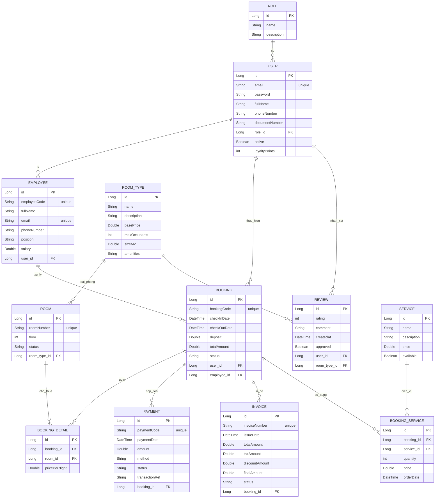
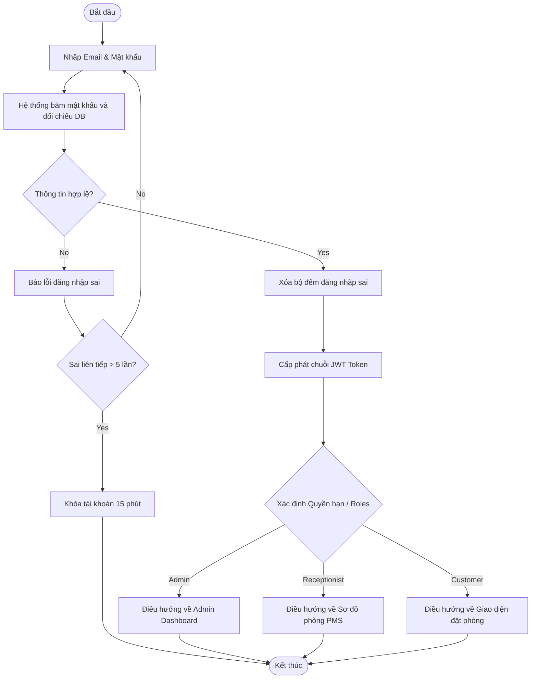
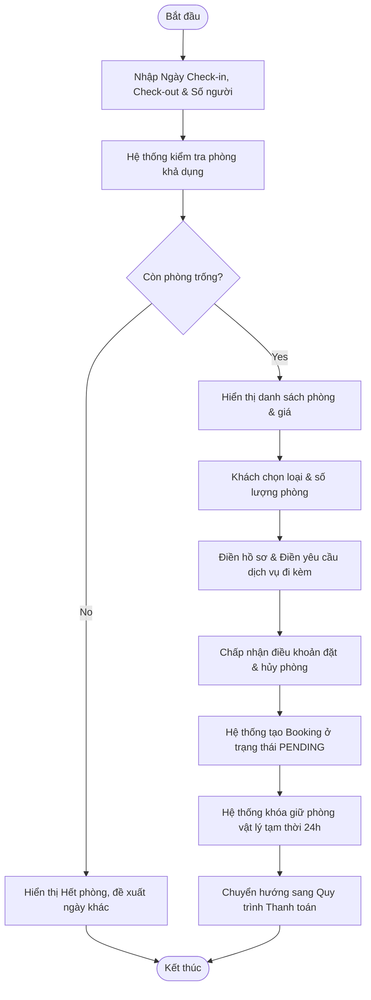
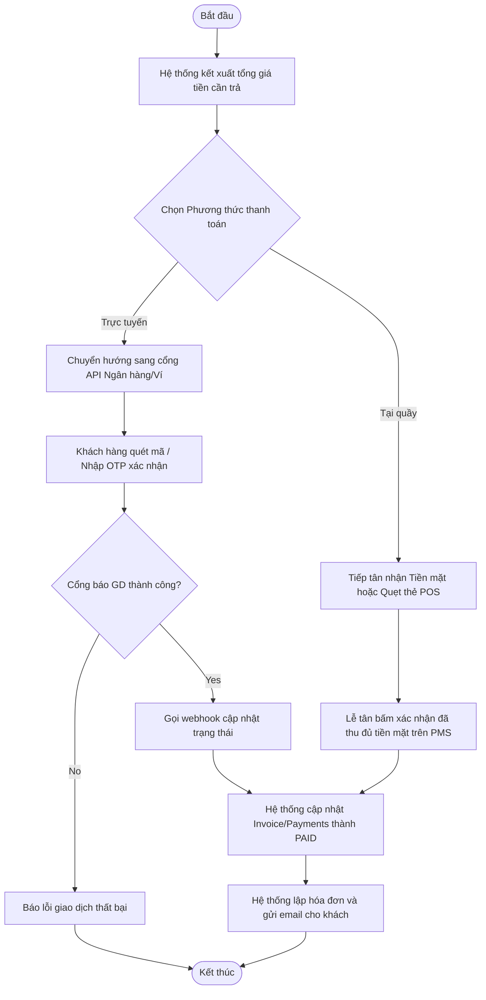
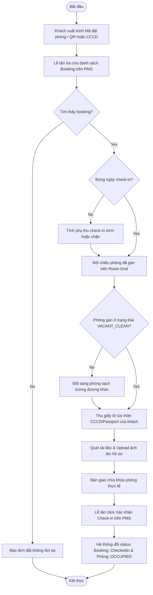
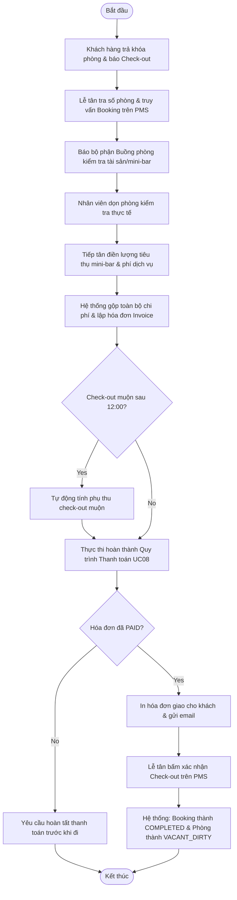
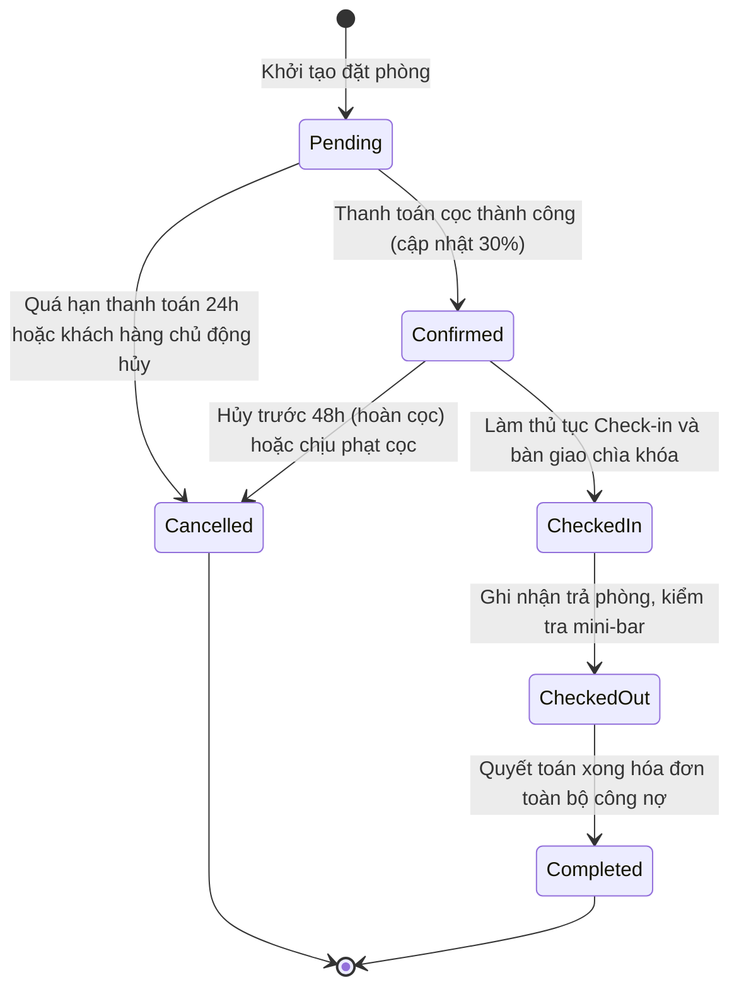
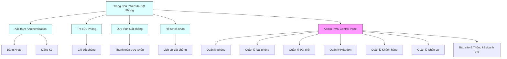

# FILE: SRS_Introduction.md

# TÀI LIỆU ĐẶC TẢ YÊU CẦU PHẦN MỀM (SRS)
## HỆ THỐNG QUẢN LÝ KHÁCH SẠN (HOTEL MANAGEMENT SYSTEM)

### PHẦN I: GIỚI THIỆU DỰ ÁN

#### 1. Mục đích tài liệu
Tài liệu Đặc tả Yêu cầu Phần mềm (Software Requirements Specification - SRS) này được biên soạn nhằm xác định và mô tả chi tiết các yêu cầu chức năng, yêu cầu phi chức năng, kiến trúc kỹ thuật và các ràng buộc hệ thống của dự án Hệ thống Quản lý Khách sạn. Tài liệu này đóng vai trò là:
- Cơ sở pháp lý và kỹ thuật thống nhất giữa khách hàng (chủ đầu tư/ban quản lý khách sạn) và nhóm phát triển dự án.
- Tài liệu định hướng chi tiết cho đội ngũ thiết kế giao diện (UI/UX designer), lập trình viên (Developer) và kiểm thử viên (Tester) trong suốt vòng đời phát triển phần mềm.
- Tài liệu tham khảo chính thức phục vụ công tác nghiệm thu, vận hành, bảo trì và nâng cấp hệ thống trong tương lai.

#### 2. Phạm vi tài liệu
Tài liệu này bao quát toàn bộ hoạt động thiết kế và triển khai Hệ thống Quản lý Khách sạn, cụ thể bao gồm:
- Đặc tả chi tiết các tác nhân (Actors) tham gia vào hệ thống.
- Đặc tả biểu đồ trường hợp sử dụng (Use Case Diagram), mô tả luồng nghiệp vụ chuẩn và luồng nghiệp vụ ngoại lệ.
- Mô tả các quy tắc nghiệp vụ (Business Rules), ràng buộc về tính bảo mật, hiệu năng và tính sẵn sàng của hệ thống.
- Định nghĩa các yêu cầu về cơ sở dữ liệu và hạ tầng công nghệ cần thiết.
- Tài liệu tập trung vào phân hệ quản lý nội bộ phục vụ nhân viên/quản lý khách sạn và phân hệ giao diện tương tác dành cho khách hàng đặt phòng trực tuyến.

#### 3. Tổng quan hệ thống
Hệ thống Quản lý Khách sạn (Hotel Management System - HMS) là giải pháp phần mềm tích hợp đa nền tảng, được thiết kế nhằm số hóa và tự động hóa toàn bộ quy trình vận hành của một cơ sở lưu trú từ quy mô trung bình đến cao cấp. Hệ thống được chia thành hai cấu phần cốt lõi:
- Phân hệ Khách hàng (Front-facing Portal): Trực quan hóa danh mục phòng, tích hợp công cụ tìm kiếm và lọc thông tin thời gian thực, tiến hành đặt phòng, thực hiện thanh toán trực tuyến và tự động quản lý lịch sử giao dịch cá nhân.
- Phân hệ Quản trị (Property Management System - PMS Dashboard): Cung cấp các công cụ vận hành cho nhân viên tiếp tân và nhà quản lý hỗ trợ xử lý thủ tục nhận/trả phòng nhanh chóng, đồng bộ trạng thái buồng phòng, xử lý sự cố bảo trì, lập hóa đơn tự động và kết xuất biểu đồ báo cáo tài chính.

#### 4. Mục tiêu dự án
Dự án được định hướng hoàn thành các mục tiêu chiến lược sau:
- Tối ưu hóa hiệu suất vận hành: Giảm thiểu 50% thời gian xử lý các thủ tục check-in/check-out truyền thống và hạn chế tối đa sai sót thủ công trong việc ghi nhận phòng trống hoặc trùng lịch (double-booking).
- Cải thiện trải nghiệm khách hàng: Rút ngắn hành trình đặt phòng trực tuyến của khách hàng xuống dưới 3 bước thao tác, tối ưu hóa giao diện hiển thị trên các thiết bị di động.
- Nâng cao năng lực quản lý và giám sát: Cung cấp số liệu thống kê thời gian thực về tỷ lệ lấp đầy phòng (occupancy rate), doanh thu theo ngày/tháng/năm và cơ cấu chi phí, giúp ban quản lý đưa ra quyết định thương mại kịp thời.
- Đảm bảo an toàn và bảo mật dữ liệu: Đảm bảo kiểm soát truy cập thông qua phân quyền nghiêm ngặt, mã hóa thông tin cá nhân của khách hàng và lịch sử giao dịch thanh toán để tuân thủ các quy định quốc tế về bảo vệ dữ liệu.

#### 5. Đối tượng sử dụng
Hệ thống được thiết kế để phân quyền và cung cấp giao diện phù hợp cho các nhóm đối tượng sau:
- 5.1. Khách hàng lưu trú (Guest): Tìm kiếm thông tin phòng, thực hiện đặt và hủy đặt phòng, sử dụng dịch vụ thanh toán, gửi đánh giá phản hồi sau thời gian lưu trú.
- 5.2. Nhân viên Tiếp tân (Receptionist): Quản lý sơ đồ phòng khách sạn, tiếp nhận các yêu cầu check-in/check-out trực tiếp, tạo mã khóa phòng cơ học/điện tử, lập hóa đơn dịch vụ và hỗ trợ khách hàng tại quầy.
- 5.3. Bộ phận Buồng phòng và Dịch vụ (Housekeeping & Maintenance Staff): Nhận thông tin cập nhật về nhu cầu dọn dẹp và bảo trì vật tư phòng nghỉ thông qua ứng dụng di động để phản hồi nhanh chóng trạng thái phòng sạch/bẩn/đang sửa chữa.
- 5.4. Quản lý Khách sạn (Hotel Manager): Giám sát toàn bộ hoạt động kinh doanh, phê duyệt các chương trình khuyến mãi, điều chỉnh biểu giá phòng linh hoạt, phê duyệt báo cáo tài chính định kỳ.
- 5.5. Quản trị viên Hệ thống (System Administrator): Quản lý danh mục tài khoản người dùng, cấu hình kết nối API của bên thứ ba, thực thi sao lưu cơ sở dữ liệu định kỳ và xử lý sự cố hạ tầng phần mềm.

#### 6. Công nghệ sử dụng
Hệ thống được xây dựng trên tầng cấu trúc công nghệ hiện đại, hướng tới kiến trúc dịch vụ chịu tải tốt và bảo mật cao:
- 6.1. Công nghệ phía Giao diện (Front-end):
  - Framework chính: React.js (dành cho Web Portal của khách hàng và trang quản trị) giúp tối ưu hóa khả năng kết xuất dữ liệu động.
  - Ngôn ngữ lập trình: HTML5, CSS3, JavaScript (ES6+).
- 6.2. Công nghệ phía Máy chủ (Back-end):
  - Ngôn ngữ và Framework cốt lõi: Java 17 kết hợp Spring Boot Framework (Spring Security, Spring Data JPA) nhằm duy trì độ ổn định cao và dễ dàng mở rộng cấu trúc.
  - Công cụ quản lý thư viện phụ thuộc: Maven hoặc Gradle.
- 6.3. Hệ quản trị và Lưu trữ Cơ sở dữ liệu (Database Management System):
  - Cơ sở dữ liệu quan hệ (RDBMS): MySQL hoặc PostgreSQL nhằm lưu trữ các thực thể thông tin mang tính chuyển mạch giao dịch cao (như Booking, Payment, Customer).
  - Cơ sở dữ liệu lưu trữ đệm (Caching): Redis để tăng tốc độ truy vấn danh sách phòng khả dụng.
- 6.4. Hạ tầng và Công cụ phụ trợ:
  - Công nghệ container hóa: Docker phục vụ môi trường phát triển và triển khai hệ thống độc lập.
  - Cổng thanh toán tích hợp: Tiền mã hóa hoặc các API ngân hàng nội địa phổ biến thông qua môi trường Sandbox kiểm thử.

#### 7. Thuật ngữ viết tắt
Bảng dưới đây định nghĩa cụ thể các chữ viết tắt và thuật ngữ chuyên ngành được sử dụng liên tục trong phạm vi tài liệu này:

| Thuật ngữ | Tiếng Anh đầy đủ | Định nghĩa dịch thuật / Ý nghĩa |
|---|---|---|
| SRS | Software Requirements Specification | Tài liệu Đặc tả Yêu cầu Phần mềm |
| HMS | Hotel Management System | Hệ thống Quản lý Khách sạn |
| PMS | Property Management System | Hệ thống Quản lý Vận hành Cơ sở lưu trú |
| UI/UX | User Interface / User Experience | Giao diện người dùng / Trải nghiệm khách hàng |
| RBAC | Role-Based Access Control | Kiểm soát quyền truy cập dựa trên vai trò người dùng |
| API | Application Programming Interface | Giao diện lập trình ứng dụng kết nối hai hệ thống |
| RDBMS | Relational Database Management System | Hệ quản trị cơ sở dữ liệu quan hệ |
| Check-in | Customer Check-in Procedure | Thủ tục tiếp nhận khách hàng nhận phòng |
| Check-out | Customer Check-out Procedure | Thủ tục thanh toán và trả phòng |
| Double-booking | Double Booking Error | Lỗi đặt trùng (thiết lập hai lượt đặt phòng cùng một thời điểm trực tiếp/gián tiếp) |

#### 8. Phạm vi chức năng
Để đạt được mục tiêu tổng thể, hệ thống được cấu trúc hóa thành các phân hệ chức năng tương ứng với sơ đồ vận hành sau:
- 8.1. Phân hệ Quản lý Đặt phòng trực tuyến (Booking Management):
  - Cho phép người dùng tìm kiếm phòng theo ngày, số lượng khách và khoảng giá mong muốn.
  - Xem thông tin mô tả chi tiết, hình ảnh căn hộ/phòng nghỉ, tiện ích đi kèm và điều khoản hủy phòng.
  - Thực hiện quy trình điền thông tin và tạo yêu cầu đặt phòng tạm thời trong thời gian chờ thanh toán xác thực.
- 8.2. Phân hệ Quản lý Vận hành Quầy tiếp tân (Front Office Management):
  - Hiển thị trực quan Bản đồ/Sơ đồ phòng (Room Grid) theo thời gian thực (Trống, Đang dọn dẹp, Đang ở, Bảo trì).
  - Xử lý nhận phòng tức thời (Walk-in booking) cho khách vãng lai và check-in nhanh đối với khách đặt trước.
  - Cập nhật thông tin bổ sung và di chuyển khách sang phòng khác khi phát sinh sự cố kỹ thuật.
- 8.3. Phân hệ Quản lý Dịch vụ và Tiêu dùng (POS & Service Integration):
  - Ghi nhận việc sử dụng các dịch vụ bổ sung của khách hàng trong thời gian lưu trú (dịch vụ ăn uống tại phòng, spa, giặt là, thuê phương tiện di chuyển).
  - Tự động đẩy chi phí phát sinh vào tài khoản phòng của khách hàng để thanh toán tổng thể khi trả phòng.
- 8.4. Phân hệ Quản lý Thanh toán và Hóa đơn (Billing & Invoicing):
  - Tích hợp cổng thanh toán trực tuyến để tự động xử lý tiền đặt cọc hoặc thanh toán toàn bộ chi phí đặt phòng.
  - Tính toán và lập hóa đơn chi tiết (chức năng tách hóa đơn hoặc gộp hóa đơn theo nhóm), hỗ trợ áp dụng mã giảm giá và thuế giá trị gia tăng (VAT).
- 8.5. Phân hệ Quản lý Buồng phòng (Housekeeping Audit):
  - Cho phép nhân viên buồng phòng nhận thông tin phòng trống cần dọn dẹp trên giao diện thiết bị cầm tay.
  - Cập nhật tức thời trạng thái phòng từ "Dơ" sang "Sạch" lên hệ thống chính sau khi hoàn tất công việc.
- 8.6. Phân hệ Báo cáo và Quản lý Kinh doanh (Management Reporting):
  - Kết xuất báo cáo doanh số, dự báo công suất sử dụng phòng nghỉ và doanh thu trung bình trên mỗi phòng trống (REVPAR).
  - Thống kê nguồn đặt phòng hiệu quả nhất để thiết lập chính sách giá bán phù hợp.


---


# FILE: SRS_Business_Analysis.md

# TÀI LIỆU PHÂN TÍCH NGHIỆP VỤ HỆ THỐNG
## DỰ ÁN: HỆ THỐNG QUẢN LÝ KHÁCH SẠN (HOTEL MANAGEMENT SYSTEM)

### PHẦN II: PHÂN TÍCH NGHIỆP VỤ (BUSINESS ANALYSIS)

#### 1. Bài toán hiện tại
Qua quá trình khảo sát thực tế tại các khách sạn quy mô vừa và nhỏ vận hành theo phương thức truyền thống, hệ thống quản trị hiện tại gặp phải nhiều bất cập và hạn chế nghiêm trọng. Hệ trạng này được khái quát qua bốn nhóm vấn đề chính dưới đây:
- 1.1. Phương thức lưu trữ dữ liệu phân mảnh: Việc ghi nhận thông tin đặt phòng, lịch sử khách hàng và thông tin thanh toán chủ yếu được thực hiện thủ công trên sổ sách hoặc các bảng tính Excel riêng lẻ. Điều này dẫn đến nguy cơ cao về sai sót dữ liệu, thất lạc thông tin và khó truy xuất lịch sử giao dịch khi cần thiết.
- 1.2. Mất đồng bộ trạng thái phòng: Sự trao đổi thông tin giữa bộ phận tiếp tân và bộ phận buồng phòng diễn ra gián tiếp (qua bộ đàm hoặc kiểm tra trực tiếp). Khi khách trả phòng, tiếp tân không được cập nhật ngay trạng thái dọn dẹp của phòng đó, dẫn đến việc phòng đã sạch nhưng vẫn để trống trên hệ thống, hoặc phòng chưa dọn xong nhưng tiếp tân đã giao cho khách mới.
- 1.3. Rủi ro trùng lịch đặt phòng (Double-booking): Khi khách sạn phân phối phòng trên nhiều kênh bán hàng khác nhau (tại quầy, qua điện thoại, mạng xã hội, các đại lý du lịch trực tuyến - OTA) mà không có hệ thống quản lý tập trung, việc cập nhật số lượng phòng khả dụng thường bị trễ, dẫn đến tình trạng bán một phòng cho hai khách hàng khác nhau trong cùng một khung thời gian.
- 1.4. Quy trình tính toán hóa đơn phức tạp và dễ nhầm lẫn: Khách hàng thường sử dụng thêm các dịch vụ bổ trợ trong thời gian lưu trú (như ăn uống tại nhà hàng, thuê xe, giặt là, mini-bar). Việc ghi nhận hóa đơn dịch vụ riêng lẻ bằng giấy tờ thủ công dễ bị bỏ quên hoặc tính toán sai sót khi tổng hợp hóa đơn thanh toán cuối cùng lúc khách trả phòng.

#### 2. Giải pháp đề xuất
Để giải quyết triệt để các hạn chế nêu trên, giải pháp đề xuất là xây dựng "Hệ thống Quản lý Khách sạn" tích hợp toàn diện. Hệ thống sẽ xây dựng một kiến trúc dữ liệu tập trung dựa trên đám mây (Cloud-based), cung cấp hai phân hệ tương tác chính:
- 2.1. Phân hệ vận hành nội bộ (Back-office System): Cho phép doanh nghiệp quản lý tập trung toàn bộ danh mục phòng nghỉ, hồ sơ khách hàng, hóa đơn thanh toán và báo cáo doanh thu. Trạng thái phòng được số hóa dưới dạng sơ đồ lưới trực quan (Room Grid), cập nhật tự động theo thời gian thực dựa trên các thao tác của nhân viên tiếp tân và bộ phận buồng phòng.
- 2.2. Phân hệ đặt phòng trực tuyến (Booking Engine Portal): Cung cấp cho khách hàng giao diện tra cứu thông tin phòng nghỉ trống, giá cả niêm yết theo mùa vụ và tiện ích đi kèm. Khách hàng có thể thao tác đặt phòng và đặt cọc/thanh toán trực tuyến thông qua cổng thanh toán bảo mật. Mọi thông tin đặt phòng từ cổng trực tuyến sẽ ngay lập tức được đồng bộ vào cơ sở dữ liệu cốt lõi của hệ thống để phân khóa phòng tự động, giảm thiểu rủi ro trùng lịch.

#### 3. Quy trình hoạt động của khách sạn
Quy trình nghiệp vụ thực tế của khách sạn khi áp dụng hệ thống được chuẩn hóa qua năm giai đoạn liên kết chặt chẽ:
- 3.1. Quy trình đặt phòng (Reservation):
  - Khách hàng thực hiện tìm kiếm phòng trên website theo ngày đến, ngày đi và số lượng khách.
  - Hệ thống kiểm tra cơ sở dữ liệu phòng có sẵn và hiển thị kết quả tương ứng.
  - Khách hàng chọn loại phòng mong muốn, cung cấp thông tin cá nhân và thực hiện thanh toán đặt cọc trực tuyến.
  - Hệ thống ghi nhận yêu cầu, cập nhật trạng thái phòng thành "Đã đặt trước" (Reserved) trong khoảng thời gian đã đăng ký, và tự động gửi email xác nhận đặt phòng (Booking Confirmation) kèm mã QR hoặc mã đặt phòng cho khách hàng.
- 3.2. Quy trình nhận phòng (Check-in):
  - Khách hàng đến quầy tiếp tân, xuất trình giấy tờ tùy thân (CCCD/Passport) và mã đặt phòng.
  - Nhân viên tiếp tân tra cứu mã đặt phòng trên hệ thống, xác minh thông tin và đối chiếu trạng thái phòng thực tế trên sơ đồ phòng.
  - Tiếp tân tiến hành thủ tục nhận phòng trên hệ thống: Cập nhật trạng thái phòng sang "Có khách" (Occupied), bàn giao chìa khóa cho khách.
  - Trong trường hợp khách vãng lai đặt phòng trực tiếp tại quầy (Walk-in), tiếp tân kiểm tra phòng trống trên hệ thống, lập hồ sơ đặt phòng mới và thực hiện quy trình nhận phòng tương tự.
- 3.3. Quy trình tiêu dùng dịch vụ (Service Consumption):
  - Trong quá trình lưu trú, khách hàng yêu cầu các dịch vụ như ăn uống tại phòng (Room Service), giặt là hoặc mini-bar.
  - Nhân viên thuộc bộ phận dịch vụ thực hiện cung cấp dịch vụ và ghi nhận giao dịch trực tiếp trên phân hệ dịch vụ của hệ thống, chỉ định chi phí phát sinh này vào đúng số phòng lưu trú của khách.
  - Hệ thống tự động ghi nợ chi phí này vào tài khoản phòng của khách hàng để chuẩn bị cho bước thanh toán cuối cùng.
- 3.4. Quy trình dọn dẹp vệ sinh (Housekeeping):
  - Vào thời gian quy định hàng ngày hoặc ngay sau khi khách hàng làm thủ tục trả phòng, hệ thống tự động thiết lập trạng thái phòng cần dọn dẹp là "Chưa dọn dẹp" (Dirty).
  - Nhân viên buồng phòng truy cập ứng dụng hệ thống trên thiết bị di động, nhận danh sách phòng được phân công và thực hiện dọn dẹp.
  - Sau khi hoàn tất và kiểm tra chất lượng phòng đạt chuẩn, nhân viên buồng phòng cập nhật trạng thái phòng thành "Sạch sẽ" (Clean) trên hệ thống. Tiếp tân ngay lập tức nhìn thấy trạng thái này và sẵn sàng bàn giao cho lượt khách tiếp theo.
- 3.5. Quy trình trả phòng (Check-out):
  - Khách hàng đến quầy tiếp tân yêu cầu trả phòng và trả lại chìa khóa.
  - Nhân viên tiếp tân chọn chức năng trả phòng trên hệ thống. Hệ thống tự động truy vấn và tổng hợp toàn bộ chi phí đặt phòng còn lại kết hợp với các dịch vụ phụ trợ đã ghi nhận trong thời gian lưu trú để xuất hóa đơn thanh toán chi tiết.
  - Nhân viên tiếp tân in hóa đơn kiểm tra cùng khách hàng, xử lý nhận thanh toán (tiền mặt, thẻ ngân hàng, cổng thanh toán trực tuyến).
  - Xác nhận hoàn tất thanh toán trên hệ thống: Trạng thái phòng chuyển sang "Chưa dọn dẹp" (Dirty) để chờ dọn dẹp, đồng thời dữ liệu giao dịch được chuyển vào lịch sử doanh thu của ngày.

#### 4. Đối tượng tham gia hệ thống
Các đối tượng (gồm tác nhân bên trong và bên ngoài) tương tác trực tiếp hoặc gián tiếp với hệ thống bao gồm:
- 4.1. Khách lưu trú (Guest): Là nhóm đối tượng bên ngoài sử dụng hệ thống để tra cứu, đặt phòng và tiến hành thanh toán trực tuyến.
- 4.2. Nhân viên Tiếp tân (Receptionist): Là người trực tiếp vận hành hệ thống tại quầy lễ tân để bán phòng tại quầy, làm thủ tục nhận phòng, trả phòng và xuất hóa đơn dịch vụ.
- 4.3. Nhân viên Buồng phòng (Housekeeper): Sử dụng ứng dụng trên thiết bị di động để phối hợp cập nhật tiến độ dọn dẹp phòng trống/bẩn trực tiếp lên cơ sở dữ liệu chung.
- 4.4. Quản lý Khách sạn (Hotel Manager): Thiết lập định cấu hình kinh doanh (giá phòng, dịch vụ, khuyến mãi) và khai thác hệ thống báo cáo số liệu kinh doanh.
- 4.5. Bộ phận Kế toán (Accountant): Truy cập hệ thống để đối soát hóa đơn thanh toán trực tuyến, đối chiếu dữ liệu thẻ ngân hàng, tiền mặt và hỗ trợ lập báo cáo doanh thu tài chính.
- 4.6. Cổng thanh toán liên kết (Payment Gateway Partner): Đối tác cung cấp API xử lý chuyển tiền giữa khách hàng và tài khoản ngân hàng của khách sạn.

#### 5. Các vai trò trong hệ thống
Để đảm bảo an toàn thông tin và tính chuyên trách trong vận hành, hệ thống áp dụng cơ chế kiểm soát truy cập dựa trên vai trò (Role-Based Access Control - RBAC) với năm nhóm quyền hạn sau:
- 5.1. Vai trò Quản trị viên (Admin): Sở hữu toàn quyền cấu hình kỹ thuật của hệ thống, quản lý danh sách và cấp quyền tài khoản nội bộ (tiếp tân, quản lý, buồng phòng), sao lưu dữ liệu và cấu hình hệ thống máy chủ.
- 5.2. Vai trò Quản lý (Manager): Có quyền thiết lập khung giá phòng, định cấu hình về chính sách dịch vụ, xem và xuất các báo cáo tài chính, báo cáo doanh thu, thống kê hiệu suất hoạt động nhưng không được phép sửa đổi mã nguồn hoặc cấu hình kỹ thuật sâu của hệ thống.
- 5.3. Vai trò Tiếp tân (Receptionist): Có quyền thực hiện các thao tác quản lý sơ đồ phòng, tiếp nhận đặt phòng trực tiếp, thực hiện quy trình Check-in, Check-out, thêm phụ thu dịch vụ vào hóa đơn phòng và thực hiện hủy đặt phòng dựa trên chính sách khách sạn.
- 5.4. Vai trò Buồng phòng (Housekeeping): Có quyền xem danh sách phòng cần dọn dẹp, dọn phòng dở dang và cập nhật trạng thái dọn dẹp hoàn tất cho từng phòng được phân công.
- 5.5. Vai trò Khách hàng (Customer): Có quyền đăng ký, đăng nhập tài khoản cá nhân để cập nhật hồ sơ, quản lý danh sách phòng đã đặt, hủy đặt phòng trực tuyến (nếu đủ điều kiện hủy), và tích điểm thành viên.

#### 6. Mục tiêu của hệ thống
Hệ thống Quản lý Khách sạn được xây dựng nhằm đạt được các mục tiêu kỹ thuật và vận hành cụ thể sau:
- 6.1. Hợp nhất luồng thông tin: Xây dựng cơ sở dữ liệu đồng bộ nhất quán giữa tất cả các vị trí nghiệp vụ tại khách sạn, triệt tiêu hoàn toàn sự sai lệch thông tin giữa bộ phận buồng phòng và lễ tân.
- 6.2. Kiểm soát dòng tiền và hóa đơn dịch vụ: Hạn chế tỷ lệ thất thoát doanh thu dịch vụ phụ trợ xuống mức 0% nhờ tính năng tự động ghi nhận trực tiếp chi phí dịch vụ vào mã phòng quản lý trên hệ thống.
- 6.3. Tốc độ phản hồi và hiệu năng: Hệ thống trang bị khả năng tải nhanh sơ đồ phòng trống dưới 1 giây, giúp nhân viên tiếp tân xử lý nghiệp vụ check-in/check-out cho một khách hàng dưới 2 phút.
- 6.4. Tính sẵn sàng cao (High Availability): Đảm bảo hệ thống hoạt động liên tục với chỉ số Uptime tối thiểu đạt 99.9% mỗi năm, cho phép khách hàng đặt phòng trực tuyến mọi lúc.

#### 7. Lợi ích mang lại
Việc đưa Hệ thống Quản lý Khách sạn vào vận hành mang lại những lợi ích thiết thực cho ba nhóm đối tượng cốt lõi:
- 7.1. Lợi ích đối với Khách hàng:
  - Chủ động tìm kiếm phòng trống và đặt phòng nhanh chóng mà không cần qua trung gian hoặc gọi điện trực tiếp.
  - Nhận hóa đơn minh bạch, chi tiết, tránh các tranh chấp về chi phí phụ thu phát sinh khi trả phòng.
  - Tiết kiệm thời gian chờ làm thủ tục hành chính tại quầy lễ tân nhờ hệ thống xác minh nhanh.
- 7.2. Lợi ích đối với Nhân viên vận hành:
  - Giảm áp lực công việc hành chính nhờ quy trình tự động hóa các thao tác lặp đi lặp lại.
  - Sử dụng giao diện sơ đồ số hóa trực quan giúp nắm bắt nhanh toàn diện thông tin sơ đồ phòng nghỉ trống sạch chỉ trong vài giây.
  - Dễ dàng trao đổi công việc liên phòng ban mà không cần di chuyển thủ công hay gọi điện nhiều lần.
- 7.3. Lợi ích đối với Ban Quản lý và Chủ đầu tư:
  - Nắm bắt được tình hình kinh doanh thực tế thông qua các số liệu báo cáo tự động cập nhật, loại bỏ rủi ro gian lận tài chính từ phía nhân viên tiếp tân.
  - Cắt giảm chi phí in ấn sổ sách giấy tờ hành chính và chi phí nhân sự trung gian quản lý thông tin.
  - Nâng cao tính chuyên nghiệp trong công tác phục vụ khách hàng, tạo dựng uy tín thương hiệu vững chắc trên thị trường lưu trú.


---


### PHẦN II BỔ SUNG: SƠ ĐỒ HỆ THỐNG VÀ PHÂN QUYỀN

#### 2.1 SƠ ĐỒ QUAN HỆ ĐỐI TƯỢNG (OBJECT RELATIONSHIP DIAGRAM)
Sơ đồ cơ sở dữ liệu thực tế (ERD) thể hiện cấu trúc 12 thực thể chính của Hệ thống Quản lý Khách sạn cùng các thuộc tính khóa chính (PK), khóa ngoại (FK) và mối tương quan số lượng (Cardinality):



#### 2.2 SƠ ĐỒ USE CASE TOÀN HỆ THỐNG (USE CASE DIAGRAM)

```mermaid
graph TD
    classDef actor fill:#f9c,stroke:#333,stroke-width:2px;
    classDef uc fill:#dff,stroke:#333,stroke-width:1px;

    Customer[Customer / Khách hàng]:::actor
    Receptionist[Receptionist / Lễ tân]:::actor
    Admin[Admin / Quản trị viên]:::actor

    UC01(UC01: Đăng ký):::uc
    UC02(UC02: Đăng nhập):::uc
    UC03(UC03: Quản lý tài khoản):::uc
    UC04(UC04: Xem phòng):::uc
    UC05(UC05: Chi tiết phòng):::uc
    UC06(UC06: Đặt phòng):::uc
    UC07(UC07: Hủy đặt phòng):::uc
    UC08(UC08: Thanh toán):::uc
    UC09(UC09: Quản lý loại phòng):::uc
    UC10(UC10: Quản lý phòng):::uc
    UC11(UC11: Quản lý Booking):::uc
    UC12(UC12: Quản lý User):::uc
    UC13(UC13: Quản lý Employee):::uc
    UC14(UC14: Dashboard):::uc
    UC15(UC15: Đánh giá):::uc

    Customer --> UC01
    Customer --> UC02
    Customer --> UC03
    Customer --> UC04
    Customer --> UC05
    Customer --> UC06
    Customer --> UC07
    Customer --> UC08
    Customer --> UC15

    Receptionist --> UC02
    Receptionist --> UC03
    Receptionist --> UC06
    Receptionist --> UC07
    Receptionist --> UC08
    Receptionist --> UC11

    Admin --> UC02
    Admin --> UC03
    Admin --> UC09
    Admin --> UC10
    Admin --> UC11
    Admin --> UC12
    Admin --> UC13
    Admin --> UC14
```



#### 2.3 SƠ ĐỒ LUỒNG HOẠT ĐỘNG (ACTIVITY DIAGRAMS)

##### 1. Luồng hoạt động: Đăng nhập


##### 2. Luồng hoạt động: Đặt phòng


##### 3. Luồng hoạt động: Thanh toán


##### 4. Luồng hoạt động: Check-in


##### 5. Luồng hoạt động: Check-out


#### 2.4 SƠ ĐỒ CHUYỂN TRẠNG THÁI (STATE DIAGRAM FOR BOOKING)



#### 2.5.1 PHÂN QUYỀN CHỨC NĂNG (FUNCTIONAL AUTHORIZATION MATRIX)

| Mã UC | Tên chức năng / Nghiệp vụ | Khách hàng (Customer) | Tiếp tân (Receptionist) | Quản trị viên (Admin) |
|---|---|:---:|:---:|:---:|
| UC01 | Đăng ký tài khoản | C, R | R | R, U, D |
| UC02 | Đăng nhập hệ thống | C, R | R | R, U, D |
| UC03 | Quản lý tài khoản cá nhân | R, U | R, U | R, U, D |
| UC04 | Xem danh sách phòng | R | R | R, U, D |
| UC05 | Xem chi tiết phòng | R | R | R, U, D |
| UC06 | Đặt phòng (Booking) | C, R, U | C, R, U | C, R, U, D |
| UC07 | Hủy đơn đặt phòng | U | U | U, D |
| UC08 | Thanh toán & Lập hóa đơn | C, R | C, R, U | C, R, U, D |
| UC09 | Quản lý hoặc điều chỉnh loại phòng | - | R | C, R, U, D |
| UC10 | Quản lý phòng vật lý | - | R, U (Chuyển trạng thái) | C, R, U, D |
| UC11 | Quản lý Booking toàn cục | - | C, R, U | C, R, U, D |
| UC12 | Quản lý người dùng (Khách hàng) | - | R | C, R, U, D |
| UC13 | Quản lý nhân sự | - | - | C, R, U, D |
| UC14 | Xem Dashboard & Thống kê | - | - | R |

> [!NOTE]
> Ký hiệu quyền: **C** (Create), **R** (Read), **U** (Update), **D** (Delete). Dấu gạch ngang (**-**) biểu thị không được phân quyền tiếp cận.

#### 2.5.2 PHÂN QUYỀN DỰ LIỆU (DATA AUTHORIZATION SPECIFICATION)

| Vai trò người dùng (Role) | Phạm vi tiếp cận và giới hạn quyền hạn dữ liệu |
|---|---|
| **Khách hàng (Customer)** | - Chỉ xem, chỉnh sửa thông tin hồ sơ của chính mình.<br>- Chỉ xem lịch sử giao dịch thanh toán và danh sách Booking thuộc sở hữu tài khoản cá nhân.<br>- Xem thông tin phòng trống công khai trên trang chủ. |
| **Tiếp tân (Receptionist)**| - Xem toàn bộ sơ đồ buồng phòng thực tế của khách sạn.<br>- Xem thông tin liên lạc và chi tiết các hóa đơn, đặt phòng của tất cả khách hàng.<br>- Không được sửa đổi bảng biểu giá gốc hoặc cấu hình phòng vật lý tĩnh. |
| **Quản trị viên (Admin)** | - Toàn quyền truy cập và thực thi các thao tác CRUD trên tất cả các bảng dữ liệu.<br>- Quản lý thông tin mật khẩu nhân viên đã băm, cấp phát ca và phân quyền truy cập hệ thống.<br>- Đọc và đối soát toàn bộ lịch sử Audit Log hệ thống. |

#### 2.6 SITE MAP HỆ THỐNG (SITEMAP DIAGRAM)




---

# FILE: SRS_Actors_Specification.md

# TÀI LIỆU ĐẶC TẢ TÁC NHÂN HỆ THỐNG
## DỰ ÁN: HỆ THỐNG QUẢN LÝ KHÁCH SẠN (HOTEL MANAGEMENT SYSTEM)

### PHẦN III: ĐẶC TẢ CHI TIẾT ACTOR (IEEE SRS STANDARDS)

Để xác định rõ ranh giới hệ thống cũng như tính chuyên trách trong từng giao dịch nghiệp vụ, dưới đây là bảng đặc tả chi tiết của ba tác nhân (Actors) cốt lõi tương tác với Hệ thống Quản lý Khách sạn bao gồm: Khách hàng (Customer), Nhân viên Tiếp tân (Receptionist), và Quản trị viên Hệ thống (Admin).

#### 1. Đặc tả tác nhân: Khách hàng (Customer)

| Tiêu chuẩn IEEE | Đặc tả chi tiết nghiên cứu nghiệp vụ |
|---|---|
| Tên tác nhân (Actor Name) | Khách hàng (Customer) |
| Loại tác nhân (Actor Type) | Tác nhân bên ngoài (External Actor) / Tác nhân chính (Primary Actor) trong luồng đặt phòng. |
| Mô tả vai trò (Role Description) | Là cá nhân hoặc tổ chức sử dụng dịch vụ lưu trú của khách sạn. Khách hàng tương tác trực tiếp với phân hệ tìm kiếm và đăng ký dịch vụ trực tuyến để đáp ứng nhu cầu thuê phòng và thanh toán hóa đơn từ xa. |
| Mức độ quyền hạn (Authorization Level) | - Quyền hạn mức độ thấp đối với dữ liệu hệ thống.<br>- Chỉ có quyền tạo, đọc, cập nhật và xóa thông tin trên các bản ghi liên quan trực tiếp đến hồ sơ cá nhân và các giao dịch đặt phòng của chính họ.<br>- Tuyệt đối không có quyền truy cập vào bảng điều khiển quản trị nội bộ hoặc sảnh thao tác của nhân viên. |
| Các chức năng được phép sử dụng (Allowed Functions) | - Tra cứu phòng trống: Xem danh sách phòng, mô tả phòng, giá cả và tiện ích.<br>- Quản lý tài khoản: Đăng ký thành viên, đăng nhập hệ thống, cập nhật hồ sơ cá nhân.<br>- Quản lý đặt phòng: Thiết lập yêu cầu đặt phòng mới, chọn phương thức đặt phòng trực tuyến.<br>- Thực hiện thanh toán: Đặt cọc hoặc thanh toán đầy đủ qua cổng liên kết ngân hàng/thẻ tín dụng.<br>- Xem lịch sử giao dịch: Theo dõi các hóa đơn và đặt phòng hiện tại hoặc quá khứ.<br>- Hủy đặt phòng: Thực hiện yêu cầu hủy phòng theo chính sách thời gian quy định.<br>- Gửi phản hồi: Đánh giá chất lượng dịch vụ phòng nghỉ sau khi check-out. |
| Mối quan hệ với hệ thống (System Relationship) | - Tương tác qua giao diện đồ họa web của Khách hàng (Customer Portal Web Client).<br>- Gửi các yêu cầu xử lý (HTTP Requests) tới hệ thống máy chủ để truy vấn danh sách phòng khả dụng theo khoảng thời gian thực tế.<br>- Kích hoạt cổng thanh toán trung gian để thông báo xác nhận trạng thái hóa đơn cho hệ thống. |

---

#### 2. Đặc tả tác nhân: Nhân viên Tiếp tân (Receptionist)

| Tiêu chuẩn IEEE | Đặc tả chi tiết nghiên cứu nghiệp vụ |
|---|---|
| Tên tác nhân (Actor Name) | Nhân viên Tiếp tân (Receptionist) |
| Loại tác nhân (Actor Type) | Tác nhân bên trong (Internal Actor) / Tác nhân vận hành trực tiếp hệ thống. |
| Mô tả vai trò (Role Description) | Là nhân viên làm việc tại quầy lễ tân của khách sạn. Chịu trách nhiệm trực tiếp trong quy trình tiếp đón khách, xử lý nghiệp vụ giao phòng, ghi nhận dịch vụ phát sinh tại chỗ và thực hiện thu ngân khi kết thúc thời gian lưu trú của khách hàng. |
| Mức độ quyền hạn (Authorization Level) | - Quyền hạn mức độ trung bình.<br>- Được cấp quyền Đọc và Ghi (Read/Write) đối với kho dữ liệu về trạng thái phòng thực tế, thông tin lưu trú của khách hàng và hóa đơn phát sinh hàng ngày.<br>- Không có quyền cập nhật bảng cấu hình hệ thống, không có quyền xóa các bản ghi lịch sử hóa đơn dịch vụ đã lưu (chỉ có quyền điều chỉnh/hủy dưới sự phê duyệt của quản lý). |
| Các chức năng được phép sử dụng (Allowed Functions) | - Bán phòng tại quầy (Walk-in booking): Tạo đơn đặt phòng trực tiếp cho khách không đặt trước.<br>- Quản lý sơ đồ phòng (Room Grid Management): Cập nhật thủ công hoặc theo dõi trạng thái hiện thời của hệ thống buồng phòng.<br>- Làm thủ tục Check-in: Xác minh hồ sơ đặt chỗ, cập nhật giấy tờ tùy thân của khách và chuyển trạng thái phòng sang "Có khách".<br>- Quản lý dịch vụ đính kèm: Thêm chi phí phát sinh dịch vụ (giặt là, minibar, ăn uống) vào mã phòng lưu trú của khách.<br>- Thay đổi phòng (Room Change): Chuyển khách sang phòng khác khi có yêu cầu hợp lệ.<br>- Làm thủ tục Check-out: Tính toán tổng hóa đơn dựa trên dữ liệu phòng, nhận thanh toán trực tiếp, in hóa đơn và giải phóng phòng về trạng thái cần dọn dẹp.<br>- Xử lý hủy đặt phòng: Thực hiện hủy giao dịch đặt trước cho khách hàng khi có cuộc gọi hỗ trợ trực tiếp. |
| Mối quan hệ với hệ thống (System Relationship) | - Sử dụng thiết bị máy tính trạm đặt tại quầy lễ tân để tương tác liên tục với phân hệ Quản lý Vận hành (PMS Dashboard).<br>- Nhập liệu dữ liệu khách hàng thực tế và ghi nhận tương tác buồng phòng trong ngày.<br>- Tiếp nhận trực tiếp các cảnh báo về phòng quá hạn check-in hoặc các phòng sẵn sàng bàn giao từ khối dọn phòng dể điều phối khách hàng hợp lý. |

---

#### 3. Đặc tả tác nhân: Quản trị viên (Admin)

| Tiêu chuẩn IEEE | Đặc tả chi tiết nghiên cứu nghiệp vụ |
|---|---|
| Tên tác nhân (Actor Name) | Quản trị viên Hệ thống (Admin) |
| Loại tác nhân (Actor Type) | Tác nhân bên trong (Internal Actor) / Tác nhân quản trị tối cao (Super User). |
| Mô tả vai trò (Role Description) | Là kỹ sư CNTT hoặc người chịu trách nhiệm kỹ thuật cao nhất chịu trách nhiệm bảo đảm tính ổn định, thiết lập cấu hình nền tảng cấu phần nghiệp vụ và kiểm soát an toàn bảo mật cho toàn bộ hệ thống lưu trữ dữ liệu. |
| Mức độ quyền hạn (Authorization Level) | - Quyền hạn mức độ cao nhất (Full CRUD - Create, Read, Update, Delete).<br>- Toàn quyền thay đổi kiến trúc cơ sở dữ liệu mẫu, thiết lập định cấu hình tích hợp phần mềm của bên thứ ba.<br>- Quyền tạo quyền và phân quyền hệ thống cho các nhóm nhân sự thuộc khách sạn. |
| Các chức năng được phép sử dụng (Allowed Functions) | - Quản trị người dùng (User Management): Tạo mới tài khoản, phân vai trò, thu hồi hoặc vô hiệu hóa tài khoản của nhân viên tiếp tân, buồng phòng và kế toán.<br>- Cấu hình danh mục hệ thống: Định cấu hình danh sách phòng gốc, phân vùng phòng theo tầng, định dạng thuộc tính loại phòng (VIP, Deluxe, Standard).<br>- Tích hợp hệ thống thứ ba: Cấu hình cổng kết nối API của cổng thanh toán trực tuyến và đối tác gửi tin nhắn SMS/OTP.<br>- Sao lưu dữ liệu (Backup & Recovery): Thực thi lập lịch sao lưu cơ sở dữ liệu định kỳ dự phòng sự cố phần cứng.<br>- Kiểm tra nhật ký hệ thống (Audit Trail/Logs): Theo dõi và kiểm toán các hành vi thay đổi dữ liệu của nhân viên trong hệ thống nhằm ngăn ngừa rủi ro gian lận hoặc tìm lỗi hệ thống. |
| Mối quan hệ với hệ thống (System Relationship) | - Tương tác trực tiếp với Cổng quản trị máy chủ (Control Panel / Admin Panel) để can thiệp sâu vào cấu hình tĩnh của cơ sở dữ liệu và bảo mật hạ tầng mạng.<br>- Nhận toàn bộ cảnh báo lỗi ngoại lệ phần mềm để phục vụ công tác điều chỉnh và khắc phục lỗi vận hành dịch vụ trực tiếp. |


---


# FILE: SRS_Functional_Requirements.md

# TÀI LIỆU YÊU CẦU CHỨC NĂNG HỆ THỐNG
## DỰ ÁN: HỆ THỐNG QUẢN LÝ KHÁCH SẠN (HOTEL MANAGEMENT SYSTEM)

### PHẦN IV: ĐẶC TẢ YÊU CẦU CHỨC NĂNG (FUNCTIONAL REQUIREMENTS)

Dưới đây là các yêu cầu chức năng của Hệ thống Quản lý Khách sạn được cấu trúc hóa chi tiết theo 10 phân hệ nghiệp vụ (modules) cốt lõi của phần mềm.

---

#### 1. Phân hệ Xác thực (Authentication Module)
- **1.1. Mô tả**: Quản lý tính hợp lệ của người dùng khi truy cập vào hệ thống, cấp phát quyền hạn dựa trên vai trò phân loại tài khoản (Role-Based Access Control - RBAC) và bảo vệ an toàn cho các phiên làm việc của nhân viên cũng như khách hàng.
- **1.2. Danh sách chức năng**:
  - 1.2.1. Đăng nhập hệ thống (Login): Hỗ trợ khách hàng và nhân viên truy cập hệ thống qua tài khoản và mật khẩu đã mã hóa.
  - 1.2.2. Xác thực và Phân quyền (Verification & Authorization): Cấp phát JSON Web Token (JWT) chứa thông tin vai trò người dùng (Customer, Receptionist, Admin) để kiểm tra quyền truy cập API.
  - 1.2.3. Đăng xuất (Logout): Thu hồi Token hoạt động và kết thúc phiên làm việc an toàn của tài khoản.
  - 1.2.4. Khôi phục mật khẩu (Password Recovery): Hỗ trợ người dùng đặt lại mật khẩu thông qua mã xác minh gửi về email đăng ký.
- **1.3. Yêu cầu dữ liệu Đầu vào (Input)**:
  - Tên đăng nhập (Email hoặc số điện thoại), mật khẩu cá nhân.
  - Yêu cầu khôi phục: Địa chỉ email cần đặt lại mật khẩu, mã bảo mật OTP gửi về hộp thư.
- **1.4. Yêu cầu dữ liệu Đầu ra (Output)**:
  - JWT Access Token (hạn dùng ngắn hạn) và Refresh Token (hạn dùng dài hạn).
  - Trạng thái đăng nhập: Đăng nhập thành công/thất bại kèm thông báo lỗi tương ứng.
  - Giao diện làm việc tương ứng với quyền hạn định sẵn của tác nhân đăng nhập.

---

#### 2. Phân hệ Quản lý Người dùng (User Module)
- **2.1. Mô tả**: Quản lý thông tin hồ sơ của khách hàng đã đăng ký thông tin thành viên trên thiết bị đầu cuối. Hỗ trợ lưu trữ lịch sử đặt chỗ phục vụ việc cá nhân hóa dịch vụ và tích lũy điểm thưởng thành viên.
- **2.2. Danh sách chức năng**:
  - 2.2.1. Đăng ký tài khoản khách hàng (Customer Registration): Khách hàng thiết lập tài khoản mới trên hệ thống trực tuyến.
  - 2.2.2. Cập nhật hồ sơ người dùng (Profile Update): Thay đổi thông tin cá nhân và mật khẩu truy cập trực tuyến.
  - 2.2.3. Xem lịch sử đặt chỗ cá nhân (Personal Booking History): Truy cập chi tiết các đơn đặt phòng của chính tài khoản đó trong quá khứ.
  - 2.2.4. Tích lũy và Sử dụng điểm thành viên (Loyalty Points Management): Tích điểm dựa trên trị giá hóa đơn thanh toán lưu trú và chuyển đổi điểm thưởng thành mã giảm giá.
- **2.3. Yêu cầu dữ liệu Đầu vào (Input)**:
  - Họ và tên, Số điện thoại, Email, CCCD/Hộ chiếu, Mật khẩu mới, Ảnh chân dung xác thực hồ sơ.
- **2.4. Yêu cầu dữ liệu Đầu ra (Output)**:
  - Hồ sơ khách hàng được ghi nhận mới hoặc cập nhật mới trong cơ sở dữ liệu.
  - Email thông báo xác thực đăng ký tài khoản thành công.
  - Trạng thái hiển thị điểm tích lũy thành viên hiện tại trên giao diện người dùng.

---

#### 3. Phân hệ Quản lý Phòng (Room Module)
- **3.1. Mô tả**: Hỗ trợ việc theo dõi trạng thái vận hành của phòng vật lý thực tế tại khách sạn trong thời gian thực. Giúp nhân viên chuyển đổi tình trạng phòng nghỉ thuận tiện cho công tác đón khách và dọn dẹp buồng phòng.
- **3.2. Danh sách chức năng**:
  - 3.2.1. Thêm mới thông tin phòng (Add Room): Khởi tạo một số phòng vật lý cụ thể trên hệ thống.
  - 3.2.2. Cập nhật trạng thái phòng (Room Status Transition): Tiếp tân hoặc nhân viên buồng phòng thay đổi trạng thái hoạt động của phòng (Occupied, Clean, Dirty, Maintenance).
  - 3.2.3. Điều chỉnh và Xử lý sự cố phòng (Room Log & Issue Booking): Thiết lập phòng tạm ngưng hoạt động để bảo trì kỹ thuật khi phát sinh hư hỏng thiết bị nội thất.
- **3.3. Yêu cầu dữ liệu Đầu vào (Input)**:
  - Số phòng, Vị trí tầng, Loại phòng liên kết (Room Type ID), Trạng thái phòng được cấu hình mong muốn (lựa chọn từ danh mục chuẩn hệ thống).
- **3.4. Yêu cầu dữ liệu Đầu ra (Output)**:
  - Bản ghi trạng thái phòng vật lý được thay đổi thành công trên sơ đồ lưới phòng (Room Grid).
  - Cập nhật số liệu phòng trống thời gian thực trên Cổng đặt phòng trực tuyến dành cho khách hàng.

---

#### 4. Phân hệ Quản lý Loại phòng (Room Type Module)
- **4.1. Mô tả**: Định nghĩa phân hạng chất lượng và quy mô của các phòng nghỉ trong khách sạn (VIP, Standard, Deluxe). Quản lý cấu hình giá phòng và thuộc tính vật tư đi kèm để tính giá tự động khi khách đặt phòng.
- **4.2. Danh sách chức năng**:
  - 4.2.1. Thêm mới loại phòng (Create Room Type): Thiết lập các đặc tả tiêu chuẩn của một loại phòng mới.
  - 4.2.2. Thiết lập định giá loại phòng (Room Pricing Configuration): Bản giá thuê ngày chuẩn, giá tính lũy tiến hoặc điều chỉnh biểu giá tăng cường theo các mùa du lịch.
  - 4.2.3. Quản lý danh mục tiện ích phòng (Amenities Management): Gán các thuộc tính tiện nghi đi kèm (Tivi, Bồn tắm, Hướng phong cảnh, Ăn sáng miễn phí) cho từng loại phòng.
- **4.3. Yêu cầu dữ liệu Đầu vào (Input)**:
  - Tên loại phòng, mô tả văn bản giới thiệu, diện tích phòng (m2), số giường tối đa (Single/Double), giá phòng cơ bản theo ngày, danh sách ID các tiện ích được tích chọn.
- **4.4. Yêu cầu dữ liệu Đầu ra (Output)**:
  - Bản ghi phân loại phòng mới hoạt động, định giá loại phòng được lưu trữ phục vụ việc phản ánh thông tin tính toán của công cụ đặt phòng tự động.

---

#### 5. Phân hệ Đặt phòng (Booking Module)
- **5.1. Mô tả**: Phân hệ trung tâm quản lý luồng nghiệp vụ đặt phòng của khách sạn. Tự động kiểm tra tính phòng còn trống và phân bổ phòng ở thực tế, đồng thời theo dõi khách hàng lưu trú xuyên suốt thời gian thuê phòng.
- **5.2. Danh sách chức năng**:
  - 5.2.1. Kiểm tra phòng khả dụng (Availability Check): Tìm kiếm phòng trống có điều kiện lọc về ngày nhận phòng/ngày trả phòng, số khách và loại phòng mong muốn.
  - 5.2.2. Tạo đặt phòng (Create Reservation): Ghi nhận giao dịch đặt chỗ mới của khách hàng trực tuyến hoặc tạo đơn walk-in lưu trú của tiếp tân tại quầy.
  - 5.2.3. Hủy bỏ đặt phòng (Cancel Booking): Tiếp nhận lệnh hủy booking và thu phí hủy phòng (nếu vi phạm điều kiện hủy).
  - 5.2.4. Cập nhật Check-in / Check-out: Xác nhận khách đến nhận phòng và thanh lý hợp đồng thuê phòng khi hoàn tất lưu trú.
- **5.3. Yêu cầu dữ liệu Đầu vào (Input)**:
  - Ngày giờ nhận phòng thực tế, ngày giờ trả phòng thực tế, ID khách hàng đặt chỗ, danh sách ID loại phòng cần thuê, số lượng khách cư trú thực tế, tiền đặt cọc trước (nếu có).
- **5.4. Yêu cầu dữ liệu Đầu ra (Output)**:
  - Mã đặt phòng duy nhất của giao dịch (Booking ID), email tự động xác nhận thông báo thanh toán và mã QR xác minh.
  - Cập nhật đồng bộ các trạng thái buồng phòng vật lý tương ứng trên sơ đồ phòng từ "Trống sạch" sang "Đã đặt chỗ trước".

---

#### 6. Phân hệ Thanh toán (Payment Module)
- **6.1. Mô tả**: Đảm nhiệm vai trò thanh quyết toán các khoản chi phí của khách hàng an toàn. Kết nối tự động với các hạ tầng tài chính bên ngoài và quản trị các phương án thu ngân tại quầy khách sạn.
- **6.2. Danh sách chức năng**:
  - 6.2.1. Xử lý thanh toán trực tuyến (Online Payment Processing): Kết nối API chuyển khoản, xử lý trừ tiền trên ví điện tử hoặc thanh toán thẻ tín dụng của khách hàng.
  - 6.2.2. Ghi nhận giao dịch trực tiếp (Over-the-Counter Payment Log): Nhân viên tiếp tân cập nhật trạng thái thu tiền mặt hoặc thanh toán máy POS tại quầy phòng.
  - 6.2.3. Quản lý hoàn trả tiền đặt cọc (Refund Processing): Trả lại toàn bộ hoặc một kỳ phí đặt cọc cho khách hàng khi tiến hành hủy dịch vụ đúng kỳ hạn quy định.
- **6.3. Yêu cầu dữ liệu Đầu vào (Input)**:
  - Mã đặt phòng (Booking ID) hoặc Mã hóa đơn (Invoice ID), Mã phương thức thanh toán lựa chọn, Số tiền chuyển khoản chi tiết, Mã xác nhận giao dịch ngân hàng (Transaction Reference).
- **6.4. Yêu cầu dữ liệu Đầu ra (Output)**:
  - Biên lai giao dịch thanh toán thành công được ghi nhận trong cơ sở dữ liệu.
  - Trạng thái biên nhận đơn đặt phòng cập nhật thành "Đã đặt cọc" (Deposit Paid) hoặc "Đã thanh toán đủ" (Fully Paid).

---

#### 7. Phân hệ Đánh giá (Review Module)
- **7.1. Mô tả**: Tiếp nhận kiểm tra chất lượng từ trải nghiệm phản hồi tự do của khách hàng lưu trú sau thời hạn check-out thực tế. Giúp ban quản lý hiểu góc nhìn khách quan của khách hàng để nâng cấp chất lượng dịch vụ.
- **7.2. Danh sách chức năng**:
  - 7.2.1. Gửi phản hồi đánh giá (Post Review): Khách hàng gửi nhận định chất lượng kèm điểm chấm dịch vụ.
  - 7.2.2. Duyệt hiển thị đánh giá (Review Moderation): Quản trị viên hệ thống lọc các bình luận phản cảm hoặc spam trước khi cho phép công khai hiển thị.
  - 7.2.3. Báo cáo đánh giá chất lượng (Rating Report): Tính toán tổng quan chỉ số điểm trung bình của khách sạn trên trang chủ.
- **7.3. Yêu cầu dữ liệu Đầu vào (Input)**:
  - Mã đặt phòng đã hoàn thành thủ tục check-out (Booking ID), số điểm đánh giá thang đo chuẩn (1-5 sao), văn bản bình luận cảm nghĩ cá nhân, tập tin hình ảnh kiểm định thực tế phòng.
- **7.4. Yêu cầu dữ liệu Đầu ra (Output)**:
  - Đánh giá được phê duyệt hiển thị công khai trên website đặt phòng ngoài.
  - Bảng thống kê điểm đánh giá chất lượng bình quân của từng loại phòng phân tích nội bộ cho Manager.

---

#### 8. Phân hệ Hóa đơn (Invoice Module)
- **8.1. Mô tả**: Tổng hợp tự động và hợp nhất mọi dòng tiền chi trả dịch vụ từ khách hàng thành một hóa đơn thanh toán trực quan chuẩn mực hóa tài chính kế toán khi giải phóng Check-out phòng.
- **8.2. Danh sách chức năng**:
  - 8.2.1. Tự động lập hóa đơn tổng (Invoice Generation): Tính toán phí đặt phòng cơ bản cộng dồn với phụ thu dịch vụ bổ trợ phát sinh trong lưu trú.
  - 8.2.2. Cấu trúc hóa đơn tùy chọn (Invoice Billing Splitting & Merging): Tách chia hóa đơn nhiều phần tiền độc lập hoặc gộp các hóa đơn phòng riêng về một pháp nhân chi trả của khách đoàn.
  - 8.2.3. Phát hành hóa đơn điện tử (E-Invoice Issuance): Bản điện tử hóa đơn có mã hóa dữ liệu gửi đến email cho khách doanh nghiệp phục vụ kiểm toán thuế.
- **8.3. Yêu cầu dữ liệu Đầu vào (Input)**:
  - Mã đặt chỗ cụ thể (Booking ID), Mã số thuế (MST) đơn vị doanh nghiệp nhận hóa đơn (nếu có yêu cầu VAT), chi phí giảm trừ khuyến mãi bổ sung (Discounts).
- **8.4. Yêu cầu dữ liệu Đầu ra (Output)**:
  - File tài liệu hóa đơn điện tử định dạng PDF chuyên nghiệp bao gồm mã số thuế hóa đơn tài chính của khách sạn.
  - Trạng thái biên lai hóa đơn chuyển đổi thành "Đã quyết toán thành công" (Cleared).

---

#### 9. Phân hệ Bảng điều khiển (Dashboard Module)
- **9.1. Mô tả**: Phân hệ báo cáo quản trị vận hành trực tuyến cho bộ phận quản lý khách sạn. Tổng hợp tự động các chuỗi dữ liệu kinh doanh rời rạc thành dữ liệu trực quan phục vụ công việc xây dựng chiến lược kinh doanh.
- **9.2. Danh sách chức năng**:
  - 9.2.1. Thống kê tỷ lệ lấp đầy phòng thực tế (Occupancy Rates Dashboard): Biểu đồ theo dõi công suất hoạt động ngày, tuần, tháng.
  - 9.2.2. Phân tích doanh số bán hàng (Revenue Analysis): Thống kê doanh thu chi tiết từ dịch vụ cho thuê phòng, doanh thu dịch vụ phụ (dịch vụ ăn uống, spa).
  - 9.2.3. Báo cáo tỷ suất RevPAR (Revenue Per Available Room): Đo lường lượng doanh thu trung bình tạo ra từ tổng số lượng phòng sẵn có.
- **9.3. Yêu cầu dữ liệu Đầu vào (Input)**:
  - Phạm vi thời gian muốn thiết lập thống kê báo cáo (Ngày bắt đầu - Ngày kết thúc), yêu cầu kiểu hiển thị biểu đồ phân tích (Hình cột, biểu đồ đường hoặc biểu đồ tròn).
- **9.4. Yêu cầu dữ liệu Đầu ra (Output)**:
  - Bản Dashboard hiển thị trực tiếp đa dạng biểu đồ biểu thị dòng tiền và chuỗi chỉ số tăng trưởng.
  - Kết xuất tệp báo cáo số liệu dạng bảng dữ liệu Excel/PDF phục vụ công tác họp nội bộ quản lý.

---

#### 10. Phân hệ Nhân viên (Employee Module)
- **10.1. Mô tả**: Quản lý hồ sơ nhân viên trong hệ thống khách sạn. Thiết lập thời gian làm việc ca trực tiếp nhận tại quầy lễ tân và dọn dẹp, kiểm tra lịch sử thao tác hệ thống hạn chế tình trạng xâm phạm tài khoản.
- **10.2. Danh sách chức năng**:
  - 10.2.1. Quản lý hồ sơ nhân sự (Employee Profile Management): Lưu trữ dữ liệu và thông tin cá nhân của nhân sự ký hợp đồng làm việc tại khách sạn.
  - 10.2.2. Phân ca trực và chấm công (Shift & Attendance Scheduling): Điều khiển phân phối ca kíp làm việc luân phiên trên lịch biểu và ghi nhận giờ vào ca, tan ca thực tế của nhân viên.
  - 10.2.3. Kiểm toán thao tác hệ thống (System Action Audit Log): Tự động ghi chép hành vi thay đổi cơ sở dữ liệu phát sinh từ mã tài khoản cụ thể của nhân viên lễ tân, buồng phòng.
- **10.3. Yêu cầu dữ liệu Đầu vào (Input)**:
  - Mã nhân viên (Employee ID), Tên nhân viên, Số CCCD, Vị trí phòng ban phân bổ, Cấu hình lịch ca phân công ngày, Dữ liệu chấm công xác thực vân tay/mã số bảo mật.
- **10.4. Yêu cầu dữ liệu Đầu ra (Output)**:
  - Bản ghi nhân sự được thêm mới hoặc điều chỉnh danh sách hiển thị nội bộ.
  - Bảng chấm công hoàn thiện cuối tháng của nhân viên phục vụ lập bảng lương phòng kế toán.
  - Hồ sơ ghi nhận nhật ký kiểm toán hệ thống cập nhật vào kho lưu trữ Admin quản trị.


---


# FILE: SRS_Non_Functional_Requirements.md

# TÀI LIỆU YÊU CẦU PHI CHỨC NĂNG HỆ THỐNG
## DỰ ÁN: HỆ THỐNG QUẢN LÝ KHÁCH SẠN (HOTEL MANAGEMENT SYSTEM)

### PHẦN V: ĐẶC TẢ YÊU CẦU PHI CHỨC NĂNG (NON-FUNCTIONAL REQUIREMENTS - IEEE STANDARDS)

Tài liệu này đặc tả các yêu cầu phi chức năng (NFR) cho Hệ thống Quản lý Khách sạn, đóng vai trò định hình các tiêu chuẩn kỹ thuật chất lượng cao về vận hành, an toàn thông tin, hiệu năng và trải nghiệm người dùng cuối.

---

#### 1. Yêu cầu về Hiệu năng (Performance Requirements)
Yêu cầu hiệu năng xác định các chỉ số kỹ thuật về thời gian phản hồi, thông lượng xử lý và hiệu suất tài nguyên máy chủ dưới áp lực tải thực tế:
- 1.1. Thời gian phản hồi trang (Response Time): Các thao tác đọc dữ liệu cơ bản như tra cứu sơ đồ phòng, tải danh sách phòng trống trên cổng khách hàng phải có thời gian phản hồi dưới 1.5 giây trong điều kiện mạng tiêu chuẩn. Đối với các giao dịch ghi dữ liệu phức tạp như xác nhận đặt phòng hoặc xuất hóa đơn thanh toán tổng hợp, thời gian phản hồi tối đa không vượt quá 3 giây.
- 1.2. Khả năng chịu tải đồng thời (Concurrency): Hệ thống phải duy trì hiệu năng hoạt động ổn định khi có tối thiểu 200 nhân viên vận hành đồng thời trên phân hệ PMS nội bộ và tối thiểu 2000 phiên truy cập tìm kiếm thông tin đồng thời từ phía khách hàng trên cổng trực tuyến mà không xảy ra tình trạng nghẽn nghẹt đường truyền hay treo máy chủ.
- 1.3. Tối ưu hóa truy vấn Database: Thời gian thực thi các câu lệnh truy vấn cơ sở dữ liệu (SQL queries) phức tạp như gộp hóa đơn hoặc tổng hợp doanh số quý/năm của phân hệ Dashboard phải được tối ưu hóa dưới 1 giây thông qua cơ chế đánh chỉ mục (indexing) và phân vùng dữ liệu hợp lý.

---

#### 2. Yêu cầu về Bảo mật (Security Requirements)
Bảo mật là tiêu chí kiểm soát sống còn nhằm phòng ngừa rủi ro rò rỉ dữ liệu thông tin cá nhân khách hàng cũng như các hành vi gian lận tài chính trực tuyến:
- 2.1. Mã hóa dữ liệu truyền tải (Data in Transit): Toàn bộ lưu lượng kết nối thông tin giữa các thiết bị đầu cuối của người dùng và máy chủ ứng dụng bắt buộc phải được mã hóa thông qua giao thức bảo mật lớp truyền tải HTTPS (TLS phiên bản tối thiểu 1.2 trở lên).
- 2.2. Mã hóa dữ liệu lưu trữ (Data at Rest): Các thông tin mang tính nhạy cảm như mật khẩu tài khoản người dùng bắt buộc phải được băm bằng các thuật toán một chiều mạnh (như BCrypt hoặc PBKDF2) kèm muối (salt) trước khi lưu trữ vào hệ quản trị cơ sở dữ liệu. Thông tin thẻ thanh toán trực tuyến hoặc mã căn cước công dân của khách phải được mã hóa bằng thuật toán đối xứng tiêu chuẩn AES-256.
- 2.3. Kiểm soát phân quyền dựa trên vai trò (RBAC): Hệ thống phải ngăn chặn tuyệt đối các hành vi truy cập ngầm chéo quyền (horizontal/vertical privilege escalation). Người dùng ở phân hệ khách hàng chỉ được xem dữ liệu của chính mình; nhân viên lễ tân không thể truy cập giao diện cấu hình kỹ thuật hoặc xem báo cáo doanh thu tài chính thuộc quyền quản lý của CEO/Admin.

---

#### 3. Yêu cầu về Độ tin cậy (Reliability Requirements)
Độ tin cậy đo lường năng lực của hệ thống hoạt động chính xác, ổn định và không xảy ra lỗi xử lý nghiệp vụ nghiêm trọng trong thời gian vận hành dài hạn:
- 3.1. Tỷ lệ lỗi giao dịch (Transaction Error Rate): Hệ thống phải kiểm soát chặt chẽ tỷ lệ lỗi của các giao dịch tạo mới đặt phòng (booking creation) và xử lý thanh toán (payment processing) ở mức thấp hơn 0.01%. Tất cả lỗi phát sinh do xung đột tài nguyên hoặc sự cố đường truyền tại thời điểm thanh toán trực tuyến phải được hệ thống rollback (hoàn tác trạng thái dữ liệu sạch) để tránh mất mát dòng tiền hay tạo giao dịch ảo.
- 3.2. Thời gian trung bình giữa các lần gặp sự cố (Mean Time Between Failures - MTBF): Hệ thống phải được thiết kế và kiểm thử nghiêm ngặt để đảm bảo chỉ số MTBF đạt tối thiểu 3000 giờ hoạt động liên tục trong môi trường sản xuất (Production).

---

#### 4. Yêu cầu về Khả năng mở rộng (Scalability Requirements)
Khả năng mở rộng đảm bảo hệ thống có thể tăng trưởng hạ tầng kỹ thuật và đáp ứng nhu cầu tăng đột biến lượng khách hàng vào các ngày lễ Tết hoặc khi khách sạn mở rộng chuỗi quy mô chi nhánh:
- 4.1. Khả năng mở rộng theo chiều ngang (Horizontal Scaling): Kiến trúc phần mềm phân hệ Backend cần được thiết kế dưới dạng không lưu trạng thái phiên làm việc (Stateless Sessions) thông qua sự hỗ trợ của máy chủ phân tán (như Spring Session lưu trữ trên Redis). Thiết kế này giúp hệ sinh thái dễ dàng gia tăng gấp đôi số lượng máy chủ xử lý (Nodes) đứng sau bộ cân bằng tải (Load Balancer) để phân tải tức thời khi lưu lượng truy cập tăng vọt.
- 4.2. Khả năng chia tách hoặc tích hợp nâng cấp: Các Service hoặc Module nghiệp vụ cần được liên kết lỏng lẻo (loose coupling), cho phép hệ thống chuyển dịch từ kiến trúc nguyên khối (Monolith) hiện tại sang kiến trúc dịch vụ vi mô (Microservices) trong tương lai mà không cần cấu trúc hóa lại toàn bộ mã nguồn.

---

#### 5. Yêu cầu về Khả năng bảo trì (Maintainability Requirements)
Mức độ bảo trì quy định mức độ dễ dàng cho đội ngũ kỹ sư vận hành trong việc tìm lỗi, sửa lỗi, cập nhật tính năng mới và tối ưu mã nguồn hệ thống:
- 5.1. Quy chuẩn phát triển mã nguồn (Coding Standards): Toàn bộ mã nguồn dự án phải tuân thủ nghiêm ngặt quy định viết mã sạch (Clean Code), áp dụng các nguyên lý thiết kế SOLID. Mã nguồn viết bằng ngôn ngữ Java phải theo tiêu chuẩn Google Java Style Guide; mã Javascript theo tiêu chuẩn ESLint quy định sẵn.
- 5.2. Tài liệu kỹ thuật đi kèm (Documentation): Mã nguồn phải được chú thích rõ ràng bằng JavaDoc/JSDoc với các hàm xử lý logic nghiệp vụ phức tạp. Phải cung cấp hệ thống tài liệu đặc tả API trực quan bằng Swagger/OpenAPI để cập nhật tức thời cấu trúc hệ thống cho nhóm lập trình viên kế cận phát triển.
- 5.3. Thời gian khắc phục sự cố trung bình (Mean Time to Repair - MTTR): Khi xuất hiện các sự cố phần mềm thuộc diện hư hại nhỏ hoặc lỗi giao diện, thời gian chẩn trị nguyên nhân và tiến hành vá lỗi trực tiếp (Hotfix) trên môi trường sản xuất không được vượt quá 4 giờ làm việc kể từ thời điểm phát hiện lỗi.

---

#### 6. Tính sẵn sàng (Availability Requirements)
Tính sẵn sàng xác định tổng thời gian hệ thống vận hành trơn tru trực tuyến để phục phục khách hàng kiếm phòng mà không bị dừng đột ngột:
- 6.1. Chỉ số Uptime của hệ thống: Hệ thống phải cam kết duy trì chỉ số sẵn sàng vận hành trực tuyến đạt tối thiểu 99.9% (Uptime). Thời gian dừng hệ thống (Downtime) ngoài ý muốn tối đa không vượt quá 8.76 giờ trong suốt cả năm vận hành.
- 6.2. Lịch bảo trì định kỳ (Scheduled Maintenance): Hoạt động bảo trì định kỳ hoặc sao nâng cấp phiên bản ứng dụng bắt buộc phải thực hiện vào khung giờ thấp điểm (từ 02:00 sáng đến 04:00 sáng theo giờ máy chủ khách sạn) và phải thông báo rộng rãi trước tối thiểu 24 giờ cho người dùng thông qua email hoặc thông báo tự động.

---

#### 7. Tính tương thích (Compatibility Requirements)
Khách hàng truy cập hệ thống từ nhiều dòng thiết bị và hệ điều hành khác nhau, do đó tính tương thích đa nền tảng là bắt buộc:
- 7.1. Tương thích trình duyệt web (Cross-browser Compatibility): Giao diện web của khách hàng và trang quản trị phải hiển thị đồng nhất, hoạt động trơn tru trên mọi phiên bản phổ biến của các trình duyệt hiện đại bao gồm Google Chrome, Mozilla Firefox, Microsoft Edge và Apple Safari.
- 7.2. Thiết kế giao diện phản hồi linh hoạt (Responsive Web Design): Giao diện ứng dụng phải tự động co dãn cấu trúc lưới hiển thị tương thích tốt với mọi kích thước màn hình thiết bị đầu cuối như điện thoại thông minh (iPhone, Samsung Android), máy tính bảng (iPad) và máy tính để bàn (giao diện màn hình rộng).

---

#### 8. Yêu cầu về Sao lưu và Khôi phục (Backup and Recovery Requirements)
Tránh mất mát dữ liệu kế toán tài chính phục vụ kinh doanh khách sạn cũng như lịch sử đặt chỗ trong trường hợp hạ tầng máy chủ gặp sự cố phần cứng nghiêm trọng:
- 8.1. Tự động hóa lịch trình sao lưu (Automated Backup): Hệ thống phải cấu hình chức năng tự động sao lưu toàn bộ cơ sở dữ liệu hàng ngày (Daily Full Backup) vào lúc 03:00 sáng và lưu trữ bản sao này tại một phân vùng đám mây độc lập (như AWS S3 hoặc Google Cloud Storage). Các thay đổi dữ liệu phát sinh trong ngày cần được sao lưu gia tăng (Incremental Backup) mỗi 2 giờ một lần.
- 8.2. Chỉ số khôi phục dữ liệu (RPO & RTO):
  - RPO (Recovery Point Objective): Điểm khôi phục dữ liệu tối đa chấp nhận được là 2 giờ (tức là trong trường hợp sập nguồn đột ngột, lượng dữ liệu tối đa bị mất đi không quá 2 giờ gần nhất).
  - RTO (Recovery Time Objective): Thời gian tối đa để phục hồi hoạt động hệ thống từ bản sao gần nhất là 1 giờ kể từ khi sự cố phần cứng được khắc phục.

---

#### 9. Yêu cầu về Nhật ký Hệ thống (Logging Requirements)
Nhật ký hệ thống đóng vai trò cung cấp bằng chứng kỹ thuật phục vụ công tác giám sát, phân tích hiệu suất và phát hiện hành vi lỗi phần cứng/phần mềm:
- 9.1. Ghi nhận lỗi phần mềm: Phải sử dụng công cụ ghi nhật ký chuẩn (như SLF4J với Logback đối với Java Spring Boot) để ghi lại tất cả các lỗi ngoại lệ (Exceptions), cảnh báo hệ thống cảnh báo quá tải tài nguyên và lỗi kết nối database. Nhật ký phải được cấu trúc chi tiết, bao gồm thời gian xảy ra, phân vùng lỗi, mã lỗi và Stack Trace lỗi tương ứng.
- 9.2. Phân cấp mức độ nhật ký (Log Levels): Nhật ký hệ thống phải được phân loại rõ rệt thành 4 cấp độ cơ bản: INFO (thông tin luồng nghiệp vụ chạy đúng), DEBUG (thông tin chi tiết phục vụ lập trình viên), WARN (cảnh báo bất thường nhẹ), và ERROR (lỗi nghiêm trọng của hệ thống).

---

#### 10. Yêu cầu về Kiểm toán Hệ thống (Audit Trail/Audit Requirements)
Yêu cầu kiểm toán hệ thống nhằm phục vụ mục đích kiểm tra và truy vết thông tin hoạt động nghiệp vụ để đảm bảo trách nhiệm pháp lý và ngăn ngừa gian lận tài chính từ nhân sự nội bộ:
- 10.1. Ghi nhận lịch sử thay đổi dữ liệu: Hệ thống phải tự động lưu dấu vĩnh viễn (Audit Log) các hành động nhạy cảm bao gồm: Thay đổi thông tin báo cáo tài chính, sửa đổi hóa đơn thanh toán trực tiếp, thay đổi bảng biểu giá phòng khách sạn, cập nhật trạng thái đặt phòng hoặc thực hiện hủy đặt phòng của khách.
- 10.2. Cấu trúc một bản ghi kiểm toán nghiệp vụ: Mỗi dòng log kiểm toán được lưu trữ bắt buộc ghi nhận tối thiểu các tham số thông tin:
  - Mã định danh tài khoản thực hiện thao tác (User ID / Employee ID).
  - Thời gian chính xác diễn ra hành vi (Timestamp chuẩn UTC+7).
  - Loại thao tác (Thêm mới, Chỉnh sửa thông tin, Xóa tài liệu).
  - Địa chỉ IP mạng của thiết bị thực thi giao dịch.
  - Giá trị của dữ liệu trước khi thay đổi (Before state) và sau khi thay đổi (After state).
- 10.3. Tính toàn vẹn của dữ liệu kiểm toán: Nhật ký kiểm toán phải được lưu trữ trong một bảng dữ liệu riêng biệt có quyền cấm sửa đổi (Read-only access) kể cả đối với nhân sự nắm giữ tài khoản Manager, chỉ tài khoản Super Admin hoặc hệ thống tự động mới có quyền ghi vào bảng dữ liệu này.

---

#### 11. Yêu cầu về Giao diện người dùng (User Interface Requirements)
Giao diện người dùng phải đảm bảo các tiêu chí về mặt công năng sử dụng, tính dễ tiếp cận học tập và tối ưu hóa chuyển đổi trải nghiệm:
- 11.1. Tính nhất quán trong ngôn ngữ thiết kế (UI Consistency): Toàn bộ các trang màn hình thuộc phân hệ Khách hàng hay trang quản lý PMS nội bộ của Tiếp tân phải tuân thủ nghiêm ngặt bộ nhận diện thương hiệu về cách phối hợp màu sắc chủ đạo, font chữ tiêu chuẩn (như Inter hoặc Roboto), kích thước nút nhấn tác vụ, quy chuẩn bo góc và khoảng dãn lưới bố cục (Grid Layout System).
- 11.2. Hỗ trợ thao tác người dùng (Usability): Giao diện PMS nội bộ của Tiếp tân phải được tối ưu phím tắt hoặc thao tác kéo thả chuột linh hoạt khi thay đổi sơ đồ giường phòng nghỉ trống mà không buộc nhân viên phải click chuột quá nhiều lần.
- 11.3. Tính thân thiện và dễ đọc (Readability): Các thông báo cảnh báo lỗi trên giao diện sử dụng phải dùng ngôn ngữ tự nhiên rõ nghĩa, dễ hiểu (tránh hiển thị trực tiếp các dòng mã lỗi kỹ thuật vô nghĩa với người dùng phổ thông). Giao diện quản lý buồng phòng phải thiết kế trực quan có sự tương phản màu sắc cao về trạng thái dọn buồng phòng để nhân viên dễ dàng thao tác dưới ánh sáng ngoài trời.


---


# FILE: SRS_Use_Cases.md

# DANH MỤC TRƯỜNG HỢP SỬ DỤNG HỆ THỐNG
## DỰ ÁN: HỆ THỐNG QUẢN LÝ KHÁCH SẠN (HOTEL MANAGEMENT SYSTEM)

### PHẦN VII: DANH SÁCH USE CASE CHI TIẾT (USE CASE SPECIFICATION LIST)

Dưới đây là bảng danh mục 32 trường hợp sử dụng (Use Cases) của Hệ thống Quản lý Khách sạn, được phân loại cụ thể theo ba tác nhân chịu trách nhiệm tương tác chính: Khách hàng (Customer), Nhân viên Tiếp tân (Receptionist), và Quản trị viên Hệ thống (Admin).

| STT | Tên Use Case | Actor | Mô tả chi tiết |
|---|---|---|---|
| 01 | Đăng ký tài khoản | Customer | Cho phép khách hàng điền các thông tin để thiết lập một tài khoản thành viên mới trên cổng trực tuyến. |
| 02 | Đăng nhập tài khoản khách hàng | Customer | Xác thực thông tin email/mật khẩu để khách hàng truy cập vào trang cá nhân. |
| 03 | Tìm kiếm phòng trống | Customer | Cho phép người dùng nhập ngày lưu trú, số lượng người ở để tra cứu các phòng vật lý khả dụng. |
| 04 | Xem chi tiết thông số phòng | Customer | Hiển thị thông tin đặc tả về diện tích phòng, số giường, biểu giá chuẩn và các tiện ích nội thất đi kèm. |
| 05 | Thiết lập đơn đặt phòng | Customer | Tạo lập yêu cầu đặt giữ chỗ trực tuyến tạm thời cho một hoặc nhiều phòng nghỉ đã chọn. |
| 06 | Thực hiện thanh toán trực tuyến | Customer | Chuyển tiếp kết nối sang cổng API thanh toán ngân hàng để hoàn thành giao dịch đặt cọc phòng trực tuyến. |
| 07 | Xem lịch sử đặt phòng cá nhân | Customer | Kết xuất danh sách tất cả các đơn đặt phòng trong quá khứ và hiện tại kèm trạng thái chi tiết của từng đơn. |
| 08 | Gửi yêu cầu hủy đặt phòng | Customer | Khách hàng thực hiện thao tác hủy đơn đặt trước trực tuyến căn cứ theo quy tắc thời gian quy định. |
| 09 | Gửi bình luận phản hồi đánh giá | Customer | Cho phép khách hàng đã check-out đăng tải nhận xét và chấm điểm dịch vụ phòng ở. |
| 10 | Đổi điểm thưởng thành mã ưu đãi | Customer | Tự động chuyển xếp hạng điểm tích lũy thành viên sang mã giảm giá áp dụng trực tiếp cho lần đặt sau. |
| 11 | Cập nhật hồ sơ thông tin cá nhân | Customer | Cho phép thay đổi thông tin liên lạc, căn cước công dân hoặc thiết lập mật khẩu mới trực tuyến. |
| 12 | Đăng nhập hệ thống PMS nội bộ | Receptionist | Tiếp tân sử dụng tài khoản doanh nghiệp để truy cập vào phân hệ quản trị vận hành khách sạn. |
| 13 | Đặt phòng trực tiếp tại quầy | Receptionist | Tạo đơn đặt phòng trực tiếp (Walk-in Booking) cho khách hàng vãng lai không đặt trước qua website. |
| 14 | Phân phối luân chuyển phòng ở | Receptionist | Tiếp tân chỉ định thủ công phòng vật lý cụ thể (Room Number) phù hợp cho đơn hàng đặt trước của khách. |
| 15 | Thực hiện check-in cho khách | Receptionist | Tiếp nhận hồ sơ tùy thân từ khách hàng, kiểm tra tính sẵn sàng của phòng và cập nhật trạng thái phòng thành Occupied. |
| 16 | Thêm chi phí dịch vụ phụ trợ | Receptionist | Ghi nhận chi tiết tiền giặt là, tiền ăn uống tại chỗ hoặc mini-bar vào tài khoản công nợ của phòng khách đang ở. |
| 17 | Thực hiện đổi phòng lưu trú | Receptionist | Cấp quyền đổi phòng nghỉ vật lý khác cho khách hàng khi phòng hiện tại phát sinh lỗi kỹ thuật hoặc sự vụ đặc biệt. |
| 18 | Thực hiện check-out cho khách | Receptionist | Đối soát công nợ phòng, xuất bảng tính tổng hợp chi phí, thực hiện thủ tục nhận tiền và chuyển trạng thái phòng sang dơ. |
| 19 | Kiểm soát trạng thái sơ đồ phòng | Receptionist | Theo dõi trực quan và điều khiển chuyển trạng thái buồng phòng thủ công trên bảng lưới sơ đồ (Room Grid view). |
| 20 | Hủy đơn đặt phòng theo nghiệp vụ | Receptionist | Tiếp tân thao tác hủy đơn đặt giữ phòng trên phần mềm theo thỏa thuận đàm thoại trực tiếp với khách hàng. |
| 21 | Lập biên lai thu tiền và hóa đơn | Receptionist | Thực hiện xác nhận nguồn thanh toán tại quầy (tiền mặt/quẹt thẻ POS) và tiến hành in hóa đơn quyết toán. |
| 22 | Đăng nhập cổng quản trị Super Admin | Admin | Xác thực danh tính kỹ thuật để truy cập phân hệ cấu hình tĩnh cao cấp nhất của hệ thống. |
| 23 | Quản trị hồ sơ tài khoản nhân viên | Admin | Thực hiện thêm mới, khóa hoạt động hoặc điều chỉnh thông tin nhân sự lễ tân, buồng phòng. |
| 24 | Phân bổ vai trò hệ thống (RBAC) | Admin | Định nghĩa mức quyền hạn truy cập tài nguyên phần mềm chi tiết cho từng nhóm tài khoản nhân viên. |
| 25 | Khởi tạo thực thể phòng vật lý | Admin | Thao tác khai báo thêm mới số phòng nghỉ, xác định tầng bố trí tương ứng trong hệ thống khách sạn. |
| 26 | Cập nhật định hình loại phòng | Admin | Khai báo các biến loại phòng mới, điều chỉnh thiết lập cấu hình giá thuê ngày tiêu chuẩn của từng loại phòng. |
| 27 | Quản trị thiết mục tiện ích phòng | Admin | Thêm mới, sửa đổi thông tin danh mục các trang thiết bị nội thất (Tivi, Điều hòa, bồn tắm...) cung cấp cho phòng. |
| 28 | Cấu hình giá phòng tăng cường | Admin | Cài đặt biểu giá phòng nâng cao theo mùa tự động áp dụng khi hệ thống chuyển lịch sang các ngày lễ, mùa cao điểm. |
| 29 | Kết cấu tích hợp cổng thanh toán | Admin | Thay đổi cấu hình kết nối API của bộ xử lý thanh toán trực tuyến của ngân hàng đối tác hoặc ví điện tử. |
| 30 | Sao lưu khôi phục cơ sở dữ liệu | Admin | Kích hoạt tác vụ sao lưu an toàn toàn bộ dữ liệu hoặc thực hiện lấy lại dữ liệu từ tệp tin dự phòng khi hệ thống lỗi. |
| 31 | Khai thác nhật ký kiểm toán hành vi | Admin | Truy xuất và xem chi tiết nhật ký thao tác sửa đổi dữ liệu (Audit Logs) của nhân viên khách sạn để phòng chống gian lận. |
| 32 | Kiểm duyệt phản hồi đánh giá | Admin | Xem xét và sàng lọc các luồng bình luận trải nghiệm của khách hàng gửi tới, có quyền ẩn bình luận không hợp lệ. |


---


# FILE: SRS_Detailed_Use_Cases.md\n\n# TÀI LIỆU ĐẶC TẢ CHI TIẾT TRƯỜNG HỢP SỬ DỤNG\n## DỰ ÁN: HỆ THỐNG QUẢN LÝ KHÁCH SẠN (HOTEL MANAGEMENT SYSTEM)\n\n### PHẦN III BỔ SUNG: ĐẶC TẢ CHI TIẾT 14 USE CASES CHỦ CHỐT (UC01 - UC14)

#### 1. UC01: Đăng ký tài khoản (Register Account)

*   **Tác nhân (Actor)**: Khách hàng (Customer)
*   **Mục đích**: Cho phép khách hàng khởi tạo tài khoản thành viên mới để sử dụng cổng đặt phòng trực tuyến.
*   **Mức ưu tiên**: Cao (High)
*   **Tác nhân kích hoạt (Trigger)**: Khách hàng bấm chọn nút "Đăng ký" trên Menu Header của trang web.
*   **Điều kiện tiên quyết (Pre-conditions)**: Khách hàng chưa đăng nhập hệ thống và thiết bị có kết nối Internet ổn định.
*   **Điều kiện sau khi hoàn tất (Post-conditions)**: Tạo mới thông tin khách hàng trong cơ sở dữ liệu ở trạng thái `PENDING_ACTIVATION` và gửi email chứa mã xác thực kích hoạt.
*   **Luồng hoạt động chính (Main Flow)**:
    1. Khách hàng nhấp vào liên kết đăng ký trên trang chủ.
    2. Hệ thống hiển thị biểu mẫu bao gồm các trường: Họ và Tên, Email, Số điện thoại, Số CCCD/Hộ chiếu, Mật khẩu, Nhập lại mật khẩu.
    3. Khách nhập toàn bộ thông tin tương ứng.
    4. Khách hàng click chọn đồng ý điều khoản chính sách của khách sạn.
    5. Khách bấm nút "Đăng ký thành viên".
    6. Hệ thống kiểm định định dạng thông tin và tính độc nhất của Email/Số điện thoại.
    7. Hệ thống tiến hành băm mật khẩu (BCrypt) và tạo bản ghi ghi nhận vào bảng `users`.
    8. Hệ thống tự động gửi email xác thực kích hoạt tài khoản.
    9. Hệ thống chuyển hướng hiển thị thông điệp yêu cầu kiểm tra email để kích hoạt.
*   **Luồng thay thế (Alternative Flow)**: Không có.
*   **Luồng ngoại lệ (Exception Flow)**:
    *   *6.a. Trùng địa chỉ email*: Hệ thống hiển thị cảnh báo đỏ bên dưới ô nhập email: `"Email đã được sử dụng bởi một tài khoản khác"`.
    *   *6.b. Mật khẩu không đủ mạnh*: Hệ thống hiển thị lỗi: `"Mật khẩu tối thiểu 8 ký tự, bao gồm ít nhất 1 chữ hoa, 1 chữ thường và 1 số"`.
    *   *6.c. Không khớp mật khẩu nhập lại*: Hệ thống báo lỗi `"Mật khẩu xác nhận chưa trùng khớp"`.
*   **Quy tắc nghiệp vụ áp dụng (Business Rules)**: BR01 (Độc nhất email), BR15 (Độ tuổi tối thiểu 18 tuổi).
*   **Yêu cầu phi chức năng (Non-Functional Requirements)**: Thời gian phản hồi kiểm tra trùng lặp < 1 giây, Mật khẩu mã hóa BCrypt round 10, thiết kế Reactive Design cho ô nhập.
*   **Sơ đồ luồng (Activity Diagram)**:
    ```mermaid
    graph TD
        A[Bấm Đăng ký] --> B[Nhập form thông tin]
        B --> C{Xác thực thông tin?}
        C -- Lỗi --> D[Hiển thị chú thích đỏ dưới ô nhập] --> B
        C -- Hợp lệ --> E[Hệ thống băm mật khẩu]
        E --> F[Lưu DB dạng PENDING_ACTIVATION]
        F --> G[Gửi email kích hoạt]
        G --> H[Hiển thị màn thông báo kích hoạt]
    ```
*   **Giao diện người dùng (UI Description)**:
    Giao diện màn hình đăng ký được chia làm 2 phần: Bên trái là slide ảnh biểu trưng của khách sạn, bên phải là form đăng ký sử dụng tông màu trắng chủ đạo. Các ô đầu vào được thiết kế dạng bo góc nhẹ (border-radius: 4px). Nút "Đăng ký thành viên" nổi bật bằng màu xanh dương neon chủ đạo.
    *Vị trí chèn ảnh giao diện*: `[IMG_UC01_REGISTER_PAGE]`
*   **Đặc tả Input/Output**:

    | Tên trường dữ liệu | Kiểu dữ liệu | Ràng buộc nghiệp vụ / Định dạng | Loại (In/Out) |
    |---|---|---|---|
    | Email | String | Hợp lệ regex email, Độc nhất | Input |
    | Họ và Tên | String | Tối thiểu 2 từ, không chứa số | Input |
    | Số điện thoại | String | Định dạng di động Việt Nam (10 số, bắt đầu: 03,05,07,08,09) | Input |
    | Số CCCD/Passport | String | 12 chữ số (CCCD Việt Nam) hoặc 8-9 ký tự (Hộ chiếu) | Input |
    | Mật khẩu | String | Tối thiểu 8 ký tự, có ký tự viết hoa và số | Input |
    | Trạng thái tài khoản | String | `PENDING_ACTIVATION` | Output |

---

#### 2. UC02: Đăng nhập hệ thống (Login)

*   **Tác nhân (Actor)**: Khách hàng (Customer), Nhân viên lễ tân (Receptionist), Quản trị viên (Admin)
*   **Mục đích**: Xác thực danh tính người dùng nhằm cấp quyền sử dụng các phân hệ chức năng tương ứng dựa trên Role.
*   **Mức ưu tiên**: Cao (High)
*   **Tác nhân kích hoạt (Trigger)**: Người dùng điền thông tin và bấm chọn button "Đăng nhập".
*   **Điều kiện tiên quyết (Pre-conditions)**: Tài khoản đã được kích hoạt thành công trên cơ sở dữ liệu (`active = true`).
*   **Điều kiện sau khi hoàn tất (Post-conditions)**: Cấp phiên đăng nhập JWT (Access & Refresh Token), lưu giữ an toàn trên LocalStorage hoặc Cookies và chuyển về trang đích.
*   **Luồng hoạt động chính (Main Flow)**:
    1. Người dùng chọn mục Đăng nhập trên giao diện.
    2. Hệ thống hiển thị form nhập Email và Mật khẩu.
    3. Người dùng khai báo thông tin chính xác.
    4. Người dùng bấm chọn nút "Đăng nhập".
    5. Hệ thống thu thập thông tin, gọi REST API `/api/v1/auth/login`.
    6. Hệ thống thực thi đối soát mật khẩu băm trong database.
    7. Hệ thống gen token JWT chứa danh sách Claims (Email, Role, UserId).
    8. Hệ thống phản hồi mã Token, cập nhật biến state đăng nhập.
    9. Hệ thống tự động chuyển hướng người dùng (Khách hàng về Home, Lễ tân về Sơ đồ phòng PMS, Admin về Dashboard).
*   **Luồng thay thế (Alternative Flow)**:
    *   *3.a. Đăng nhập qua tài khoản Google Oauth2*: Người dùng click chọn biểu tượng của Google để tiến hành đăng nhập đồng bộ trực tiếp.
*   **Luồng ngoại lệ (Exception Flow)**:
    *   *6.a. Sai thông tin hoặc tài khoản bị khóa*: Hệ thống tăng biến đếm số lần nhập sai. Nếu sai quá 5 lần, tài khoản bị tạm khóa 15 phút. Hiển thị thông báo trên màn hình: `"Tài khoản hoặc mật khẩu không khớp"`.
*   **Quy tắc nghiệp vụ áp dụng (Business Rules)**: BR01 (Độc nhất email), khóa tài khoản tạm thời khi sai quá 5 lần liên tục.
*   **Yêu cầu phi chức năng (Non-Functional Requirements)**: Thời gian phản hồi xác thực JWT < 1 giây, mã hóa HTTPS bắt buộc, Token có hạn dùng (Access Token: 15 phút, Refresh Token: 7 ngày).
*   **Sơ đồ luồng (Activity Diagram)**:
    ```mermaid
    graph TD
        A[Nhập Email/Mật khẩu] --> B[Gửi API Login]
        B --> C{Xác thực hợp lệ?}
        C -- Sai --> D[Cộng lần sai & Warning] --> A
        C -- Đúng --> E[Tạo JWT Tokens]
        E --> F[Đọc Role phân bổ]
        F --> G[Điều hướng về trang chuyên biệt]
    ```
*   **Giao diện người dùng (UI Description)**:
    Màn hình đăng nhập tối tối màu gradient tối giản, hộp đăng nhập (Login Box) nằm chính giữa có hiệu ứng bóng đổ mờ (box-shadow). Các trường nhập màu xám nhạt với viền xanh lam nhạt khi click chuột focus.
    *Vị trí chèn ảnh giao diện*: `[IMG_UC02_LOGIN_PAGE]`
*   **Đặc tả Input/Output**:

    | Tên trường dữ liệu | Kiểu dữ liệu | Ràng buộc nghiệp vụ / Định dạng | Loại (In/Out) |
    |---|---|---|---|
    | Email | String | Đúng định dạng email chuẩn | Input |
    | Mật khẩu | String | Đúng thông tin mật khẩu ban đầu | Input |
    | Access Token | String | Chuỗi JWT mã hóa HS256 hoặc RS256 | Output |
    | Role | String | Giá trị thuộc tập `["ROLE_CUSTOMER", "ROLE_RECEPTIONIST", "ROLE_ADMIN"]` | Output |

---

#### 3. UC03: Quản lý tài khoản (Manage Account)

*   **Tác nhân (Actor)**: Khách hàng (Customer), Nhân viên lễ tân (Receptionist), Quản trị viên (Admin)
*   **Mục đích**: Cho phép thay đổi thông tin cá nhân và quản lý mật khẩu riêng của chính họ.
*   **Mức ưu tiên**: Trung bình (Medium)
*   **Tác nhân kích hoạt (Trigger)**: Người dùng nhấp chọn mục "Hồ sơ cá nhân" hoặc "Cài đặt tài khoản" sau khi đăng nhập.
*   **Điều kiện tiên quyết (Pre-conditions)**: Người dùng đã đăng nhập thành công vào hệ thống.
*   **Điều kiện sau khi hoàn tất (Post-conditions)**: Bản ghi người dùng được cập nhật thông tin trong cơ sở dữ liệu (`users`).
*   **Luồng hoạt động chính (Main Flow)**:
    1. Người dùng truy cập tab Hồ sơ cá nhân.
    2. Hệ thống truy xuất dữ liệu từ API `/api/v1/users/me` và hiển thị thông tin hiện tại lên biểu mẫu.
    3. Người dùng thực hiện chỉnh sửa các trường được phép (Họ tên, SĐT, Số CCCD).
    4. Người dùng bấm chọn "Lưu thay đổi".
    5. Hệ thống thực thi xác thực dữ liệu đầu vào.
    6. Hệ thống cập nhật bảng dữ liệu và gửi thông báo Toast: `"Cập nhật thông tin tài khoản thành công!"`.
*   **Luồng thay thế (Alternative Flow)**:
    *   *3.a. Đổi mật khẩu*: Người dùng chọn Tab đổi mật khẩu, nhập Mật khẩu cũ, Mật khẩu mới và xác nhận mật khẩu mới.
*   **Luồng ngoại lệ (Exception Flow)**:
    *   *5.a. Mật khẩu cũ nhập sai*: Hệ thống báo lỗi `"Mật khẩu hiện tại không hợp lệ"`.
    *   *5.b. Số điện thoại mới trùng lặp*: Hệ thống chặn và báo lỗi `"Số điện thoại đã liên kết tài khoản khác"`.
*   **Quy tắc nghiệp vụ áp dụng (Business Rules)**: Không cho phép đổi email đăng nhập trực tiếp (yêu cầu tạo yêu cầu xác nhận riêng hỗ trợ từ Admin).
*   **Yêu cầu phi chức năng (Non-Functional Requirements)**: Thời gian tải dữ liệu hồ sơ < 0.5 giây, logs ghi lại các thay đổi thông tin căn cước.
*   **Sơ đồ luồng (Activity Diagram)**:
    ```mermaid
    graph TD
        A[Vào Hồ sơ cá nhân] --> B[Hiển thị thông tin hiện tại]
        B --> C[Chỉnh sửa thông tin & bấm Lưu]
        C --> D{Xác thực thông tin?}
        D -- Trùng lặp/Lỗi --> E[Hiển thị Toast lỗi] --> B
        D -- Hợp lệ --> F[Cập nhật Database]
        F --> G[Hiển thị Toast Thành công]
    ```
*   **Giao diện người dùng (UI Description)**:
    Giao diện màn hình dạng chia đôi cột: Cột trái là thanh Sidebar điều hướng (Thông tin cá nhân, Đổi mật khẩu, Trạng thái thành viên và Điểm tích lũy). Cột phải hiển thị chi tiết form thông tin và avatar đại diện dạng khung tròn.
    *Vị trí chèn ảnh giao diện*: `[IMG_UC03_ACCOUNT_MANAGEMENT]`
*   **Đặc tả Input/Output**:

    | Tên trường dữ liệu | Kiểu dữ liệu | Ràng buộc nghiệp vụ / Định dạng | Loại (In/Out) |
    |---|---|---|---|
    | Họ và Tên | String | Không quá 100 ký tự | Input |
    | Số điện thoại | String | Định dạng số di động | Input |
    | Mật khẩu hiện tại | String | Dành cho chức năng đổi mật khẩu | Input (Optional) |
    | Trạng thái cập nhật | Boolean | `true/false` báo thành công | Output |

---

#### 4. UC04: Xem phòng (Browse Rooms)

*   **Tác nhân (Actor)**: Khách hàng (Customer), Nhân viên lễ tân (Receptionist)
*   **Mục đích**: Cho phép tìm kiếm phòng trống theo khoảng thời gian đặt phòng mong muốn.
*   **Mức ưu tiên**: Cao (High)
*   **Tác nhân kích hoạt (Trigger)**: Người dùng thiết lập bộ lọc ngày và click nút "Tìm phòng".
*   **Điều kiện tiên quyết (Pre-conditions)**: Không có.
*   **Điều kiện sau khi hoàn tất (Post-conditions)**: Hiển thị danh mục các loại phòng hoặc phòng còn trống trong khoảng ngày được chọn thỏa mãn yêu cầu.
*   **Luồng hoạt động chính (Main Flow)**:
    1. Người dùng truy cập Trang chủ hoặc Trang Danh sách phòng.
    2. Hệ thống hiển thị thanh công cụ tìm kiếm gồm: Ngày nhận phòng, Ngày trả phòng, Số lượng khách.
    3. Người dùng nhập các mốc ngày Check-in/Check-out và bấm "Tìm kiếm".
    4. Hệ thống gọi API `/api/v1/rooms/available` truyền Query Parameters.
    5. Hệ thống truy vấn SQL kiểm định bảng `bookings` để lọc bỏ các phòng đã khóa ngày.
    6. Hệ thống hiển thị danh sách các phòng khả dụng hiển thị đầy đủ: Tên loại phòng, hình ảnh, diện tích, sức chứa và đơn giá.
*   **Luồng thay thế (Alternative Flow)**:
    *   *6.a. Sử dụng chức năng Sắp xếp/Lọc biệt định*: Người dùng thực hiện lọc thêm theo các tùy chọn tiện ích (Điều hòa, Bể bơi...) hoặc mức giá.
*   **Luồng ngoại lệ (Exception Flow)**:
    *   *3.a. Chọn sai lịch trình*: Ngày nhận phòng sau ngày trả phòng, hệ thống báo lỗi `"Ngày Check-in phải nhỏ hơn ngày Check-out"`.
    *   *3.b. Ngày đặt ở quá khứ*: Nhập ngày Check-in nhỏ hơn ngày hiện tại, hệ thống báo lỗi `"Không thể tìm kiếm phòng ở mốc thời gian quá khứ"`.
*   **Quy tắc nghiệp vụ áp dụng (Business Rules)**: BR02 (Chặn đặt trùng phòng).
*   **Yêu cầu phi chức năng (Non-Functional Requirements)**: Phản hồi truy vấn < 1 giây, dữ liệu trạng thái phòng trống được lưu cache Redis để giảm tải database.
*   **Sơ đồ luồng (Activity Diagram)**:
    ```mermaid
    graph TD
        A[Nhập Ngày & Số người] --> B[Gọi API tìm phòng trống]
        B --> C{Lịch trình hợp lệ?}
        C -- Sai --> D[Báo lỗi đỏ dải ngày] --> A
        C -- Đúng --> E[Truy vấn kiểm tra DB + Redis]
        E --> F[Hiển thị danh sách thẻ phòng]
    ```
*   **Giao diện người dùng (UI Description)**:
    Thanh công cụ lọc ngang nằm đầu trang. Bên dưới hiển thị các Phòng dưới dạng thẻ (Cards) xếp theo dạng lưới 3 cột. Mỗi thẻ bao gồm ảnh đại diện phòng, tên phân hạng phòng, số lượng giường vẽ biểu tượng nhỏ, đơn giá hiển thị to màu cam vàng bên góc dưới và nút "Xem chi tiết".
    *Vị trí chèn ảnh giao diện*: `[IMG_UC04_BROWSE_ROOMS]`
*   **Đặc tả Input/Output**:

    | Tên trường dữ liệu | Kiểu dữ liệu | Ràng buộc nghiệp vụ / Định dạng | Loại (In/Out) |
    |---|---|---|---|
    | CheckInDate | LocalDate | Không được ở quá khứ | Input |
    | CheckOutDate | LocalDate | Phải lớn hơn CheckInDate | Input |
    | MaxGuests | int | Lớn hơn hoặc bằng 1 | Input |
    | RoomList | List | Danh sách đối tượng RoomDTO | Output |

---

#### 5. UC05: Chi tiết phòng (Room Details)

*   **Tác nhân (Actor)**: Khách hàng (Customer), Nhân viên lễ tân (Receptionist)
*   **Mục đích**: Hiển thị mô tả chi tiết, hình ảnh thực tế, tiện nghi đi kèm và tổng số bình luận phản hồi của loại phòng nghỉ đã chọn.
*   **Mức ưu tiên**: Cao (High)
*   **Tác nhân kích hoạt (Trigger)**: Người dùng click chuột vào tiêu đề hoặc ảnh của thẻ phòng trên danh sách.
*   **Điều kiện tiên quyết (Pre-conditions)**: Không có.
*   **Điều kiện sau khi hoàn tất (Post-conditions)**: Người dùng xem được đầy đủ chi tiết thông tin của loại phòng đó để ra quyết định đặt phòng.
*   **Luồng hoạt động chính (Main Flow)**:
    1. Người dùng bấm chọn phòng mong muốn.
    2. Hệ thống gọi API `/api/v1/room-types/{id}` để tả về thông tin chi tiết loại phòng đồng thời gọi API `/api/v1/reviews/room-type/{id}` để load đánh giá của khách hàng khác.
    3. Hệ thống tải lại trang chuyển hướng sang Màn hình Chi tiết phòng.
    4. Hệ thống hiển thị Slide ảnh phòng, nội dung văn bản mô tả tiện ích, danh sách tiện nghi (Amenities) đính kèm và điểm đánh giá trung bình.
    5. Hệ thống hiển thị nút "Tiến hành đặt phòng" đi kèm.
*   **Luồng thay thế (Alternative Flow)**: Không có.
*   **Luồng ngoại lệ (Exception Flow)**:
    *   *2.a. Không tồn tại loại phòng (ID ảo)*: Hệ thống hiển thị trang lỗi 404 `"Loại phòng này không tồn tại hoặc đã ngừng cung cấp dịch vụ"`.
*   **Quy tắc nghiệp vụ áp dụng (Business Rules)**: Không có quy tắc đặc biệt.
*   **Yêu cầu phi chức năng (Non-Functional Requirements)**: Thời gian tải trang < 0.5 giây, hiển thị hình ảnh tối ưu dung lượng (WebP) để tăng tốc tải.
*   **Sơ đồ luồng (Activity Diagram)**:
    ```mermaid
    graph TD
        A[Click chọn thẻ phòng] --> B[Gọi API lấy chi tiết RoomType]
        B --> C[Gọi API lấy Reviews khách hàng]
        C --> D[Render Slide ảnh & Tiện ích]
        D --> E[Hiển thị bảng review & form lịch nhanh]
    ```
*   **Giao diện người dùng (UI Description)**:
    Trang chi tiết phòng thiết kế sang trọng: Cột trái chiếm 65% hiển thị Carousel lướt ảnh lớn độ phân giải cao và phần văn bản mô tả căn hộ. Cột phải là Box tính tiền nhanh (Booking widget) hiển thị giá thuê 1 đêm, mục chọn ngày nhanh và nút Click Đặt phòng. Phía dưới cùng là mục bình chọn đánh giá dạng list.
    *Vị trí chèn ảnh giao diện*: `[IMG_UC05_ROOM_DETAILS]`
*   **Đặc tả Input/Output**:

    | Tên trường dữ liệu | Kiểu dữ liệu | Ràng buộc nghiệp vụ / Định dạng | Loại (In/Out) |
    |---|---|---|---|
    | RoomTypeId | Long | Khóa chính hiện hữu trong DB | Input |
    | RoomTypeDetail | Object | Đối tượng RoomTypeDTO đầy đủ | Output |
    | ReviewList | List | Danh sách các đối tượng ReviewDTO của phòng | Output |

---
\n\n#### 6. UC06: Đặt phòng (Book Room)

*   **Tác nhân (Actor)**: Khách hàng (Customer), Nhân viên lễ tân (Receptionist)
*   **Mục đích**: Thiết lập giao dịch thuê giữ phòng nghỉ của khách sạn trong một khoảng ngày cụ thể.
*   **Mức ưu tiên**: Cao (High)
*   **Tác nhân kích hoạt (Trigger)**: Người dùng chọn nút "Xác nhận đặt phòng" sau khi nhập đầy đủ thông tin phòng đính kèm.
*   **Điều kiện tiên quyết (Pre-conditions)**: Hệ thống có phòng thuộc loại đã chọn còn trống trong mốc ngày mong muốn.
*   **Điều kiện sau khi hoàn tất (Post-conditions)**: Khởi tạo bản ghi Booking trạng thái `PENDING` và tạm thời khóa giữ phòng vật lý để chờ thanh toán cọc trong 24 giờ.
*   **Luồng hoạt động chính (Main Flow)**:
    1. Người dùng chọn phòng và thời gian đặt phòng thỏa mãn.
    2. Hệ thống yêu cầu điền Thông tin đặt phòng: Họ tên, Số điện thoại, Email, dịch vụ phụ trợ đi kèm (nếu có) và yêu cầu đặc biệt.
    3. Người dùng nhập thông tin và xác nhận.
    4. Người dùng bấm chọn nút "Đặt phòng".
    5. Hệ thống gọi REST API `/api/v1/bookings/create` kèm Payload BookingRequest.
    6. Hệ thống thực thi transaction mở: Khóa các phòng vật lý được chọn tránh xung đột, thêm mới bản ghi vào bảng `bookings` và `booking_details`.
    7. Hệ thống trả về mã Booking duy nhất cùng số tiền tạm tính cọc (30% tổng chi phí).
    8. Hệ thống điều hướng sang phần chọn phương thức nạp tiền thanh toán.
*   **Luồng thay thế (Alternative Flow)**:
    *   *4.a. Lễ tân thao tác tạo đơn trực tiếp tại quầy (Walk-in)*: Lễ tân nhập thông tin khách trực tiếp, gán trực tiếp số phòng vật lý trống có chuẩn và bấm Check-in luôn mà không cần qua bước đặt giữ chỗ chờ cọc (thực hiện thu tiền mặt).
*   **Luồng ngoại lệ (Exception Flow)**:
    *   *6.a. Xung đột lịch (Double-booking)*: Một người khách thứ hai thanh toán cọc trước đó cho cùng phòng đó vừa xảy ra, hệ thống báo lỗi `"Phòng đã được đặt trong khoảng thời gian này. Vui lòng chọn phòng khác"` và rollback.
*   **Quy tắc nghiệp vụ áp dụng (Business Rules)**: BR02 (Chặn đặt trùng), BR05 (Đặt cọc giữ chỗ 30%), BR07 (Giới hạn sức chứa), BR17 (Timeout hủy đơn).
*   **Yêu cầu phi chức năng (Non-Functional Requirements)**: Tính toàn vẹn giao dịch ACID cao, xử lý luồng ghi dữ liệu tranh chấp (Optimistic Locking/Pessimistic Locking trong Spring JPA) để không xảy ra lỗi bán trùng.
*   **Sơ đồ luồng (Activity Diagram)**:
    ```mermaid
    graph TD
        A[Điền thông tin đặt phòng] --> B[Gửi lệnh đặt chỗ]
        B --> C{Kiểm tra khóa giữ phòng?}
        C -- Đã bị đặt trước --> D[Rollback & Báo hết phòng]
        C -- Trống --> E[Tạo Booking PENDING]
        E --> F[Khóa phòng vật lý ảo]
        F --> G[Trả về mã Booking & link payment]
    ```
*   **Giao diện người dùng (UI Description)**:
    Giao diện chia làm hai cột rõ rệt. Cột trái hiển thị thông tin điền biểu mẫu của khách truy cập. Cột phải là thanh Summary đơn đặt hiển thị các thông tin chi tiết: Phân hạng phòng đã chọn, Khoảng ngày lưu trú, Phụ thu VAT, danh mục Dịch vụ bổ sung đã tích chọn và tổng tiền cần đặt cọc.
    *Vị trí chèn ảnh giao diện*: `[IMG_UC06_BOOKING_SUMMARY_PAGE]`
*   **Đặc tả Input/Output**:

    | Tên trường dữ liệu | Kiểu dữ liệu | Ràng buộc nghiệp vụ / Định dạng | Loại (In/Out) |
    |---|---|---|---|
    | RoomId | Long | ID phòng vật lý hoạt động | Input |
    | CustomerDetails | Object | Họ tên, email, sđt khách đặt | Input |
    | ServiceList | List | ID các dịch vụ phụ trợ sử dụng | Input (Optional) |
    | BookingId | Long | Khóa chính tự tăng của bảng bookings | Output |
    | TotalAmount | Double | Tổng giá trị thực tế sau thuế | Output |

---

#### 7. UC07: Hủy đặt phòng (Cancel Booking)

*   **Tác nhân (Actor)**: Khách hàng (Customer), Nhân viên lễ tân (Receptionist)
*   **Mục đích**: Hủy bỏ yêu cầu đặt phòng trước đó, giải phóng phòng vật lý về trạng thái trống sạch và ghi nhận hoàn tiền cọc nếu làm đúng quy định.
*   **Mức ưu tiên**: Trung bình (Medium)
*   **Tác nhân kích hoạt (Trigger)**: Người dùng nhấn nút "Hủy đơn" trên chi tiết Booking.
*   **Điều kiện tiên quyết (Pre-conditions)**: Đơn đặt phòng phải ở trạng thái `PENDING` hoặc `CONFIRMED` và chưa thực hiện check-in thực tế.
*   **Điều kiện sau khi hoàn tất (Post-conditions)**: Đơn đặt phòng chuyển trạng thái thành `CANCELLED`, và lịch bận của phòng được giải phóng hoàn toàn trên Database.
*   **Luồng hoạt động chính (Main Flow)**:
    1. Người dùng vào danh mục Lịch sử đặt phòng.
    2. Chọn Booking muốn hủy và nhấn nút "Hủy đặt phòng".
    3. Hệ thống hiển thị hộp thoại cảnh báo và yêu cầu xác nhận lý do hủy đơn.
    4. Người dùng nhập lý do và bấm xác nhận đồng ý.
    5. Hệ thống gọi REST API `/api/v1/bookings/{id}/cancel`.
    6. Hệ thống kiểm định mốc thời gian bắt đầu Check-in quy định (so sánh theo BR06).
    7. Hệ thống chuyển đổi trạng thái bản ghi thành `CANCELLED`.
    8. Hệ thống giải phóng phòng và tự động gửi email thông báo xác nhận hủy phòng.
*   **Luồng thay thế (Alternative Flow)**:
    *   *7.a. Hủy tự động từ hệ thống*: Scheduler chạy ngầm quét dọn các đơn đặt `PENDING` quá hạn 24 giờ không thanh toán cọc, tự động chuyển về trạng thái `CANCELLED` mà không cần người dùng thao tác.
*   **Luồng ngoại lệ (Exception Flow)**:
    *   *6.a. Hủy sát giờ lưu trú (Dưới 48 tiếng)*: Hệ thống ghi nhận trạng thái đã hủy nhưng hiển thị thông báo: `"Bạn thực hiện hủy đơn quá trễ (dưới 48h trước giờ Check-in), toàn bộ tiền đặt cọc ban đầu sẽ bị phạt 100% theo điều khoản chính sách."`
*   **Quy tắc nghiệp vụ áp dụng (Business Rules)**: BR06 (Quy tắc hoàn tiền cọc hủy phòng), BR17 (Timeout hủy đơn).
*   **Yêu cầu phi chức năng (Non-Functional Requirements)**: Ghi nhật ký Audit Log đầy đủ để đối soát tài chính về sau, Uptime của email service.
*   **Sơ đồ luồng (Activity Diagram)**:
    ```mermaid
    graph TD
        A[Yêu cầu hủy Booking] --> B{Kiểm tra mốc thời gian?}
        B -->|Trước 48h| C[Hủy hoàn cọc] --> E[Cập nhật CANCELLED]
        B -->|Sau 48h| D[Hủy phạt cọc 100%] --> E
        E --> F[Giải phóng phòng trống sạch]
        F --> G[Gửi email xác nhận hủy]
    ```
*   **Giao diện người dùng (UI Description)**:
    Popup Dialog mờ hiển thị rõ điều khoản điều kiện hủy phạt cọc, có ô textbox nhập lý do hủy phòng bắt buộc từ 10 ký tự trở lên để đảm bảo tính tường minh của log.
    *Vị trí chèn ảnh giao diện*: `[IMG_UC07_CANCEL_MODAL]`
*   **Đặc tả Input/Output**:

    | Tên trường dữ liệu | Kiểu dữ liệu | Ràng buộc nghiệp vụ / Định dạng | Loại (In/Out) |
    |---|---|---|---|
    | BookingId | Long | ID đơn đang chờ Check-in | Input |
    | Reason | String | Tối thiểu 10 ký tự | Input |
    | RefundAmount | Double | Số tiền hoàn lại cho khách | Output |

---

#### 8. UC08: Thanh toán (Process Payment)

*   **Tác nhân (Actor)**: Khách hàng (Customer), Nhân viên lễ tân (Receptionist), API Cổng thanh toán (Secondary)
*   **Mục đích**: Thực hiện thanh toán nạp tiền cọc đặt giữ phòng hoặc xử lý quyết toán hóa đơn khi check-out.
*   **Mức ưu tiên**: Cao (High)
*   **Tác nhân kích hoạt (Trigger)**: Người dùng nhấn nút "Thanh toán ngay".
*   **Điều kiện tiên quyết (Pre-conditions)**: Có đối tượng Booking/Invoice hợp lệ đang trong trạng thái chưa thanh toán dứt điểm công nợ.
*   **Điều kiện sau khi hoàn tất (Post-conditions)**: Bản ghi giao dịch được thêm mới, trạng thái hóa đơn đổi thành `PAID` và cập nhật thông số booking phòng.
*   **Luồng hoạt động chính (Main Flow)**:
    1. Người dùng chọn phương thức thanh toán trực tuyến (VNPAY/Thẻ ATM).
    2. Hệ thống tạo chuỗi URL thanh toán chứa các mã mã hóa dữ liệu gọi API sang VNPAY.
    3. Hệ thống chuyển hướng người dùng tới trang và Cổng thanh toán của bên thứ ba.
    4. Khách thực hiện quét mã QR hiển thị hoặc điền tài khoản thẻ thanh toán.
    5. Cổng thanh toán xử lý chuyển tiền và gọi webhook (IPN API) truyền kết quả về cho server Backend.
    6. Backend tiếp nhận, kiểm định chữ ký bảo mật xác thực giao dịch chính xác.
    7. Backend tạo biên lai, cập nhật Booking sang `CONFIRMED` hoặc Invoice sang `PAID`.
    8. Chuyển hướng người dùng về trang báo kết quả giao dịch thành công.
*   **Luồng thay thế (Alternative Flow)**:
    *   *1.a. Thanh toán trực tiếp tại quầy*: Tiếp tân nhận tiền mặt hoặc hỗ trợ quẹt thẻ POS cơ học tại sảnh, sau đó bấm chọn nút "Xác nhận đã thanh toán đủ tiền mặt" trên PMS.
*   **Luồng ngoại lệ (Exception Flow)**:
    *   *4.a. Giao dịch thất bại (Tài khoản không đủ số dư, hủy giao dịch)*: Cổng thanh toán báo lỗi, hệ thống ghi nhận log thất bại và hiển thị Toast cảnh báo: `"Thanh toán thất bại, lòng giao dịch lại."`
*   **Quy tắc nghiệp vụ áp dụng (Business Rules)**: BR05 (Cọc tối thiểu 30%), BR10 (Khóa cập nhật hóa đơn đã quyết toán), BR19 (Quyết toán toàn nợ trước khi check-out).
*   **Yêu cầu phi chức năng (Non-Functional Requirements)**: Bảo mật SSL/TLS, mã hóa chữ ký (Checksum SHA512), thời gian xử lý webhook IPN < 2 giây.
*   **Sơ đồ luồng (Activity Diagram)**:
    ```mermaid
    graph TD
        A[Bấm Thanh toán] --> B{Chọn Cổng hay Tại quầy?}
        B -- Cổng API --> C[Redirect sang VNPay] --> D[Xác thực giao dịch] --> E{GD Thành công?}
        E -- Không --> F[Cảnh báo thất bại]
        E -- Có --> G[Gọi IPN Webhook updates DB] --> H[Hiển thị biên lai]
        B -- Tại quầy --> I[Thu Tiền mặt/POS] --> J[Lễ tân xác nhận PMS] --> H
    ```
*   **Giao diện người dùng (UI Description)**:
    Trang hiển thị trung gian chứa các thông tin giao dịch của ngân hàng (QRCode chuyển khoản kèm nội dung chuyển khoản tự sinh chuẩn cấu trúc như: `"PAY_BK10902"` để robot đọc ngân hàng tự động).
    *Vị trí chèn ảnh giao diện*: `[IMG_UC08_PAYMENT_PAGE]`
*   **Đặc tả Input/Output**:

    | Tên trường dữ liệu | Kiểu dữ liệu | Ràng buộc nghiệp vụ / Định dạng | Loại (In/Out) |
    |---|---|---|---|
    | BookingId | Long | Liên kết đơn hàng | Input |
    | PaymentMethod | String | Giá trị thuộc tập `["CASH", "BANK_TRANSFER", "VNPAY", "POS"]` | Input |
    | Amount | Double | Số tiền giao dịch bắt buộc lớn hơn 0 | Input |
    | TransactionRef | String | Mã giao dịch ngân hàng đối tác trả về | Output |
    | Status | String | `SUCCESS` hoặc `FAILED` | Output |

---

#### 9. UC09: Quản lý loại phòng (Manage Room Types)

*   **Tác nhân (Actor)**: Quản trị viên (Admin)
*   **Mục đích**: Cho phép Admin cấu hình cài đặt phân loại phòng trống, mức giá cơ bản và các trang bị tiện ích nội thất đính kèm.
*   **Mức ưu tiên**: Trung bình (Medium)
*   **Tác nhân kích hoạt (Trigger)**: Admin nhấp vào danh mục menu "Quản lý loại phòng" trên trang Admin Panel.
*   **Điều kiện tiên quyết (Pre-conditions)**: Đã đăng nhập bằng vai trò quyền Admin tối cao.
*   **Điều kiện sau khi hoàn tất (Post-conditions)**: Bản ghi loại phòng (`room_types`) được tạo mới, cập nhật hoặc đánh dấu ngưng cung cấp trên DB.
*   **Luồng hoạt động chính (Main Flow)**:
    1. Admin chọn cấu hình mục Quản lý loại phòng.
    2. Hệ thống truy vấn danh sách loại phòng hiện hữu hiển thị lên bảng biểu.
    3. Admin chọn các tùy chọn: Thêm loại phòng mới hoặc bấm Edit trên dòng loại phòng cũ.
    4. Admin nhập dữ liệu: Tên loại phòng, Đơn giá/đêm, Diện tích, Sức chứa tối đa và Danh sách Amenities (JSON array).
    5. Admin bấm "Lưu thông tin".
    6. Hệ thống thực thi validate cấu trúc: Đơn giá và sức chứa phải lớn hơn 0.
    7. Hệ thống cập nhật bảng dữ liệu và gửi thông báo thành công.
*   **Luồng thay thế (Alternative Flow)**:
    *   *3.a. Quản lý biểu giá tăng cường (Dynamic Peak Pricing)*: Admin gán thêm luật phụ thu hoặc tăng giá loại phòng theo tỷ lệ % vào các mốc nghỉ lễ lớn.
*   **Luồng ngoại lệ (Exception Flow)**:
    *   *6.a. Xóa loại phòng đang sử dụng*: Admin chọn xóa loại phòng nhưng loại phòng đó đang chứa các phòng vật lý có đặt đơn dở dang, hệ thống ngăn chặn hành động và báo lỗi `"Không thể xóa loại phòng đang hoạt động của khách sạn."`
*   **Quy tắc nghiệp vụ áp dụng (Business Rules)**: BR13 (Biểu giá theo mùa tự động).
*   **Yêu cầu phi chức năng (Non-Functional Requirements)**: Ghi audit log thay đổi giá để tránh gian lận nội bộ của nhân viên Admin kỹ thuật, load list < 1s.
*   **Sơ đồ luồng (Activity Diagram)**:
    ```mermaid
    graph TD
        A[Truy cập list loại phòng] --> B[Chọn Thêm/Sửa loại phòng]
        B --> C[Nhập các trường: Giá, Sức chứa, Tiện ích]
        C --> D{Xác định Input?}
        D -- Giá <= 0 --> E[Hiện cảnh báo lỗi validate] --> C
        D -- Hợp lệ --> F[Lưu DB & Cập nhật cache phòng trống]
        F --> G[Toast thành công]
    ```
*   **Giao diện người dùng (UI Description)**:
    Bảng quản lý dạng lưới chuẩn Bootstrap hiển thị cột: Tên loại phòng, Giá cơ bản, Sức chứa, Tiện nghi (hiển thị tag icon nhỏ). Cột thao tác có các icon bánh răng cưa để Edit nhanh. Giao diện tối màu chuyên nghiệp.
    *Vị trí chèn ảnh giao diện*: `[IMG_UC09_MANAGE_ROOM_TYPES_DASHBOARD]`
*   **Đặc tả Input/Output**:

    | Tên trường dữ liệu | Kiểu dữ liệu | Ràng buộc nghiệp vụ / Định dạng | Loại (In/Out) |
    |---|---|---|---|
    | Name | String | Không trùng lặp | Input |
    | BasePrice | Double | Bắt buộc lớn hơn 0 | Input |
    | MaxOccupants | int | Bắt buộc >= 1 | Input |
    | Amenities | List | Định dạng lưu DB là JSON string | Input |

---

#### 10. UC10: Quản lý phòng vật lý (Manage Rooms)

*   **Tác nhân (Actor)**: Quản trị viên (Admin)
*   **Mục đích**: Cho phép Admin thiết lập danh mục, số tầng, số phòng và thay đổi tình trạng bảo trì của các căn phòng vật lý.
*   **Mức ưu tiên**: Trung bình (Medium)
*   **Tác nhân kích hoạt (Trigger)**: Admin truy cập danh mục menu mục "Quản lý phòng".
*   **Điều kiện tiên quyết (Pre-conditions)**: Đăng nhập quyền Admin hoạt động hợp lý.
*   **Điều kiện sau khi hoàn tất (Post-conditions)**: Bản ghi tại bảng `rooms` được cập nhật thay đổi thành công.
*   **Luồng hoạt động chính (Main Flow)**:
    1. Admin truy cập trang Quản lý danh sách phòng.
    2. Hệ thống tải lưới danh sách hiển thị chi tiết số phòng, số tầng, loại phòng liên kết và trạng thái hiện tại.
    3. Admin click chọn "Thêm phòng" hoặc bấm "Sửa đổi" trên ô phòng xác định.
    4. Admin nhập thông tin: Số phòng (Room Number), Vị trí tầng, Loại phòng và chỉ định trạng thái ban đầu (`VACANT_CLEAN`, `MAINTENANCE`).
    5. Admin bấm "Lưu".
    6. Hệ thống kiểm định trùng lặp số phòng trong DB.
    7. Hệ thống cập nhật bảng dữ liệu phòng và reset cache Redis.
*   **Luồng thay thế (Alternative Flow)**: Không có.
*   **Luồng ngoại lệ (Exception Flow)**:
    *   *6.a. Trùng số phòng*: Nhập trùng số phòng đã có sẵn trong khách sạn, hệ thống báo lỗi `"Số phòng đã tồn tại trong sơ đồ."`
    *   *6.b. Sửa trạng thái bất hợp lý*: Đổi phòng đang ở (Occupied) sang bảo trì (Maintenance) khi khách đang check-in cư trú, hệ thống báo lỗi và ngăn thao tác.
*   **Quy tắc nghiệp vụ áp dụng (Business Rules)**: BR08, BR09 (Ràng buộc phòng clean check-in).
*   **Yêu cầu phi chức năng (Non-Functional Requirements)**: UI cập nhật theo thời gian thực (sao cho Room Grid đồng bộ tức thời khi Admin thay đổi trạng thái bảo trì).
*   **Sơ đồ luồng (Activity Diagram)**:
    ```mermaid
    graph TD
        A[Vào Quản lý phòng] --> B[Chọn thêm mới/sửa phòng]
        B --> C[Nhập số phòng, tầng, liên kết RoomType]
        C --> D{Xác thực số phòng?}
        D -- Trùng số phòng --> E[Báo lỗi đỏ] --> C
        D -- Hợp lệ --> F[Lưu DB & Clear cache]
        F --> G[Đồng bộ sơ đồ lễ tân PMS]
    ```
*   **Giao diện người dùng (UI Description)**:
    Giao diện màn hình gồm form kéo thả và bảng Grid đại diện cho cấu trúc phòng theo từng tầng (Tầng 1, Tầng 2, Tầng 3). Mỗi ô phòng có màu biểu thị của trạng thái tương ứng để lễ tân và housekeeping dễ dàng xem nhanh.
    *Vị trí chèn ảnh giao diện*: `[IMG_UC10_MANAGE_ROOMS_UI]`
*   **Đặc tả Input/Output**:

    | Tên trường dữ liệu | Kiểu dữ liệu | Ràng buộc nghiệp vụ / Định dạng | Loại (In/Out) |
    |---|---|---|---|
    | RoomNumber | String | Không trống, Duy nhất ví dụ: "101", "205" | Input |
    | Floor | int | Lớn hơn hoặc bằng 1 | Input |
    | RoomTypeId | Long | Phải tồn tại ở bảng `room_types` | Input |
    | Status | String | Thuộc tập `["VACANT_CLEAN", "VACANT_DIRTY", "OCCUPIED", "MAINTENANCE"]` | Input |

---
\n\n#### 11. UC11: Quản lý Booking toàn cục (Manage Bookings)

*   **Tác nhân (Actor)**: Nhân viên lễ tân (Receptionist), Quản trị viên (Admin)
*   **Mục đích**: Cho phép nhân viên duyệt, theo dõi chi tiết và cập nhật các thủ tục Check-in, Check-out, thêm phụ thu dịch vụ của tất cả khách đặt phòng.
*   **Mức ưu tiên**: Cao (High)
*   **Tác nhân kích hoạt (Trigger)**: Nhân viên click vào menu "Quản lý Booking" trên phân hệ PMS.
*   **Điều kiện tiên quyết (Pre-conditions)**: Đăng nhập thành công bằng tài khoản nhân viên (Receptionist/Admin).
*   **Điều kiện sau khi hoàn tất (Post-conditions)**: Bản ghi đặt phòng được cập nhật trạng thái tương ứng (`CheckedIn`, `Completed`, `Cancelled`) và các bảng phụ dịch vụ lưu DB thành công.
*   **Luồng hoạt động chính (Main Flow)**:
    1. Tiếp tân vào mục Quản lý Booking trên PMS.
    2. Hệ thống hiển thị bảng danh sách các Booking lọc theo trạng thái hoặc mã tìm kiếm nhanh.
    3. Tiếp tân chọn một đơn hàng để xử lý.
    4. Đối với Booking check-in: Tiếp tân nhập thông tin căn cước công dân của khách lưu trú (BR16), thực hiện gán phòng vật lý đang sạch, bấm Confirm Check-in.
    5. Đối với Booking check-out: Tiếp tân gọi buồng phòng kiểm tra mini-bar, nhập các chi phí phát sinh, tính hóa đơn và click hoàn thành thanh toán.
    6. Hệ thống thực hiện các cập nhật DB và xuất hóa đơn.
*   **Luồng thay thế (Alternative Flow)**:
    *   *6.a. Tiếp tân sửa thông tin đặt phòng*: Hỗ trợ khách đổi phòng nghỉ, thêm số giường phụ hoặc tăng thêm thời gian lưu trú khi cấu hình trống có sẵn.
*   **Luồng ngoại lệ (Exception Flow)**:
    *   *4.a. Phòng chỉ định check-in đang bẩn*: Tiếp tân bị hệ thống ngăn chặn check-in (theo BR09), buộc phải chọn phòng Clean tương đương khác.
    *   *5.a. Check-out khi còn nợ*: Hệ thống chặn hoàn tất check-out nếu hóa đơn chưa được cập nhật trạng thái PAID (BR19).
*   **Quy tắc nghiệp vụ áp dụng (Business Rules)**: BR03 (Check-in sớm), BR04 (Check-out trễ), BR08 (Tự độngDirty), BR09 (Điều kiện check-in), BR16 (CCCD bắt buộc), BR19 (Quyết toán nợ).
*   **Yêu cầu phi chức năng (Non-Functional Requirements)**: Thời gian truy xuất log và in hóa đơn < 1.5 giây, mã QR code hóa đơn in nét.
*   **Sơ đồ luồng (Activity Diagram)**:
    ```mermaid
    graph TD
        A[Vào list Booking trên PMS] --> B[Tra cứu Booking]
        B --> C{Thực hiện Check-in hay Check-out?}
        C -- Check-in --> D[Nhập ảnh CCCD khách & Gán phòng Clean] --> E[Xác nhận CheckedIn]
        C -- Check-out --> F[Kiểm kiểm tra mini-bar & thêm phí phát sinh] --> G{Hóa đơn đã PAID?}
        G -- Chưa --> H[Yêu cầu Khách hàng trả đủ tiền] --> F
        G -- Rồi --> I[Xác nhận Completed & Phòng thành Vacant Dirty]
    ```
*   **Giao diện người dùng (UI Description)**:
    Giao diện làm việc trung tâm hiển thị Sơ đồ buồng phòng dạng thẻ kéo thả tiện lợi. Menu bộ lọc trạng thái booking màu sắc nổi bật. Khi chọn một booking sẽ mở Drawer trượt ra từ bên phải màn hình hiển thị toàn bộ hồ sơ khách và các invoice phát sinh chi tiết.
    *Vị trí chèn ảnh giao diện*: `[IMG_UC11_BOOKING_PMS_MANAGE]`
*   **Đặc tả Input/Output**:

    | Tên trường dữ liệu | Kiểu dữ liệu | Ràng buộc nghiệp vụ / Định dạng | Loại (In/Out) |
    |---|---|---|---|
    | BookingCode | String | Chuỗi mã booking duy nhất | Input |
    | CCCD_Image | File/Base64 | Ảnh chụp giấy tờ tùy thân của khách ở | Input |
    | ServiceCharges | List | Đối tượng chi phí dịch vụ phát sinh | Input (Optional) |
    | BookingStatus | String | Cập nhật dạng `CheckedIn` or `Completed` | Output |

---

#### 12. UC12: Quản lý người dùng (Manage User)

*   **Tác nhân (Actor)**: Quản trị viên (Admin)
*   **Mục đích**: Cho phép Admin kiểm soát tài khoản của tất cả khách hàng đăng ký trên hệ thống, bao gồm khóa/mở khóa tài khoản nâng cao.
*   **Mức ưu tiên**: Thấp (Low)
*   **Tác nhân kích hoạt (Trigger)**: Admin nhấp chuột vào phân mục quản lý "Khách hàng" trên Panel Admin.
*   **Điều kiện tiên quyết (Pre-conditions)**: Đăng nhập quyền Admin hoạt động.
*   **Điều kiện sau khi hoàn tất (Post-conditions)**: Thay đổi cột `active` trong bảng `users` được ghi nhận.
*   **Luồng hoạt động chính (Main Flow)**:
    1. Admin truy cập mục Quản lý Khách hàng.
    2. Hệ thống hiển thị bảng thông tin tài khoản người dùng: ID, Họ tên, Email, Số điện thoại, Điểm thưởng tích lũy, Trạng thái hoạt động.
    3. Admin nhập thông tin tìm kiếm theo tên hoặc SĐT của khách.
    4. Admin click chọn Toggle Switch "Block/Unblock" để đình chỉ hoặc mở khóa tài khoản của khách có hành lý xấu.
    5. Hệ thống yêu cầu xác nhận hành động hủy khóa.
    6. Hệ thống thực thi thay đổi và tự động logout khách hàng đó ra khỏi tất cả các thiết bị dùng Token nếu bị block.
*   **Luồng thay thế (Alternative Flow)**:
    *   *4.a. Điều chỉnh thủ công điểm loyalty*: Admin có thể điều chỉnh điểm thưởng khách hàng trực tiếp khi cần bù điểm cho khách do sự cố dịch vụ của khách sạn (theo BR12).
*   **Luồng ngoại lệ (Exception Flow)**: Không phát sinh lỗi ngoại lệ lớn.
*   **Quy tắc nghiệp vụ áp dụng (Business Rules)**: BR01.
*   **Yêu cầu phi chức năng (Non-Functional Requirements)**: Thời gian đồng bộ trạng thái khóa tài khoản tức thời trên server (Invalidate Token cache) trong vòng < 1 giây.
*   **Sơ đồ luồng (Activity Diagram)**:
    ```mermaid
    graph TD
        A[Vào mục Quản lý Khách hàng] --> B[Tra cứu tài khoản]
        B --> C[Click Block/Unblock tài khoản]
        C --> D{Xác nhận đổi trạng thái?}
        D -- Hủy --> B
        D -- Đồng ý --> E[Cập nhật status DB & Xóa Token Cache khách]
        E --> F[Toast thành công]
    ```
*   **Giao diện người dùng (UI Description)**:
    Bảng dữ liệu phân trang hiển thị thông tin rõ ràng. Switch Toggle màu đỏ/xanh lá biểu thị trạng thái kích hoạt tài khoản. Phía đầu trang có thanh search lớn giúp lọc nhanh hồ sơ.
    *Vị trí chèn ảnh giao diện*: `[IMG_UC12_USER_MANAGEMENT_TABLE]`
*   **Đặc tả Input/Output**:

    | Tên trường dữ liệu | Kiểu dữ liệu | Ràng buộc nghiệp vụ / Định dạng | Loại (In/Out) |
    |---|---|---|---|
    | TargetUserId | Long | ID người dùng đại diện | Input |
    | ActiveStatus | Boolean | Thay đổi từ `true` sang `false` và ngược lại | Input |
    | ExecutionStatus| Boolean | `true/false` báo thành công của API | Output |

---

#### 13. UC13: Quản lý nhân sự (Manage Employee)

*   **Tác nhân (Actor)**: Quản trị viên (Admin)
*   **Mục đích**: Cho phép Admin quản lý các vị trí nhân viên (lễ tân, buồng phòng, kế toán), phân bổ lương và quyền hạ cấp tài khoản làm việc của nhân sự.
*   **Mức ưu tiên**: Cao (High)
*   **Tác nhân kích hoạt (Trigger)**: Admin truy cập mục menu "Quản lý nhân viên".
*   **Điều kiện tiên quyết (Pre-conditions)**: Đăng nhập quyền Admin hoạt động.
*   **Điều kiện sau khi hoàn tất (Post-conditions)**: Cập nhật thông tin nhân viên hoặc tài khoản làm việc nội bộ ở bảng `employees` và `users`.
*   **Luồng hoạt động chính (Main Flow)**:
    1. Admin vào trang quản lý nhân viên.
    2. Admin chọn nút "Thêm nhân viên mới".
    3. Nhập đầy đủ thông tin: Mã nhân viên, Họ tên, Email, Số điện thoại, Chức danh, Mức lương cơ bản, và vai trò hệ thống tương ứng (`ROLE_RECEPTIONIST`, `ROLE_ADMIN`).
    4. Admin nhấn nút "Lưu hồ sơ".
    5. Hệ thống kiểm tra hợp lệ của Email tuyển dụng và mã code.
    6. Hệ thống tự động khởi tạo account người dùng sử dụng email nhân viên vừa tạo, gửi link cấp mật khẩu ngẫu nhiên tới hòm thư người lao động.
    7. Hệ thống hiển thị thông báo thêm nhân viên thành công trên màn hình.
*   **Luồng thay thế (Alternative Flow)**:
    *   *3.a. Cập nhật thông tin*: Chọn sửa chức danh hoặc lương của nhân sự, hệ thống tự lưu cập nhật.
*   **Luồng ngoại lệ (Exception Flow)**:
    *   *5.a. Trùng mã nhân viên hoặc Email*: Hệ thống báo lỗi tương ứng `"Mã nhân viên / Email tuyển dụng đã tồn tại trên dữ liệu"`.
*   **Quy tắc nghiệp vụ áp dụng (Business Rules)**: BR20 (Đóng khóa sổ ca làm việc nhân viên).
*   **Yêu cầu phi chức năng (Non-Functional Requirements)**: Phân quyền gán vai trò nghiêm ngặt tối ưu bảo mật, dữ liệu mật khẩu nhân viên băm 2 lớp.
*   **Sơ đồ luồng (Activity Diagram)**:
    ```mermaid
    graph TD
        A[Vào Quản lý nhân viên] --> B[Click Thêm nhân viên]
        B --> C[Nhập thông tin, lương & gắn Role]
        C --> D{Xác thực thông tin?}
        D -- Trùng Email/Mã --> E[Hiện báo lỗi đỏ] --> C
        D -- Hợp lệ --> F[Lưu DB & Tự tạo TK login linked]
        F --> G[Gửi email xác thực mật khẩu nhân viên]
    ```
*   **Giao diện người dùng (UI Description)**:
    Bảng quản lý dạng lưới gọn gàng bổ sung avatar và nhãn hiển thị loại vai trò có từng nhân viên (màu xanh cho lễ tân, màu tím cho admin). Có form modal trượt sang bên hỗ trợ điền trực quan.
    *Vị trí chèn ảnh giao diện*: `[IMG_UC13_EMPLOYEE_DASHBOARD]`
*   **Đặc tả Input/Output**:

    | Tên trường dữ liệu | Kiểu dữ liệu | Ràng buộc nghiệp vụ / Định dạng | Loại (In/Out) |
    |---|---|---|---|
    | EmployeeCode | String | Mã số duy nhất, ví dụ: "EMP001" | Input |
    | Position | String | `RECEPTIONIST`, `ADMIN` | Input |
    | Salary | Double | Mức lương cố định lớn hơn 0 | Input |
    | LinkedUserId | Long | ID liên kết tài khoản đăng nhập của nhân viên | Output |

---

#### 14. UC14: Dashboard & Xem báo cáo (View Dashboard & Reports)

*   **Tác nhân (Actor)**: Quản trị viên (Admin)
*   **Mục đích**: Cung cấp bức tranh tổng thể về doanh thu, tỷ lệ buồng phòng và các chỉ số vận hành phục vụ quản trị doanh nghiệp.
*   **Mức ưu tiên**: Cao (High)
*   **Tác nhân kích hoạt (Trigger)**: Admin nhấp vào menu "Dashboard" trên giao diện Admin.
*   **Điều kiện tiên quyết (Pre-conditions)**: Đăng nhập quyền quản lý hoặc Admin.
*   **Điều kiện sau khi hoàn tất (Post-conditions)**: Các biểu đồ dữ liệu thống kê trực quan được hiển thị đầy đủ và cập nhật.
*   **Luồng hoạt động chính (Main Flow)**:
    1. Admin chọn xem trang chủ Dashboard Admin.
    2. Hệ thống tự động thu thập thông tin và gọi API `/api/v1/dashboard/statistics` với các thông số cấu trúc mặc định lấp đầy 30 ngày qua.
    3. Hệ thống tổng hợp lượng dữ liệu từ bảng `payments`, `bookings`, `rooms`.
    4. Trả về đối tượng JSON chứa: Tỷ lệ lấp đầy phòng trống hiện tại, Tổng doanh thu chu kỳ lựa chọn, số lượng booking mới được tạo và biểu đồ doanh số từng tháng.
    5. React Frontend tiếp nhận, tính toán và vẽ các biểu đồ trực quan (Recharts/ChartJS) cho Admin xem.
*   **Luồng thay thế (Alternative Flow)**:
    *   *2.a. Thay đổi khoảng thời gian đối soát*: Admin chọn bộ lọc tùy chỉnh theo Từng Quý, Từng Năm, hoặc mốc bất khả kháng để so sánh hiệu quả kinh doanh.
*   **Luồng ngoại lệ (Exception Flow)**: Không phát sinh lỗi ngoại lệ lớn.
*   **Quy tắc nghiệp vụ áp dụng (Business Rules)**: BR20 (Đóng ca ngân quỹ).
*   **Yêu cầu phi chức năng (Non-Functional Requirements)**: Biểu đồ tải mượt mà dưới 2 giây dù cơ sở dữ liệu lớn (giải quyết bằng cách tối ưu hóa Database Indexes trên các trường ngày và trạng thái).
*   **Sơ đồ luồng (Activity Diagram)**:
    ```mermaid
    graph TD
        A[Truy cập Dashboard Admin] --> B[Chọn dải ngày cần xem]
        B --> C[Gọi API thống kê dữ doanh thu]
        C --> D[Tính toán các chỉ số: Lấp đầy %, Thu nhập]
        D --> E[Vẽ biểu đồ cột và hình quạt trên giao diện]
    ```
*   **Giao diện người dùng (UI Description)**:
    Một Dashboard hiện đại gồm 4 ô thống kê chính trên cùng (KPI Cards) hiệu ứng phát sáng mờ. Bên dưới là một Grid chứa Biểu đồ đường của Doanh thu dòng chảy hàng ngày, cùng biểu đồ tròn phân phối thị phần buồng phòng (cơ cấu loại phòng thuê).
    *Vị trí chèn ảnh giao diện*: `[IMG_UC14_DASHBOARD_ANALYTICS]`
*   **Đặc tả Input/Output**:

    | Tên trường dữ liệu | Kiểu dữ liệu | Ràng buộc nghiệp vụ / Định dạng | Loại (In/Out) |
    |---|---|---|---|
    | StartDate | LocalDate | Dải ngày tối thiểu thống kê | Input |
    | EndDate | LocalDate | Mốc ngày tối đa | Input |
    | StatisticsReport | Object | Dữ liệu dạng JSON chứa KPI và mảng biểu đồ | Output |

---
\n\n# FILE: SRS_Activity_Flows.md

# TÀI LIỆU QUY TRÌNH NGHIỆP VỤ HỆ THỐNG
## DỰ ÁN: HỆ THỐNG QUẢN LÝ KHÁCH SẠN (HOTEL MANAGEMENT SYSTEM)

### PHẦN IX: LUỒNG HOẠT ĐỘNG NGHIỆP VỤ (BUSINESS PROCESS ACTIVITY FLOWS)

Mục này trình bày luồng nghiệp vụ chi tiết của 6 quy trình cốt lõi cấu thành nên Hệ thống Quản lý Khách sạn. Các quy trình được mô tả tuần tự theo định dạng luồng hoạt động (Activity Flow) kết nối bằng mũi tên điều hướng, thể hiện rõ quá trình chuyển dịch dữ liệu giữa các tác nhân và hệ thống.

---

#### 1. Quy trình Đăng ký tài khoản (Registration Flow)
Quy trình mô tả chuỗi hoạt động từ thời điểm khách hàng khởi tạo yêu cầu thành lập tài khoản thành viên trực tuyến cho đến khi tài khoản được kích hoạt trên hệ thống máy chủ:

Khách hàng truy cập trang đăng ký trực tuyến -> Hệ thống hiển thị biểu mẫu đăng ký hồ sơ thành viên -> Khách hàng khai báo các trường dữ liệu (Họ tên, Email, Số điện thoại, Căn cước công dân, Mật khẩu tùy chọn) -> Khách hàng nhấn nút Xác nhận đăng ký -> Hệ thống tiếp nhận thông tin đăng ký -> Hệ thống kiểm tra tính đầy đủ và hợp lệ của dữ liệu nhập vào:
- Trường hợp dữ liệu không hợp lệ (Trùng email với tài khoản khác, định dạng số điện thoại sai) -> Hệ thống xuất cảnh báo lỗi nhập liệu -> Khách hàng quay lại màn hình nhập thông tin.
- Trường hợp dữ liệu hợp lệ -> Hệ thống thực thi cơ chế băm mật khẩu bảo mật -> Hệ thống ghi nhận biên bản tài khoản mới vào cơ sở dữ liệu với trạng thái PENDING_ACTIVATION -> Hệ thống tự động tạo mã xác minh và gửi kèm đường liên kết kích hoạt về email của người dùng -> Khách hàng truy cập email đăng ký và click chọn đường liên kết xác thực -> Hệ thống ghi nhận yêu cầu và cập nhật trạng thái tài khoản thành ACTIVE -> Hệ thống gửi thông báo tạo tài khoản thành công cho khách hàng -> Kết thúc quy trình.

---

#### 2. Quy trình Đăng nhập hệ thống (Login Flow)
Quy trình mô tả chuỗi thao tác của người dùng (Khách hàng hoặc Nhân viên nội bộ) để truy cập vào hệ thống làm việc:

Người dùng truy cập màn hình đăng nhập giao diện tương ứng -> Điền thông tin nhận diện tài khoản (Tên đăng nhập/Email và Mật khẩu) -> Nhấn nút Đăng nhập -> Hệ thống tiếp nhận thông tin -> Hệ thống tiến hành mã hóa mật khẩu nhập vào và đối chiếu với cơ sở dữ liệu lưu trữ:
- Trường hợp xác thực thất bại (Sai tên đăng nhập hoặc mật khẩu) -> Hệ thống cộng 1 lần đếm đăng nhập sai -> Hệ thống gửi cảnh báo lỗi đăng nhập và đề nghị nhập lại thông tin -> Thực hiện lại bước nhập liệu thông tin đăng nhập. (Nếu sai quá 5 lần liên tiếp, hệ thống khóa tài khoản tạm thời trong 15 phút).
- Trường hợp xác thực thành công -> Hệ thống tự động làm sạch bộ đếm đăng nhập sai -> Hệ thống tạo chuỗi Token bảo mật JWT -> Hệ thống truy vấn vai trò (RoleID) thiết lập của tài khoản trong cơ sở dữ liệu (Customer, Receptionist, Admin) -> Hệ thống điều hướng người dùng sang giao diện Portal được cấp phép quyền hạn tương ứng -> Kết thúc quy trình.

---

#### 3. Quy trình Đặt phòng trực tuyến (Booking Flow)
Quy trình mô tả các bước khách hàng tiến hành tìm kiếm và thiết lập một giao dịch giữ chỗ phòng thực tế trên website:

Khách hàng lựa chọn thời gian đặt phòng dự kiến (Ngày đến, Ngày đi, Sức chứa) trên cổng tìm kiếm của website -> Hệ thống tra cứu cơ sở dữ liệu phòng có sẵn khớp khung ngày lựa chọn -> Hệ thống xuất danh sách các loại phòng trống khả dụng kèm biểu giá tương ứng -> Khách hàng duyệt chọn loại phòng muốn thuê -> Điền chi tiết thông tin chủ sở hữu booking và các yêu cầu đặc biệt -> Khách hàng nhấn Đặt phòng -> Hệ thống tiếp nhận dữ liệu -> Hệ thống tạo mới một bản ghi tại bảng `bookings` với trạng thái PENDING -> Hệ thống kích hoạt khóa giữ phòng vật lý tạm thời trong 24 giờ và khởi chạy Quy trình Thanh toán đặt cọc:
- Trường hợp khách hàng không hoàn thành chuyển khoản cọc trong 24 giờ -> Hệ thống chạy tác vụ quét tự động hủy đơn đặt phòng -> Chuyển trạng thái Booking sang CANCELLED -> Giải phóng khóa giữ phòng vật lý về trạng thái Vacant -> Kết thúc quy trình.
- Trường hợp khách hàng hoàn thành thanh toán đặt cọc 30% -> Hệ thống nhận tín hiệu xác thực giao dịch thành công tự động từ cổng ngân hàng -> Cập nhật trạng thái Booking sang CONFIRMED -> Chuyển phòng vật lý tương ứng sang trạng thái RESERVED -> Hệ thống tự động lập mẫu thư xác nhận đặt phòng và gửi email thông báo kèm mã QR xác thực đến khách hàng -> Kết thúc quy trình.

---

#### 4. Quy trình Thanh toán hóa đơn (Payment Flow)
Quy trình xử lý dòng tiền thanh toán giữa khách hàng và bộ phận thu ngân khách sạn khi phát sinh yêu cầu quyết toán tài chính:

Khách hàng thực hiện thao tác thanh toán trực tuyến hoặc Tiếp tân yêu cầu thu ngân hóa đơn check-out -> Hệ thống kết xuất tổng giá trị hóa đơn thực tế cần trả -> Người dùng chọn phương thức thanh toán giao dịch:
- Trường hợp chọn Thanh toán trực tuyến -> Hệ thống chuyển hướng kết nối và gửi thông tin hóa đơn sang cổng API của ngân hàng/đối tác ví điện tử -> Khách hàng nhập thông tin xác thực thẻ/quét mã giao dịch ứng dụng Mobile Banking -> Khách hàng nhập OTP xác nhận giao dịch -> Cổng đối tác thực hiện đối soát ngân quỹ và truyền dữ liệu trạng thái giao dịch về hệ thống.
- Trường hợp chọn Thanh toán tại quầy -> Khách hàng đưa tiền mặt hoặc quẹt thẻ ngân hàng qua máy POS lễ tân -> Nhân viên tiếp tân trực tiếp kiểm đếm số tiền nhận thực tế -> Tiếp tân nhấn chọn xác nhận hoàn tất thanh toán thủ công trên giao diện quản trị PMS.
Hệ thống tiếp nhận thông số trạng thái giao dịch đã hoàn tất từ phía lễ tân hoặc cổng thanh toán API -> Hệ thống thay đổi trạng thái hóa đơn liên quan thành PAID -> Tạo mới một bản ghi dữ liệu tại bảng `payments` ghi nhận các mã số tham chiếu giao dịch và thời gian thực thanh toán -> Hệ thống in hóa đơn tài chính bàn giao cho khách -> Kết thúc quy trình.

---

#### 5. Quy trình Làm thủ tục Nhận phòng (Check-in Flow)
Quy trình nghiệp vụ thực tế của tiếp tân tại quầy lễ tân khi tiếp đón khách hàng đến lưu trú tại khách sạn:

Khách hàng đến khách sạn trình mã đặt phòng (hoặc mã QR code) cho lễ tân -> Tiếp tân nhập mã tra cứu thông tin đặt phòng trên phân hệ PMS -> Hệ thống kết xuất thông tin đơn đặt phòng liên quan -> Tiếp tân tiếp nhận giấy tờ tùy thân (CCCD/Hộ chiếu) của khách cư trú -> Tiếp tân quét/nhập số CCCD và tải ảnh mặt giấy chứng minh nhân thân lên hệ thống -> Tiếp tân đối chiếu thông tin đặt chỗ và kiểm tra trạng thái buồng phòng vật lý được chỉ định trên Sơ đồ lưới (Room Grid):
- Trường hợp phòng nghỉ được gán sẵn hiển thị trạng thái chưa dọn dẹp hoặc đang bảo trì -> Tiếp tân đổi mã phòng trên hệ thống sang một phòng cùng phân hạng đang sạch sẽ khả dụng.
- Trường hợp phòng nghỉ sẵn sàng đón khách (VACANT_CLEAN) -> Tiếp tân giao chìa khóa phòng thực tế cho khách -> Tiếp tân bấm Xác nhận nhận phòng (Check-in) trên giao diện PMS -> Hệ thống ghi nhận mốc thời gian check-in thực tế -> Cập nhật trạng thái chi tiết đặt phòng thành CheckedIn -> Chuyển đổi hiển thị trạng thái phòng vật lý liên quan thành OCCUPIED -> Kết thúc quy trình.

---

#### 6. Quy trình Làm thủ tục Trả phòng (Check-out Flow)
Quy trình thực hiện tổng kết chi phí dịch vụ lưu trú, lập hóa đơn thuế tài chính hoàn chỉnh và trả buồng phòng sạch:

Khách hàng đến quầy tiếp tân bàn giao khóa phòng và yêu cầu trả phòng -> Tiếp tân tìm kiếm thông tin đơn đặt phòng theo số phòng thực tế trên PMS -> Hệ thống tải thông tin chi tiết biên lai đặt chỗ hiện tại -> Tiếp tân gọi điện hoặc gửi cảnh báo nghiệp vụ cho bộ phận buồng phòng kiểm tra thực trạng phòng nghỉ (đồ dùng mini-bar tiêu thụ, tài sản hư hại) -> Nhân viên buồng phòng kiểm kê xong và điều chỉnh trạng thái phòng thành bẩn trên ứng dụng di động trực tiếp -> Buồng phòng báo cáo các chi phí phát sinh bổ sung cho lễ tân -> Tiếp tân chọn danh mục dịch vụ phát sinh trên PMS, nhập số lượng tiêu thụ -> Hệ thống tự động nạp các khoản phát sinh mới vào đơn hàng và chạy thuật toán tính hóa đơn tổng (invoice) bao gồm giá phòng, phụ thu check-out muộn và tiền dịch vụ phụ trợ -> Kích hoạt thực thi Quy trình Thanh toán -> Hệ thống cập nhật hóa đơn thanh quyết toán thành PAID -> Hệ thống in hóa đơn kết xuất chi tiết VAT gửi cho khách -> Tiếp tân nhấn nút xác nhận Check-out để đóng hồ sơ đặt phòng -> Hệ thống chuyển trạng thái đặt phòng thành Completed -> Đảm bảo trạng thái phòng vật lý được khóa cố định ở trạng thái VACANT_DIRTY để lập ca dọn rửa -> Kết thúc quy trình.


---


# FILE: SRS_Business_Rules.md

# THUYẾT MINH QUY TẮC NGHIỆP VỤ HỆ THỐNG
## DỰ ÁN: HỆ THỐNG QUẢN LÝ KHÁCH SẠN (HOTEL MANAGEMENT SYSTEM)

### PHẦN VI: DANH MỤC QUY TẮC NGHIỆP VỤ (BUSINESS RULES)

Bảng dưới đây định nghĩa cụ thể 20 quy tắc nghiệp vụ (Business Rules - BR) cốt lõi chi phối toàn bộ luồng xử lý dữ liệu và hoạt động vận hành thực tế của Hệ thống Quản lý Khách sạn:

| Mã | Nội dung Quy tắc nghiệp vụ | Giải thích chi tiết và Ràng buộc hệ thống |
|---|---|---|
| BR01 | Độc nhất địa chỉ email đăng ký thành viên. | Mỗi địa chỉ email chỉ được liên kết với duy nhất một tài khoản khách hàng hoạt động (Unique Constraint). Hệ thống sẽ chặn và báo lỗi nếu người dùng cố đăng ký tài khoản mới bằng email đã tồn tại trong cơ sở dữ liệu. |
| BR02 | Không cho phép đặt trùng phòng vật lý trong một thời điểm. | Trạng thái đặt phòng của một phòng cụ thể không được có sự giao thoa về mặt thời gian (Khóa ngày lưu trú). Tránh tình trạng double-booking đối với cùng một căn phòng vật lý. |
| BR03 | Giờ nhận phòng mặc định (Check-in time). | Giờ nhận phòng tiêu chuẩn quy định từ 14:00 giờ hàng ngày. Việc nhận phòng trước thời gian này được ghi nhận là Check-in sớm và hệ thống sẽ tự động áp dụng biểu phí phụ thu dựa trên khung thời gian cấu hình sẵn. |
| BR04 | Giờ trả phòng mặc định (Check-out time). | Giờ trả phòng tiêu chuẩn là trước 12:00 giờ trưa hàng ngày. Trả phòng sau thời gian này được xác nhận là Check-out muộn và hệ thống tự động cộng thêm phụ thu nghỉ thêm (tính theo giờ hoặc theo ngày đầy đủ). |
| BR05 | Yêu cầu cọc giữ phòng trực tuyến tối thiểu. | Đơn đặt phòng trực tuyến muốn được chuyển trạng thái "Đã xác nhận" (Confirmed) buộc phải hoàn thành giao dịch thanh toán đặt cọc trực tuyến tối thiểu đạt 30% giá trị hợp đồng thuê phòng trong vòng 24 giờ kể từ lúc tạo yêu cầu. |
| BR06 | Chính sách hủy phòng và hoàn cọc tự động. | Khách hàng được phép hủy đặt phòng miễn phí và nhận lại hoàn cọc trước thời gian Check-in tối thiểu 48 giờ. Hủy phòng trong vòng 48 giờ sẽ bị phạt 100% số tiền đặt cọc trước đó. |
| BR07 | Giới hạn sức chứa tối đa của phòng nghỉ lưu trú. | Mỗi phòng nghỉ được cấu hình quy định rõ số lượng khách tối đa cư trú. Khách hàng muốn tăng số lượng người ở vượt quá cấu hình chuẩn bắt buộc phải đăng ký phụ thu đệm phụ (Extra Bed) hoặc đặt phòng mới. |
| BR08 | Tự động chuyển đổi trạng thái buồng phòng dơ. | Ngay sau khi nhân viên tiếp tân thực hiện thao tác hoàn tất Check-out cho một phòng cụ thể trên phần mềm, trạng thái phòng vật lý đó phải tự động chuyển sang "Chưa dọn dẹp" (Dirty). |
| BR09 | Ràng buộc điều kiện Check-in phòng vật lý. | Hệ thống chỉ cho phép lễ tân tiến hành gán phòng (Assign Room) và Check-in cho khách hàng khi phòng vật lý được chỉ định ở trạng thái "Trống và Sạch sẽ" (Vacant Clean). |
| BR10 | Khóa sửa đổi dữ liệu hóa đơn đã quyết toán. | Hóa đơn khi đã được đánh dấu trạng thái "Đã thanh toán" (Cleared/Paid) và cập nhật số dư công nợ về không (0) thì hệ thống tự đóng băng khóa bản ghi, không cho phép chỉnh sửa dịch vụ hoặc số tiền đã ghi nhận. |
| BR11 | Phân quyền phê duyệt thao tác hủy hóa đơn. | Nhân viên lễ tân thông thường chỉ có quyền tạo lập hóa đơn nháp. Thao tác hủy hoặc điều chỉnh giảm giá hóa đơn đã phát hành bắt buộc phải do tài khoản quản lý (Manager) nhập mật khẩu xác thực trực tiếp. |
| BR12 | Cơ chế quy đổi điểm thưởng tích lũy thành viên. | Khách hàng lưu trú sẽ được tích lũy điểm thưởng dựa trên tỷ lệ thanh toán thực tế của hóa đơn phòng: mỗi 100.000 VNĐ thực trả tương đương tích lũy được 1 điểm thưởng (Loyalty Point). |
| BR13 | Tự động thay đổi biểu giá thuê phòng theo mùa vụ. | Hệ thống tự cập nhật bảng giá phòng tăng cường (Peak/Holiday Pricing) tăng từ 10% đến 30% dựa trên lịch ngày Quốc khánh, Tết Dương lịch và các mùa cao điểm du lịch đã được cấu hình trong bảng giá mẫu. |
| BR14 | Giới hạn đối tượng có quyền đăng đánh giá. | Chỉ những khách hàng đã thực tế cư trú tại khách sạn và có mã Booking hoàn tất Check-out trên hệ thống mới được cấp quyền viết đánh giá chất lượng (Review) cho loại phòng nghỉ đó. |
| BR15 | Độ tuổi tối thiểu của chủ thể đại diện đặt phòng. | Người thực hiện thao tác đặt phòng trực tuyến đại diện phải từ 18 tuổi trở lên (xác thực thông qua ngày sinh đăng ký tài khoản thành viên hoặc đối chiếu CCCD lúc nhận phòng). |
| BR16 | Bắt buộc thu thập hồ sơ tùy thân khi làm thủ tục Check-in. | Trường thông tin số CCCD/Hộ chiếu và hình ảnh văn bản tùy thân của ít nhất một khách hàng đại diện cho phòng lưu trú là bắt buộc để hệ thống cho phép hoàn tất biên bản nhận phòng. |
| BR17 | Giờ giới hạn bảo lưu yêu cầu đặt chỗ chưa thanh toán. | Đối với các phòng được đặt giữ chỗ tại quầy hoặc qua điện thoại nhưng chưa thanh toán cọc, hệ thống tự giải phóng phòng nếu khách không đến nhận phòng sau 2 giờ so với lịch hẹn (Check-in pending timeout). |
| BR18 | Phụ thu chi phí dọn dẹp do trẻ em lưu trú thừa. | Trẻ em dưới 6 tuổi lưu trú cùng bố mẹ được đi kèm miễn phí; Trẻ em từ 6 đến 11 tuổi phụ thu ăn sáng/dọn dẹp cố định; Trẻ từ 12 tuổi trở lên tính phí phụ thu giống như một khách người lớn. |
| BR19 | Điều kiện quyết toán công nợ dịch vụ trước khi trả phòng. | Tất cả hóa đơn dịch vụ phụ phát sinh (gọi đồ ăn, nước uống mini-bar, thuê xe) được tích lũy trên mã phòng buộc phải thanh toán dứt điểm mới cho phép hoàn tất quy trình Check-out kỹ thuật. |
| BR20 | Thời hạn bắt buộc đối soát và khóa sổ ca trực ngân quỹ. | Hệ thống bắt buộc nhân viên lễ tân trực ca kết thúc trong ngày phải lập báo cáo doanh thu tiền mặt, ký gửi đối soát ngân quỹ và thực hiện thao tác đóng khóa sổ ca làm việc trong vòng 30 phút sau khi bàn giao ca trực. |


---

### PHẦN IV BỔ SUNG: HỆ THỐNG THÔNG BÁO VÀ THÀNH PHẦN GIAO DIỆN (SYSTEM NOTIFICATIONS & COMPONENTS)

Dưới đây là đặc tả chi tiết giao diện và các loại phản hồi thông báo của hệ thống Hotel Management System đồng bộ với giao diện React Frontend:

#### 1. Bảng cấu phần thông báo hệ thống (Notification Components)

| Loại thông báo | Trường hợp kích hoạt (Trigger) | Cách hiển thị (UI Element) | Nội dung hiển thị mẫu (Template) |
|---|---|---|---|
| **Validation Message** | Nhập sai định dạng dữ liệu (Email không có @, SĐT thiếu số). | Text đỏ nhỏ ngay dưới ô input liên quan. | `"Định dạng Email không hợp lệ. Vui lòng nhập lại (ví dụ: name@domain.com)"` |
| **Warning/Cảnh báo** | Đặt phòng sắp hết hạn giữ chỗ cọc (còn 2 tiếng) hoặc thay đổi giá. | Banner màu vàng nhạt đầu trang màn hình Dashboard. | `"Cảnh báo: Booking BK10902 sẽ tự động bị hủy do chưa thanh toán đặt cọc sau 24h!"` |
| **Error Message** | Sai thông tin xác thực login hoặc API bị ngắt kết nối mạng. | Alert box viền đỏ chữ màu đỏ giữa màn hình. | `"Đăng nhập thất bại: Tài khoản hoặc mật khẩu không khớp với cơ sở dữ liệu."` |
| **Toast Notification** | Thêm phòng thành công, check-in thành công hoặc thanh toán pass. | Popup popup nhỏ trượt ra ở góc trên bên phải, tự tắt sau 3 giây. | `"Thành công: Đã ghi nhận Check-in cho phòng 101."` (Màu xanh lá) |
| **Modal / Dialog** | Hành động xóa dữ liệu Static (Xóa phòng, Hủy phòng). | Hộp thoại tối mờ nền sau, hiển thị nút Xác nhận/Hủy nằm giữa màn hình. | `"Bạn có chắc chắn muốn hủy đơn đặt phòng BK10902? Thao tác này không thể hoàn tác."` |

---

### PHẦN V BỔ SUNG: QUẢN LÝ TIẾN ĐỘ DỰ ÁN (PROJECT PROGRESS MANAGEMENT)

Dự án được quản lý cá nhân, không sử dụng Jira. Việc quản lý tiến độ được thực hiện thông qua GitHub, Git Commit và tệp dữ liệu bảng quản lý [HotelManagement_Technical.xlsx](file:///Users/khanhly/Desktop/PROCJECT_EXAMPLE_HOLIDAY/HotelManagement_Technical.xlsx).

